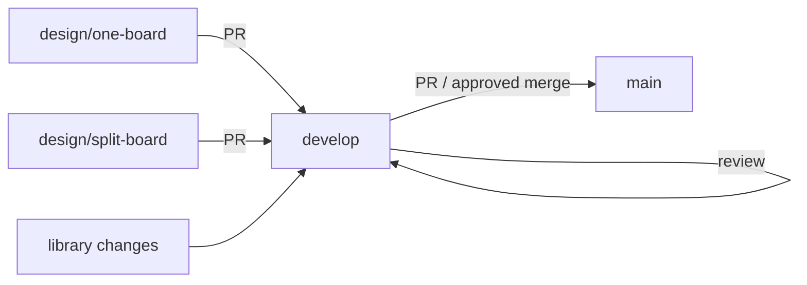

# Development Workflow

This document describes how the repository is organized and how changes flow from design branches into the stable `main` branch.

## 1. Branch Model

The repository follows a **GitFlow-style** model adapted for hardware design:

```text
main (stable, release-ready)
  ▲ merge after review
develop (integration + shared libraries)
  ▲ merge via pull request
  ├── design/one-board     (One_Board_Design)
  └── design/split-board   (Split_Board_Design)
```

| Branch | Purpose | Contents |
|---|---|---|
| `main` | Stable, release-ready state | Project skeleton only: `README.md`, `LICENSE`, `.gitignore`, `Docs/` |
| `develop` | Integration point and shared assets | Skeleton + `Hardware/libraries/` (symbols, footprints, 3D models) |
| `design/one-board` | Development of the single-board design | `Hardware/One_Board_Design/` + `Hardware/libraries/` |
| `design/split-board` | Development of the split-board design | `Hardware/Split_Board_Design/` + `Hardware/libraries/` |

## 2. Roles of Each Branch

### `main`

- Holds only content that is considered **stable and release-ready**.
- During the prototype phase, no board design lives on `main`.
- A board design moves to `main` only after it has been reviewed and validated, and after it has already been merged into `develop` and approved.

### `develop`

- The **integration branch**: all reviewed changes are merged here before reaching `main`.
- Hosts the **shared libraries** (`Hardware/libraries/`) — the single source of truth for symbols, footprints, and 3D models used by all board designs.
- Library changes are made on `develop` (or via a short-lived branch merged into `develop`).

### `design/*` branches

- Each board design is developed on its **own dedicated branch**.
- `design/one-board`   → the single-board (One_Board_Design) layout.
- `design/split-board` → the split control/relay board (Split_Board_Design) layout.
- These branches **merge `develop` periodically** to receive the latest shared libraries and project skeleton updates.

## 3. Change Flow



### 3.1 Working on a board design

1. Check out the relevant design branch:
   ```sh
   git checkout design/one-board      # or design/split-board
   ```
2. Pull the latest shared assets from `develop`:
   ```sh
   git fetch origin
   git merge origin/develop
   ```
3. Make the schematic / PCB changes.
4. Run ERC and DRC, and record the review evidence.
5. Commit with a descriptive message (see [Commit conventions](#6-commit-conventions)).
6. Push the branch:
   ```sh
   git push origin design/one-board
   ```
7. Open a pull request into `develop`.

### 3.2 Changing shared libraries

Shared libraries (symbols, footprints, 3D models) live on `develop`:

1. Create a short-lived branch from `develop` (or work on `develop` directly for small changes):
   ```sh
   git checkout develop
   git checkout -b fix/library-xyz
   ```
2. Edit the library files under `Hardware/libraries/`.
3. Commit, push, and open a pull request back into `develop`.
4. After the library change is merged into `develop`, each design branch merges `develop` to pick it up.

### 3.3 Releasing to `main`

1. Ensure all board changes are merged into `develop` and have been reviewed.
2. When the integrated state is considered stable:
   ```sh
   git checkout main
   git merge develop
   git push origin main
   ```
   or open a pull request from `develop` into `main`.
3. Tag the release if desired:
   ```sh
   git tag -a v0.1.0 -m "First prototype baseline"
   git push origin v0.1.0
   ```

## 4. Current Repository Layout

```text
robot_charge_controller/
├── README.md                 # Project overview
├── LICENSE                   # Project license
├── .gitignore
├── Docs/
│   ├── Schematic.pdf         # Schematic export
│   └── workflow.md           # This document
└── Hardware/
    ├── libraries/            # Shared: symbols, footprints, 3D models (on develop)
    ├── One_Board_Design/     # Single-board design (on design/one-board)
    └── Split_Board_Design/   # Split-board design (on design/split-board)
```

> [!NOTE]
> `Hardware/One_Board_Design/` and `Hardware/Split_Board_Design/` exist only on their
> respective design branches. On `main` and `develop`, `Hardware/` contains only the
> shared `libraries/` directory (on `develop`).

## 5. Quality Gates

Before a design branch is merged into `develop`, the following checks should pass and be recorded:

| Gate | Tool | Requirement |
|---|---|---|
| Electrical Rules Check (ERC) | KiCad `kicad-cli sch erc` | No errors; warnings reviewed |
| Design Rules Check (DRC) | KiCad `kicad-cli pcb drc` | No unapproved violations |
| Library resolution | KiCad | No missing symbols, footprints, or 3D models |
| Design review | Engineering review | Reviewed and approved |
| Manufacturing checks | KiCad / fab house | Only before a fabrication release |

## 6. Commit Conventions

Commit messages follow the repository's **semantic style**:

- `feat(hardware): ...` — new feature or capability
- `fix(hardware): ...` — bug fix
- `refactor(hardware): ...` — restructuring without behavior change
- `chore: ...` — maintenance, housekeeping, non-functional changes
- `docs: ...` — documentation only

Scope examples: `hardware`, `firmware`, `docs`, `libraries`.

Example:

```sh
git commit -m "fix(hardware): correct 3D model paths in shared footprints"
```

## 7. Branch Hygiene

- Delete a design branch after it has been merged and is no longer needed:
  ```sh
  git push origin --delete design/one-board
  git branch -d design/one-board
  ```
- Keep `main` clean: it should never contain work-in-progress designs.
- Rebase or merge `develop` into design branches regularly to minimize conflicts.
- Tag meaningful milestones (prototype baseline, review checkpoints, releases).