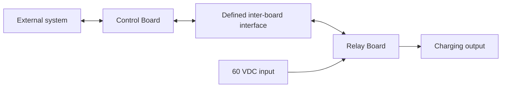

# Split-Board Design

This directory is reserved for the Robot Charge Controller architecture that separates the low-voltage control electronics from the relay and high-current charging path. Unlike the [One-Board Design](../One_Board_Design/README.md), this variant is intended to use two physically separate PCBs connected through a defined inter-board interface.

> [!WARNING]
> This is a planned prototype architecture for a charging path with requirements of up to **60 VDC and 20 A**. The split-board implementation, interface, and operating capability have not yet been verified. Incorrect partitioning, wiring, assembly, or testing can cause arcing, overheating, fire, equipment damage, or personal injury. The design is not approved for production or safety-critical use.

## Architecture



The intended high-level partition is:

| Board | Intended responsibility |
|---|---|
| Control Board | ESP32 supervision, low-voltage logic power, USB/programming support, external inputs, and CAN/RS485/UART communications |
| Relay Board | DC-rated relay switching and the 60 VDC / 20 A charging-current path |

The final allocation of voltage sensing, current sensing, protection circuits, relay-coil drive, and auxiliary field outputs has not yet been defined. These functions must be assigned using electrical, thermal, EMC, fault-containment, serviceability, and testability requirements rather than assumed from the one-board schematic.

## Inter-Board Interface Requirements

Before schematic capture begins, the connection between the two boards must be specified as an interface contract covering at least:

- Connector family, pinout, keying, retention, and mating-cycle requirements.
- Signal direction, voltage range, logic thresholds, reference ground, and default safe state.
- Power distribution, current limits, startup/shutdown order, brownout behavior, and partial-power conditions.
- Relay command and feedback behavior, including open-circuit and short-circuit faults.
- Placement and ownership of sensing, filtering, isolation, transient protection, and cable shielding.
- Cable length, conductor size, routing, separation, and EMC constraints.
- Fault-current paths and the behavior expected if the inter-board connection is missing, reversed, intermittent, or miswired.
- Test points and acceptance criteria for independent and integrated board bring-up.

No connector assignment or electrical pinout is defined by this README.

## Planned Repository Structure

No split-board KiCad project has been added to this directory yet. A practical structure is expected to keep each board independently openable and reviewable, while continuing to use the shared project libraries:

```text
Split_Board_Design/
├── Control_Board/       # Future Control Board KiCad project
├── Relay_Board/         # Future Relay Board KiCad project
├── interface/           # Future controlled interface definition
└── README.md
```

The exact filenames and subdirectory layout should be established when the first split-board KiCad projects are created. Both projects should use the shared `Hardware/libraries/` resources through a portable path strategy that is verified from each project directory. A copied `${KIPRJMOD}/libraries/...` path must not be assumed to work when the KiCad projects are nested below `Hardware/Split_Board_Design/`.

## Benefits and Trade-offs

### Expected benefits

- Physical separation can improve isolation between high-current switching and sensitive control circuitry.
- The Control Board and Relay Board can be serviced, revised, and tested independently.
- The Relay Board can be placed closer to the high-current wiring, potentially shortening the main current path.
- The architecture can support future relay-stage variants without replacing the complete controller.

### Expected trade-offs

- The inter-board connector and cable introduce additional failure modes, voltage drop, EMC coupling paths, and assembly steps.
- Grounding, shielding, signal integrity, and fault behavior require an explicit interface design.
- Two PCB assemblies increase mechanical, procurement, inventory, and integration complexity.
- Independent board testing does not replace verification of the complete connected system.

These are architectural expectations, not verified outcomes.

## Development Status

| Area | Current state |
|---|---|
| Architecture concept | Control and relay functions are intended to be separated |
| Functional allocation | Partially defined; sensing, protection, and auxiliary functions need a recorded decision |
| Inter-board interface | Not defined |
| Control Board schematic and PCB | Not present in this directory |
| Relay Board schematic and PCB | Not present in this directory |
| Integrated verification | Not started |
| Production release | Not authorized |

The next engineering step is to define measurable requirements and the inter-board interface contract before creating or adapting the KiCad schematics. Any reuse from the one-board design must be reviewed against the new grounding, cable, transient, thermal, and fault-propagation conditions.

This design does not replace a battery charger or battery management system. Charging control, cell balancing, and pack-level protection remain the responsibility of the external charger and BMS.
