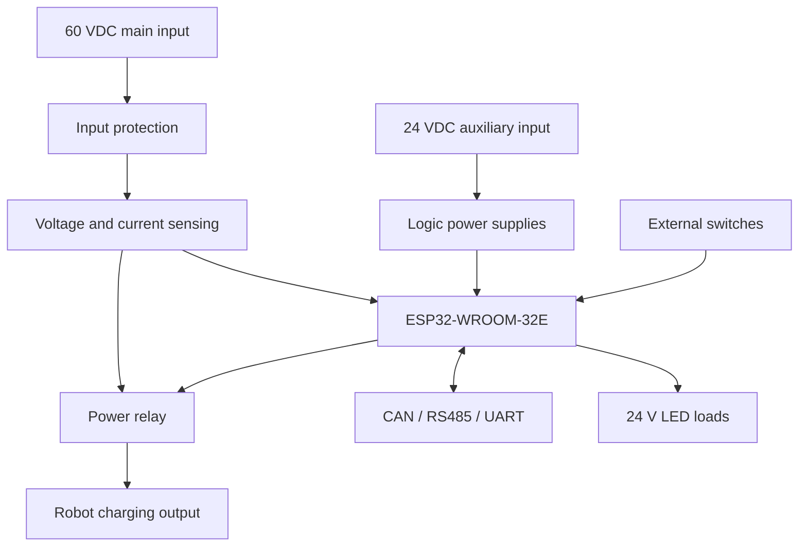

# Robot Charge Controller

An ESP32-based controller for switching, monitoring, and supervising the high-power DC charging path of a robotic system. The board controls a power relay, measures bus voltage and current, and communicates with external systems through CAN, RS485, and 3.3 V UART interfaces.

> [!WARNING]
> This project operates at up to **60 VDC and 20 A**. This energy level can cause arcing, overheating, fire, equipment damage, or personal injury if the system is designed, assembled, or tested incorrectly. The current design is a **prototype under development** and has not been validated for production or safety-critical use.

## 1. Project Goals

The project is intended to provide the following capabilities:

- Switch a 60 VDC charging path using a DC-rated power relay.
- Measure voltage and current on the main power path.
- Control and supervise system operation using an ESP32.
- Communicate with higher-level systems through CAN, RS485, or 3.3 V UART.
- Read external switch inputs.
- Control auxiliary 24 V indicator loads.
- Support hardware diagnostics, firmware development, and future expansion.

This board **does not replace a dedicated battery charger or battery management system (BMS)**. Battery-chemistry-specific charging control, cell balancing, and pack-level protection remain the responsibility of the external charger and BMS.

## 2. Design Specifications

| Item | Design target | Status |
|---|---:|---|
| Main bus voltage | Up to 60 VDC | Design requirement |
| Continuous load current | Up to 20 A | Requires thermal validation |
| Auxiliary input | 24 VDC | Design requirement |
| Microcontroller | ESP32-WROOM-32E | Selected |
| Main switching device | DC-rated power relay | Verification in progress |
| Current measurement | Shunt and current-sense amplifier | Verification in progress |
| Voltage measurement | Resistor divider connected to an ADC input | Verification in progress |
| Communication interfaces | CAN, RS485, and 3.3 V UART | Included in the design |
| External inputs | Two switch inputs | Included in the design |
| Auxiliary outputs | Three 24 V LED load-control channels | Included in the design |
| PCB construction | Four layers; 2 oz outer copper and 1 oz inner copper | Target stack-up |

The values above describe design requirements or planned configurations. If any conflict exists, the released BOM, schematic, PCB, and verification records for the applicable revision are the authoritative sources.

## 3. System Architecture



### Main Functional Blocks

| Block | Function |
|---|---|
| Input protection | Limits the effects of overcurrent, voltage transients, and incorrect connections within the defined protection scope |
| Power path | Carries the 60 V–20 A load while maintaining acceptable electrical loss and temperature rise |
| Relay and driver | Switches the charging path and limits transients generated by the relay coil and contacts |
| Current sensing | Measures the shunt voltage through Kelvin connections and conditions the signal for the ADC |
| Voltage sensing | Divides, filters, and clamps the bus voltage before it reaches the ESP32 ADC |
| Logic power | Converts the 24 V auxiliary input into the rails required by the MCU and communication circuits |
| Communications | Provides CAN, RS485, and UART connectivity to external systems |
| Control | Implements operating states, fault supervision, relay control, and auxiliary-output control |

## 4. Repository Structure

```text
robot-charge-controller/
├── README.md                 # Project overview and getting-started guide
├── CHANGELOG.md              # Version history
├── LICENSE                   # Project license
├── docs/                     # Requirements, design, calculations, and verification
│   ├── 01-requirements/
│   ├── 02-architecture/
│   ├── 03-design/
│   ├── 04-calculations/
│   ├── 05-reviews/
│   ├── 06-verification/
│   └── decisions/            # Architecture Decision Records
├── hardware/
│   ├── kicad/                # Schematic and PCB source files
│   ├── libraries/            # Project-local symbols, footprints, and 3D models
│   └── templates/            # Shared KiCad templates
├── firmware/                 # ESP32 firmware
│   ├── include/
│   ├── src/
│   ├── lib/
│   └── test/
├── simulation/               # SPICE simulations and component models
├── components/               # BOM, qualified alternatives, and datasheet links
├── manufacturing/            # Fabrication notes and controlled release packages
├── test/                     # Measurements, oscilloscope captures, and test reports
└── tools/                    # Export, validation, and automation scripts
```

## 5. Development Tools

### Hardware

- KiCad for schematic capture and PCB layout.
- KiCad ERC and DRC for connectivity and layout-rule checks.
- LTspice or ngspice for relevant circuit simulations.
- Suitable tools for analyzing conductor current capacity, power loss, and PCB temperature rise.

### Firmware

- Visual Studio Code.
- PlatformIO or ESP-IDF, depending on the configuration selected in `firmware/`.
- A suitable USB connection for programming and serial logging.

The exact tool versions used to generate a release should be recorded with that release so the design can be reproduced.

## 6. Project Status

| Area | Status |
|---|---|
| System requirements | In progress |
| Schematic | In development/review |
| PCB layout | In development |
| Firmware | In development |
| Simulation | Not completed |
| Prototype assembly | Not confirmed |
| 60 V–20 A verification | Not confirmed |
| Production release | Not released |

Update this table only when corresponding evidence is available. Completion of the schematic or PCB alone does not establish safety, reliability, or production readiness.

## 7. License

The project license has not yet been selected. Before publishing the repository or permitting third-party reuse, add an appropriate `LICENSE` file and verify the licenses of all included libraries, models, and documentation.

---

**Project:** Robot Charge Controller  
**Design target:** 60 VDC, 20 A  
**Lifecycle state:** Prototype / under development
