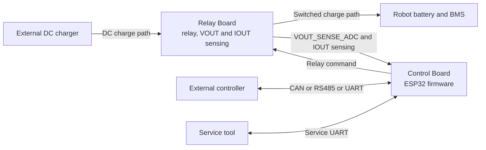
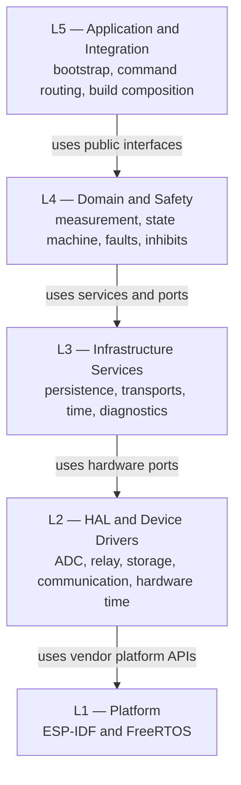
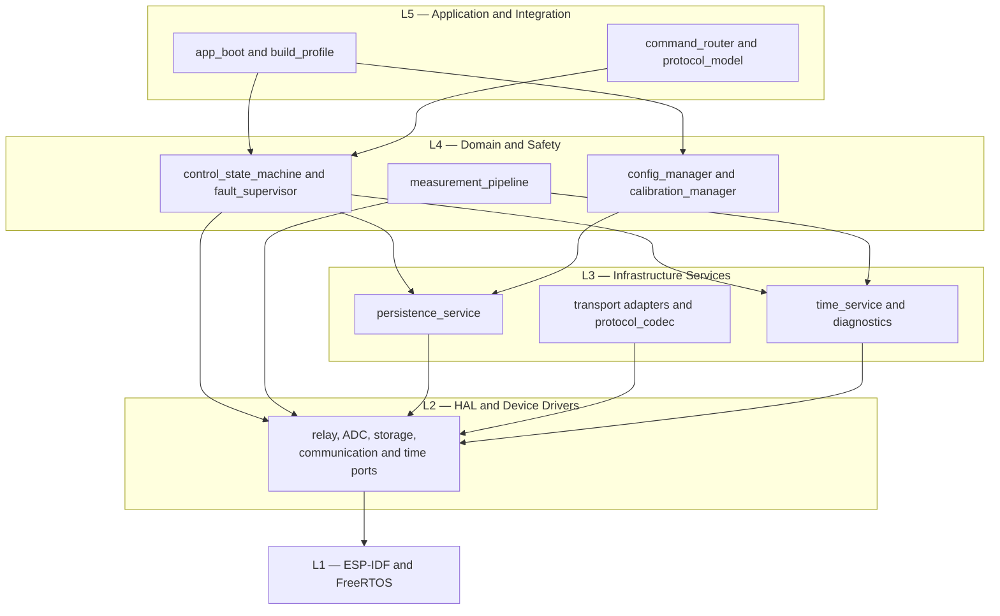
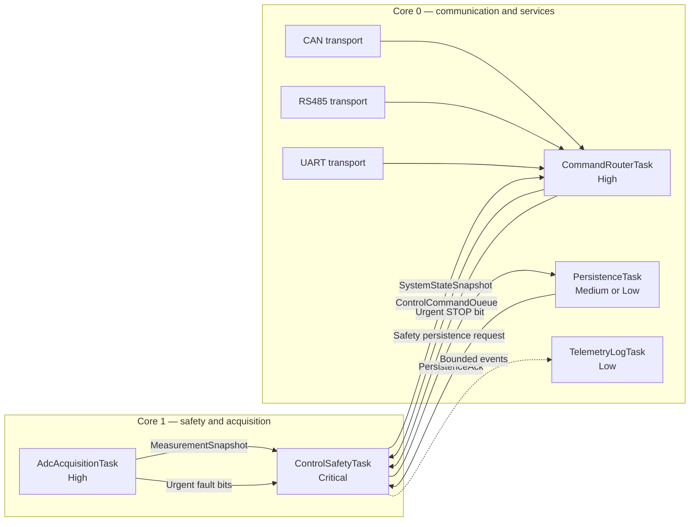
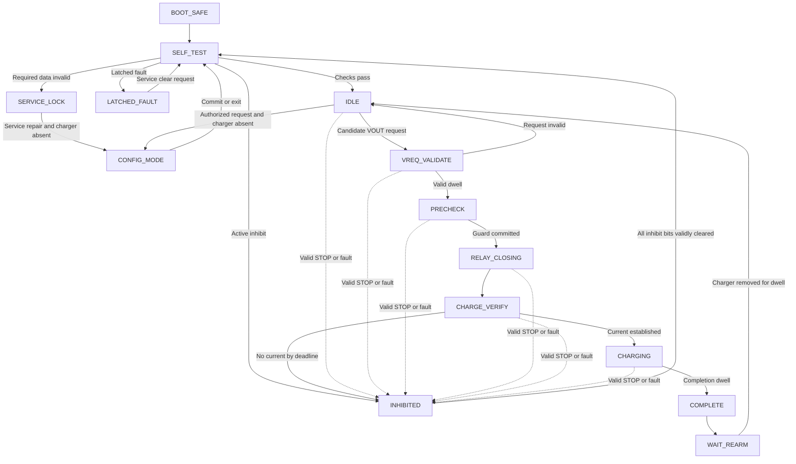
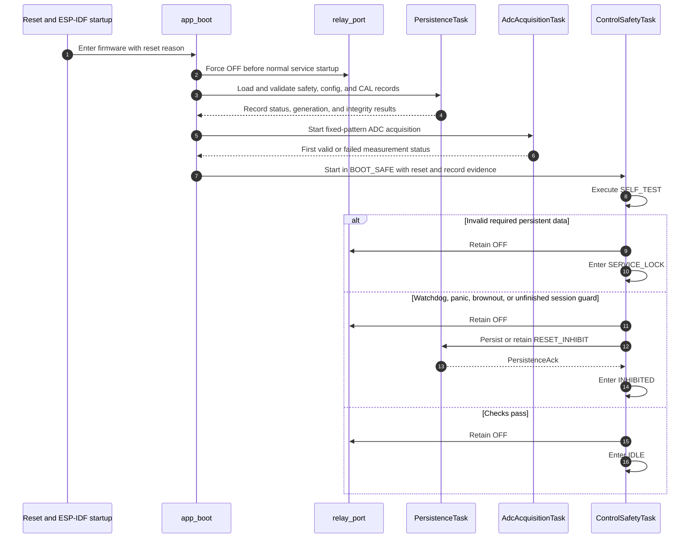
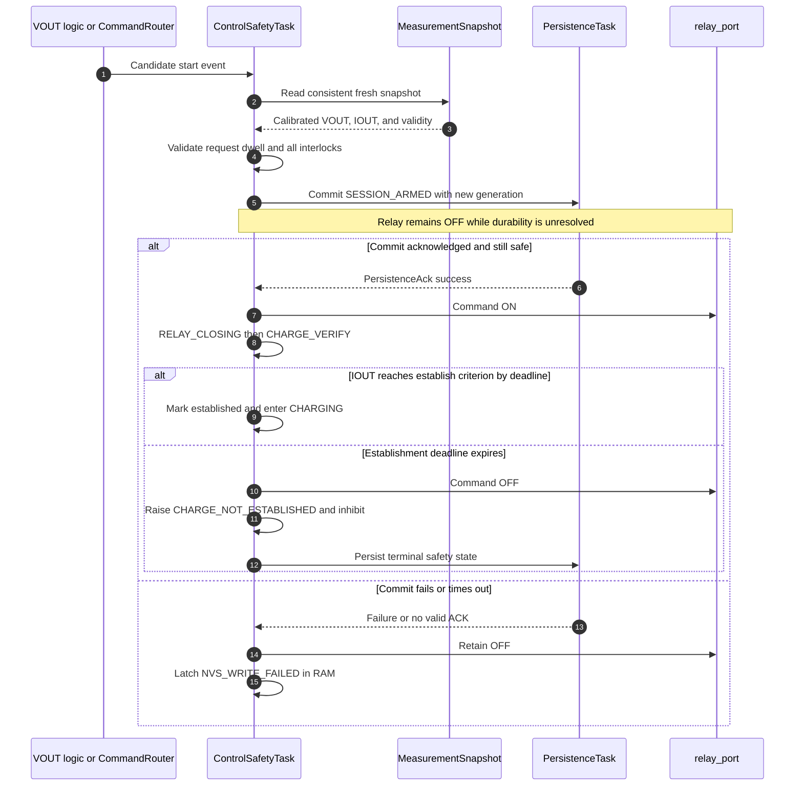
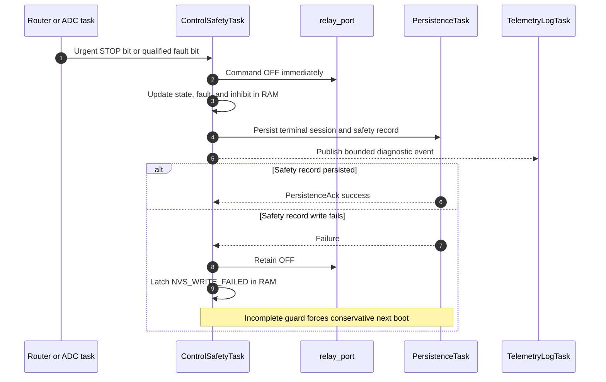
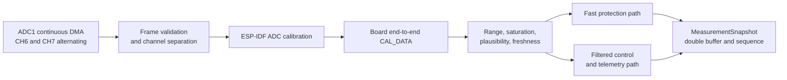
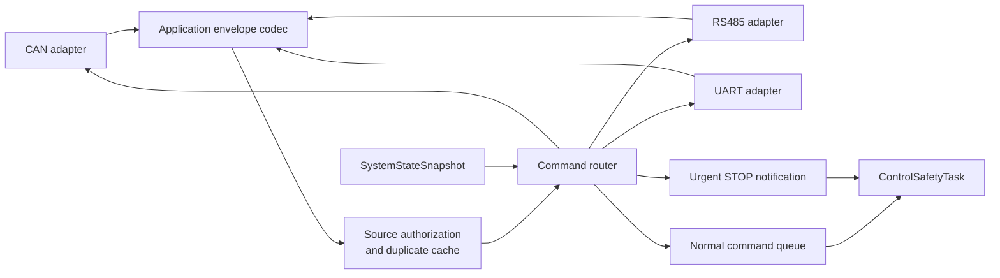

# Firmware Architecture Design

## 1. Document control

| Field | Value |
|---|---|
| Document ID | `RCC-FW-ARCH-001` |
| Project | Robot Charge Controller |
| Applicable hardware variant | Split Board Design — Control Board + Relay Board |
| Record revision | Draft 0.2 |
| Status | Under review |
| Prepared at | 2026-09-01, Asia/Bangkok (UTC+07:00) |
| Last updated | 2026-09-03, Asia/Bangkok (UTC+07:00) |
| Prepared by | Codex drafting support, based on explicit user-selected architecture decisions |
| Primary input | `RCC-FW-SRS-001`, Draft 0.1 |
| Hardware source baseline | Git commit `fe85ff2` plus the uncommitted hardware changes identified in the SRS |
| Firmware source baseline | Pre-implementation; no firmware source revision exists yet |

This document defines the firmware architecture. It does not approve the hardware,
certify safety or compliance, accept residual risk, or authorize a production release.

### 1.1 Revision history

| Revision | Date | Change |
|---|---|---|
| Draft 0.1 | 2026-09-01 | Initial event-driven architecture baseline |
| Draft 0.2 | 2026-09-03 | Formalized the five-layer logical architecture, module-to-layer allocation, and dependency rules |

## 2. Purpose, scope, and document boundary

This document translates the firmware system requirements into:

- logical module boundaries and dependency rules;
- FreeRTOS task and core deployment;
- ownership of safety-relevant state and physical outputs;
- inter-task data contracts and overload behavior;
- boot, session, STOP, fault, and persistence sequences;
- failure-containment and testability mechanisms.

The detailed CAN, RS485, and UART framing belongs in a separate Interface Control
Document (ICD). Exact C APIs, data structure layouts, FreeRTOS numeric priorities,
stack sizes, queue depths, timeout values, filter coefficients, and hard electrical
thresholds belong in Detailed Design after the relevant timing and analog evidence is
available.

### 2.1 Architectural inputs

| Input | Architectural consequence |
|---|---|
| ESP32-WROOM-32E, ESP-IDF, and FreeRTOS | Dual-core task deployment with ESP-IDF drivers and watchdog support |
| Split Control Board and Relay Board | Explicit connector/signal boundary and hardware-revision binding |
| Hybrid autonomous + remote operation | VOUT can initiate a session; communication is optional for continued operation |
| Relay-open safe state | Boot, reset, inhibit, service, and fault paths converge on relay OFF |
| Shared VOUT meaning | Interpretation depends on relay state: request while open, charging voltage while closed |
| Persistent inhibit and session guard | Safety records require atomic, acknowledged NVS transactions |
| CAN, RS485, and UART | Transport adapters share one application command model |
| No Wi-Fi/Bluetooth in v1 | Wireless stacks are excluded from the build and runtime architecture |

### 2.2 Exclusions

- Battery charge regulation and BMS behavior.
- Supervision of the separate 24 V auxiliary source.
- Hardware-independent claims that the 60 V / 20 A maximum normal operating values
  are hard fault thresholds.
- Product safety certification, EMC compliance, or release authorization.

## 3. Architecture drivers and invariants

The following rules have priority over convenience, throughput, or diagnostic detail.

| ID | Architectural invariant |
|---|---|
| `ARCH-INV-001` | Only `ControlSafetyTask` may command the relay. No driver, ISR, transport, logger, or persistence module may bypass it. |
| `ARCH-INV-002` | Relay ON is permitted only in `RELAY_CLOSING`, `CHARGE_VERIFY`, and `CHARGING`. |
| `ARCH-INV-003` | A safe physical action is issued before persistence or diagnostic work on STOP, fault, inhibit, or shutdown paths. |
| `ARCH-INV-004` | Relay close is forbidden until precheck succeeds and the persistent `SESSION_ARMED` write is acknowledged. |
| `ARCH-INV-005` | Missing, stale, saturated, inconsistent, or implausible safety measurements cannot be treated as valid measurements. |
| `ARCH-INV-006` | Communication loss, congestion, or malformed traffic cannot block control progression or autonomous operation. |
| `ARCH-INV-007` | Urgent STOP and urgent measurement faults do not depend on space in the normal command queue. |
| `ARCH-INV-008` | Any invalid required safety/configuration/calibration record results in relay OFF and a conservative state. |
| `ARCH-INV-009` | Production firmware contains no test fault-injection command or mock physical backend. |
| `ARCH-INV-010` | Runtime configuration cannot change hardware-bound sample rate, hard limits, or fault escalation policy. |

## 4. System context

At the firmware boundary, `VOUT_SENSE_ADC` is received as MCU net
`VOUT_MCU_ADC` on module pin 7 / GPIO35 / ADC1_CH7. `IOUT_MCU_ADC` is received
on module pin 6 / GPIO34 / ADC1_CH6. The connector mapping and analog transfer
functions remain bound to the controlled hardware revision and `CAL_DATA` revision.

## 5. Architectural style

The firmware combines a **five-layer logical architecture** with an **event-driven
runtime architecture**. The layers control source-level responsibility and dependency
direction. FreeRTOS tasks and core affinity control execution context and scheduling.
One layer is not required to map to one task.

The event-driven runtime has one safety-control owner. Data acquisition publishes
immutable snapshots. Transport adapters normalize messages into a common command
model. Persistence and logging execute asynchronously, except when the control state
machine explicitly waits for a safety-record acknowledgment while the relay remains
OFF.

The architecture uses three interaction types:

1. **Latest-value publication** for measurements and system state.
2. **Bounded event queues** for commands, persistence requests, and diagnostics.
3. **Urgent notification bits** for STOP and faults that must not wait behind normal
   queue traffic.

No module obtains safety authority merely because it has access to a transport,
storage driver, or hardware abstraction.

### 5.1 Five-layer logical architecture

Layer numbers increase from the hardware/platform boundary toward system composition
and external application behavior.

| Layer | Name | Primary responsibility | Representative components | Safety boundary |
|---:|---|---|---|---|
| `L1` | Platform | Provide the operating system, scheduler, interrupt, and vendor peripheral framework | ESP-IDF, FreeRTOS | Contains no project charging policy and grants no relay authority |
| `L2` | Hardware Abstraction and Device Drivers | Isolate board pins, ADC DMA, relay output, NVS primitives, communication peripherals, reset reason, and hardware time sources | `adc_port`, `relay_port`, `storage_port`, `communication_ports`, `time_port` | Exposes capability and status only; never decides whether charging is permitted |
| `L3` | Infrastructure Services | Provide reusable storage, transport, protocol-codec, time, telemetry, and diagnostic services | `persistence_service`, `transport_can`, `transport_rs485`, `transport_uart`, `protocol_codec`, `time_service`, `diagnostics` | May report failures and carry requests, but cannot mutate the control state or command the relay |
| `L4` | Domain and Safety | Implement charging-domain measurements, configuration/calibration validity, state transitions, fault policy, inhibit policy, and session safety | `measurement_pipeline`, `config_manager`, `calibration_manager`, `control_state_machine`, `fault_supervisor` | Sole layer allowed to decide relay ON/OFF; physical command remains owned by `ControlSafetyTask` |
| `L5` | Application and Integration | Compose the firmware, initialize tasks, expose the common application command model, authorize commands, and select the build composition | `app_boot`, `command_router`, `protocol_model`, `build_profile` | May request an action but cannot bypass L4 interlocks or directly operate the relay |

### 5.2 Layer dependency rules

1. Normal compile-time dependency direction is downward: `L5 → L4 → L3 → L2 → L1`.
2. A higher layer may skip a lower layer only through a documented public interface;
   for example, L4 may invoke `relay_port` in L2 when an intervening L3 service would
   add no policy or isolation value.
3. A lower layer shall not include, call, or mutate a concrete implementation in a
   higher layer.
4. Upward measurements, events, acknowledgments, and command receptions shall cross a
   defined boundary through immutable snapshots, bounded queues, notifications, or
   callback/port interfaces. Runtime event direction does not reverse source-level
   ownership.
5. Boundary contract types belong to the layer that defines their meaning. Lower-layer
   producers may implement a narrow port or publish the contract without gaining
   access to the consumer's internal state.
6. Direct dependencies from L5 or L3 to `relay_port` are forbidden. Only L4 control
   logic may request a relay change, and only `ControlSafetyTask` may execute it.
7. L1 and L2 shall contain no charger-request, completion, inhibit, fault-clear, or
   command-authority policy.
8. L3 failures are converted into explicit status, timeout, or acknowledgment results;
   they cannot silently degrade a safety operation into best-effort behavior.
9. Cross-layer access to another module's private data is forbidden even when both
   modules execute in the same FreeRTOS task.

### 5.3 Relationship between layers and FreeRTOS tasks

Layers are design-time boundaries; tasks are runtime containers. A task may execute
modules from more than one adjacent layer, but each module retains its layer rules.

| Runtime context | Layers hosted or invoked | Constraint |
|---|---|---|
| Startup context | L5, then public initialization entry points in L4/L3/L2 | `app_boot` establishes relay OFF but cannot decide a charging transition |
| `ControlSafetyTask` | Primarily L4; invokes L3 services and the L2 `relay_port` | Remains the sole relay and state-machine owner |
| `AdcAcquisitionTask` | L4 `measurement_pipeline` with L2 `adc_port` and L3 time support | Publishes measurements; does not own charging state |
| `CommandRouterTask` | L5 command authorization/routing with L3 protocol service | Submits requests and urgent STOP; does not mutate control state |
| CAN/RS485/UART tasks | L3 transport services with L2 communication ports | Transport failure cannot block L4 control |
| `PersistenceTask` | L3 persistence service with L2 storage port | Serializes storage; never decides relay permission |
| `TelemetryLogTask` | L3 diagnostics and telemetry | May lose/coalesce diagnostics without back-pressuring L4 |

## 6. Logical module decomposition

Conceptual package names below define layer allocation, ownership, and dependency
direction. They are not yet final source-directory or C-component names.

| Layer | Logical module | Responsibility | May depend on | Shall not do |
|---:|---|---|---|---|
| L5 | `app_boot` | Establish safe outputs, initialize services in order, create tasks, start self-test | Public initialization interfaces in L4/L3/L2 | Energize relay or decide a charging transition |
| L5 | `command_router` | Validate application envelope, authorize trusted source, deduplicate, normalize commands, and generate results | Protocol model, transport metadata, state snapshot, control command port | Directly command relay or mutate control state |
| L5 | `protocol_model` | Define command codes, payload semantics, results, reason codes, and version rules | Fixed-width contract types | Contain CAN/RS485/UART-specific framing |
| L5 | `build_profile` | Select production/test backends and feature set at build time | Build system and public composition interfaces | Allow runtime promotion of a test image to production identity |
| L4 | `control_state_machine` | Own system/operational state, session lifecycle, relay command, timers, and interlocks | Measurement/state contracts, fault policy, relay port, time service, persistence client | Parse transport frames, access raw ADC DMA, perform NVS writes directly |
| L4 | `fault_supervisor` | Evaluate active faults, severity, escalation, inhibit effects, and clear preconditions inside the control context | Fault policy tables, measurement validity, reset/session state | Run as an independent relay owner or clear a fault from transport context |
| L4 | `measurement_pipeline` | Consume ADC DMA, separate channels, calibrate, validate, filter, and publish snapshots | ADC port, calibration data, time service | Command relay, write NVS, or infer command authority |
| L4 | `config_manager` | Stage, validate, atomically activate, version, and expose one active configuration | Persistence client and validation rules | Change compiled hard-safety policy or activate partial data |
| L4 | `calibration_manager` | Manage board-bound calibration workflow and validated `CAL_DATA` | Measurement support and persistence client | Mark calibration valid without verification criteria |
| L3 | `persistence_service` | Serialize prioritized storage operations, integrity checks, generations, and acknowledgments | Storage port and CRC/version codecs | Decide relay state or silently downgrade a safety write failure |
| L3 | `protocol_codec` | Encode/decode the common envelope and validate structural integrity | Fixed-width boundary contract and transport-independent CRC support | Authorize a source or interpret a command as permitted |
| L3 | `transport_can` | CAN framing, addressing, transport integrity, Rx/Tx | CAN communication port and protocol codec | Grant authority from payload claims |
| L3 | `transport_rs485` | RS485 framing, direction control, integrity, Rx/Tx | UART communication port and protocol codec | Block safety control on link failure |
| L3 | `transport_uart` | Operational/service UART framing and trusted port identity | UART communication port and protocol codec | Treat operational UART as service UART without hardware/config identity |
| L3 | `diagnostics` | RAM event ring, bounded persistent summaries, counters, and telemetry publication | Time service, state/measurement snapshots, persistence low-priority client | Delay a physical safe action or write periodic telemetry to flash |
| L3 | `time_service` | Monotonic time, `boot_id`, event sequence, optional UTC synchronization | Time port and persistence at controlled boundaries | Make UTC availability an operational interlock |
| L2 | `relay_port` | Provide minimal OFF/ON hardware operation and readback if available | ESP-IDF GPIO driver | Decide whether ON is allowed |
| L2 | `adc_port` | Configure fixed channel pattern and DMA, expose raw samples and driver health | ESP-IDF ADC continuous driver | Apply session or fault policy |
| L2 | `storage_port` | Wrap required NVS primitives and return explicit storage errors | ESP-IDF NVS API | Select record priority, accept invalid data, or hide write failures |
| L2 | `communication_ports` | Wrap CAN and UART peripheral operations, timestamps, and driver status | ESP-IDF communication drivers | Parse application commands or assign source authority |
| L2 | `time_port` | Expose monotonic hardware/OS time and reset-reason primitives | ESP-IDF system APIs | Apply session timers or reset-inhibit policy |
| L1 | ESP-IDF and FreeRTOS | Supply scheduler, synchronization, ISR, watchdog, and peripheral framework | Vendor/platform implementation | Contain project charging policy |

### 6.1 Enforced module dependency direction

The safety-control domain depends on abstract ports, infrastructure services, and
immutable data contracts. Transport and diagnostic modules may deliver events or
observe published control state, but they cannot call private state transitions. Solid
arrows below mean compile-time use of a public interface; runtime events in the reverse
direction use the contracts defined in Section 8.

A published snapshot, queue message, notification, or acknowledgment is an explicit
runtime contract and does not grant reverse mutation access.

## 7. Runtime deployment

### 7.1 Task allocation

| Task | Core | Relative priority | Blocking rule | Watchdog |
|---|---:|---|---|---|
| `ControlSafetyTask` | 1 | Critical | May wait only on bounded event/timer operations or explicit safety-record ACK while relay is OFF | Required |
| `AdcAcquisitionTask` | 1 | High | May block on DMA/notification with bounded freshness supervision | Required |
| `CommandRouterTask` | 0 | High | Must reject overload rather than wait indefinitely | Required if timing analysis identifies loss-of-service risk |
| Transport tasks | 0 | Medium | Bounded Rx/Tx waits; no dependency from Control | As justified by driver behavior |
| `PersistenceTask` | 0 | Medium/Low | Storage latency cannot run on Core 1 control context | Monitored by request deadlines and task-health diagnostics |
| `TelemetryLogTask` | 0 | Low | Droppable/coalesced diagnostics; never back-pressure Control | Not safety-critical |

Numeric priorities, task periods, stack sizes, queue depths, and watchdog timeouts shall
be derived and recorded in Detailed Design with measured worst-case execution and
latency evidence.

## 8. Inter-task contracts

| Contract | Owner/producer | Consumer | Mechanism | Consistency and overload policy |
|---|---|---|---|---|
| `MeasurementSnapshot` | ADC task | Control, telemetry | Double buffer plus sequence counter | Consumer retries/rejects torn read; stale or invalid data becomes a fault input |
| `UrgentNotifyBits` | ADC task, router | Control | Direct task notification bits | Coalescing is permitted; bit remains actionable until control processes the condition |
| `ControlCommandQueue` | Router | Control | Bounded FreeRTOS queue | Full queue returns explicit `BUSY/QUEUE_FULL`; urgent STOP uses separate bit |
| `SystemStateSnapshot` | Control | Router, transports, logger | Immutable latest-value double buffer | Readers never lock Control; skipped intermediate telemetry is allowed |
| `PersistenceRequestQueue` | Control/config/calibration/logger | Persistence | Bounded priority classes | Safety request reservation; diagnostics drop/coalesce first; config reports busy |
| `PersistenceAck` | Persistence | Control/requester | Correlated notification/result | Includes request ID, record generation, and success/failure; bounded timeout |
| `EventLogQueue` | All modules | Logger | Bounded queue | Low-severity events drop/coalesce; safety action proceeds independently |

### 8.1 Contract rules

- Every queued object uses fixed-width fields and explicit schema/version where it can
  cross a persistence or external interface boundary.
- Ownership transfers are explicit. Producers do not reuse mutable queue storage until
  the FreeRTOS operation completes.
- No pointer to a task-local stack object may outlive the call that publishes it.
- ISR code performs no parsing, policy evaluation, NVS access, logging, or relay action.
- Queue overflow and timeout are observable conditions with stable reason codes.
- An acknowledgment means the requested operation reached the stated durability or
  processing boundary; it is not a generic “message received” signal.

## 9. Core data models

Fields are logical. Exact C layout and packing remain a Detailed Design decision.

### 9.1 `MeasurementSnapshot`

| Field group | Minimum content |
|---|---|
| Identity | Snapshot sequence and hardware/calibration revision references |
| Time | Acquisition timestamp, publication timestamp, and computed age |
| Engineering values | `vout_mv` as `uint32`; `iout_ma` as `int32` |
| Raw observability | Latest/bounded raw ADC statistics needed for service diagnosis |
| Validity | Per-channel fresh, calibrated, in-range, saturated, plausible, and sequence-consistent flags |
| Fast protection | Debounced/qualified fast-condition bits and their first-observed time |
| Filtered control | Filtered values and dwell-condition inputs for request, completion, and telemetry |

### 9.2 `SystemStateSnapshot`

| Field group | Minimum content |
|---|---|
| State | Top-level state and operational substate |
| Output | Relay command and optional feedback status |
| Session | Session ID, request source, established flag, start/elapsed time, terminal result |
| Safety | Inhibit mask, active fault bitmap, primary fault, reset classification |
| Measurements | Latest accepted VOUT/IOUT, age, and validity summary |
| Configuration | Active config revision, `CAL_DATA` revision, hardware and firmware identity |
| Diagnostics | `boot_id`, latest `event_seq`, time synchronization flag |

### 9.3 `ControlCommand`

| Field group | Minimum content |
|---|---|
| Trusted origin | Source interface and node identity supplied by the transport adapter |
| Transaction | Protocol version, request ID, command code, and receive timestamp |
| Authorization | Resolved permission class; never accepted from a payload role claim |
| Payload | Validated command-specific fixed-width values |
| Response route | Correlation information used by the router, not by control policy |

### 9.4 Persistent safety record

| Field group | Minimum content |
|---|---|
| Integrity | Magic, schema version, payload length, generation, CRC |
| Compatibility | Hardware revision, firmware compatibility range where required |
| Safety state | Inhibit mask, latched fault, session guard state, terminal reason |
| Boot trace | Previous boot ID/reset classification and controlled sequence counters |

Unknown schema, incompatible revision, invalid length, invalid CRC, or ambiguous newest
generation is invalid data and causes conservative boot behavior.

## 10. State ownership and state machine

`ControlSafetyTask` owns all state transitions. Other tasks submit observations or
requests. The embedded `fault_supervisor` module evaluates fault policy synchronously
inside the control task so that fault and relay decisions cannot race.

The dotted transitions summarize global safe overrides. The precise destination is
`INHIBITED`, `LATCHED_FAULT`, or `SERVICE_LOCK` according to cause and storage health.
The relay is OFF in every state except `RELAY_CLOSING`, `CHARGE_VERIFY`, and
`CHARGING`.

### 10.1 VOUT semantic ownership

| Relay/state context | VOUT interpretation |
|---|---|
| Relay open in `IDLE`/`VREQ_VALIDATE` | Charger presence and charge-request candidate |
| Relay open in `WAIT_REARM` | Charger-removal/re-arm evidence |
| Relay closed | Charging/battery voltage used with current and session state |
| VOUT channel invalid | No VOUT-derived request, completion, or re-arm decision is permitted |

The state machine, not the ADC task, assigns this semantic meaning. The ADC task only
publishes calibrated values and validity evidence.

## 11. Boot and reset sequence

If storage validation itself is unavailable, boot does not depend on a successful new
write to become safe; relay OFF and `SERVICE_LOCK` are maintained in RAM and physical
output state.

## 12. Autonomous and commanded session start

Autonomous VOUT request and valid `START_CHARGE` converge at the same precheck. START
does not bypass request validity, calibration, fault, inhibit, or storage checks.

The control task rechecks urgent notifications, measurement freshness, and current
state after receiving the ACK and before relay ON. A late ACK cannot authorize a close
after STOP, fault, state change, or request cancellation.

## 13. STOP, fault, completion, and terminal persistence

Normal completion follows the same physical ordering: relay OFF first, terminal record
second, then `WAIT_REARM`. `STOP_CHARGE` additionally sets persistent
`REMOTE_INHIBIT`. Recoverable faults set `RECOVERY_INHIBIT`. Fault-specific policy
decides whether a condition may be cleared by valid START, charger removal, or only
service action.

## 14. Measurement architecture

### 14.1 Pipeline rules

- ADC1 uses a fixed alternating channel pattern for GPIO34/ADC1_CH6 and
  GPIO35/ADC1_CH7.
- Sample rate is compiled and bound to a hardware revision after analog settling/noise
  characterization. It is not adjustable through NVS.
- The fast path minimizes detection latency but still applies the qualification needed
  to prevent single-sample nuisance action.
- The filtered path provides stable request, establishment, completion, re-arm, and
  telemetry inputs.
- Both paths retain timestamps so a filter cannot hide stale acquisition.
- Driver calibration is followed by per-board end-to-end calibration: two points for
  VOUT and negative-zero-positive points for IOUT, with independent verification
  points.
- Invalid calibration or error exceeding the SRS 25%-of-nearest-margin rule makes the
  measurement unsuitable for operational decisions.

### 14.2 Measurement fault containment

| Failure | Detection location | Control effect |
|---|---|---|
| DMA stops or snapshot ages out | ADC task and Control age check | Urgent measurement fault; relay OFF if active; inhibit/fault per matrix |
| Channel missing/reordered | Frame/channel validator | Reject frame; no semantic substitution between VOUT and IOUT |
| ADC saturation/out of calibrated range | Quality stage | Mark channel invalid; apply fault policy |
| Implausible step or cross-signal combination | Quality stage plus Control context | Qualify condition; use context-specific fault policy |
| Invalid `CAL_DATA` | Boot/config/calibration validation | `SERVICE_LOCK`; no operational relay close |

## 15. Control and fault architecture

The control loop is event driven. Each iteration drains urgent bits first, then reads a
consistent measurement snapshot, processes elapsed timers, accepts at most a bounded
amount of normal command work, evaluates faults/inhibits, performs one deterministic
state transition, updates relay output if required, and publishes a new immutable
state snapshot.

### 15.1 Event precedence

Highest precedence is listed first:

1. Relay-OFF enforcement and active urgent safety condition.
2. Measurement invalidity/freshness and hard fault evaluation.
3. Valid urgent STOP.
4. Active latched/recoverable fault and inhibit maintenance.
5. State deadline and session completion logic.
6. Normal command processing.
7. Autonomous request/re-arm progression.
8. Telemetry and diagnostic publication.

STOP and a simultaneous fault both result in relay OFF. The architecture records both
causes where observable; it does not erase fault evidence merely because STOP also
arrived.

### 15.2 Fault policy representation

Fault behavior is described by a release-controlled policy table with, at minimum:

| Policy field | Purpose |
|---|---|
| Fault ID and priority | Stable reporting and primary-fault selection |
| Detection source and qualification | Required evidence and dwell/debounce |
| Severity | `WARNING`, `RECOVERABLE`, or `LATCHED` |
| Relay action and maximum response | Safe action and timing requirement |
| Inhibit bits set | Persistent restart behavior |
| Clear preconditions and authority | START, removal/re-arm, or service UART |
| Recurrence window and escalation | Fault-specific fixed policy |
| Persistence and event behavior | Safety record priority and diagnostic rate limit |

The table is compiled/release-controlled when it contains hard safety or escalation
policy. Runtime configuration may supply only parameters explicitly classified as
operational in the SRS.

### 15.3 Inhibit semantics

`REMOTE_INHIBIT`, `RESET_INHIBIT`, and `RECOVERY_INHIBIT` are independent bits and
may coexist. Clearing one cause cannot clear another. The system remains
`INHIBITED` until every active bit has passed its own clear rule and `SELF_TEST`
confirms the interlocks again. Historical events remain after the live inhibit clears.

## 16. Communication architecture

### 16.1 Authority model

- One operational control interface is selected in active NVS configuration.
- Other external interfaces remain monitor-only unless an explicit service rule
  applies.
- Service UART identity comes from the configured physical/logical port, not an
  untrusted payload field.
- `CLEAR_FAULT` and calibration commands are service-UART only.
- Transport adapters attach trusted `source_interface` and `source_node` metadata.
- Router authorization occurs before a command reaches the control queue.
- A duplicate `(source, request_id)` returns the cached result without repeating the
  action. STOP remains idempotent.

### 16.2 Application model boundary

The common envelope contains `protocol_version`, `message_type`, `request_id`,
`command_code`, `flags`, `payload_length`, payload, and optional object CRC32. The ICD
shall map this model to each transport's framing, addressing, segmentation, CRC,
timeouts, bitrate, and physical-layer assumptions.

`ACCEPTED` means a valid request entered the application/control workflow. It does not
mean the relay is ON. Final `COMPLETED` or `FAILED` results carry state, inhibit mask,
primary fault, and reason code.

## 17. Persistence architecture

### 17.1 Record domains

| Domain | Examples | Priority | Failure behavior |
|---|---|---:|---|
| Safety | Inhibit mask, latched fault, session guard, terminal session state | Highest | Relay OFF; fail closed; incomplete guard retained conservatively |
| Calibration | Board-bound `CAL_DATA` | High | Existing valid generation retained; invalid/missing active data causes service lock |
| Configuration | Active/staging operational configuration | High | Atomic old-or-new activation; invalid staging never becomes active |
| Identity/time | Boot ID and controlled counters | Medium | Preserve ordering where possible; uncertainty is explicitly marked |
| Diagnostics | Bounded critical summaries | Lowest | Drop/coalesce/rate-limit before affecting safety work |

### 17.2 Atomicity model

Each controlled record uses a schema version, length, monotonically ordered generation,
and CRC. Updates use staging and a commit marker or equivalent ESP-IDF NVS transaction
scheme so boot accepts the previous valid generation or the new valid generation, but
never a partially validated payload.

The exact NVS key namespace, generation comparison across rollover, commit-marker
layout, and power-cut recovery algorithm shall be specified and tested in Detailed
Design. The architecture requires deterministic handling of:

- power loss before payload completion;
- power loss after payload but before activation;
- corrupted newest generation;
- two apparently valid but ambiguous generations;
- schema or hardware-revision incompatibility;
- NVS full, wear, timeout, and driver errors.

### 17.3 Priority and acknowledgment

The persistence service reserves capacity or an independent path for safety records.
Diagnostic pressure cannot consume all safety request capacity. Each safety request
has a correlated ACK with durability status and committed generation. The control task
uses a bounded deadline; on failure or ambiguity it retains relay OFF and enters the
defined fail-closed state.

## 18. Configuration and calibration architecture

Configuration and calibration are independent records with independent schemas,
revisions, CRCs, staging, validation, and atomic activation.

`CONFIG_MODE` is a relay-OFF service state entered only after verified charger absence.
`START_CHARGE` is rejected while it is active. An invalid update cannot replace the
previous active generation. Service UART remains available to repair invalid or
missing required data in `SERVICE_LOCK`.

Hard safety limits, ADC sample rate, and fault escalation rules are compiled and tied
to firmware/hardware identity. Operational configuration includes only the validated
request/completion thresholds, dwell values, selected control interface, and approved
telemetry behavior.

## 19. Concurrency, scheduling, and bounded behavior

### 19.1 Concurrency rules

- Relay state and state-machine variables are private to `ControlSafetyTask`.
- ADC driver buffers are private to `AdcAcquisitionTask` and the ADC port.
- NVS access is serialized by `PersistenceTask`; no other task calls NVS directly
  after service startup.
- Protocol duplicate-cache state is owned by `CommandRouterTask`.
- State and measurement publication uses single-writer/multiple-reader snapshots.
- Cross-core access uses FreeRTOS/ESP-IDF synchronization primitives with documented
  memory ordering; ad hoc `volatile` sharing is forbidden.
- No safety task waits on telemetry Tx, external ACK, log flush, or UTC time sync.
- Lock ordering, if locks remain necessary inside a service, is fixed and documented;
  Control never holds a shared lock while requesting persistence.

### 19.2 Overload behavior

| Overload source | Required degradation |
|---|---|
| Command flood | Validate/rate-limit/reject; preserve urgent STOP and monitoring health |
| Telemetry consumer slow | Drop intermediate latest-value telemetry; never queue unbounded history |
| Event burst | Coalesce/rate-limit repeated diagnostics; preserve first occurrence and safety summary |
| Persistence backlog | Serve safety first; reject/defer config; drop diagnostics |
| ADC processing overrun | Mark freshness failure; notify Control; do not publish an apparently fresh stale value |
| CPU starvation or deadlock | Task watchdog/reset; next boot applies `RESET_INHIBIT` |

## 20. Failure containment matrix

| Initiating failure | Local containment | System-level result | Verification route |
|---|---|---|---|
| Control task crash/deadlock | Task watchdog and relay hardware default | Reset, relay OFF, `RESET_INHIBIT` on boot | Target fault injection + HIL |
| ADC task/DMA failure | Freshness deadline and watchdog | Relay OFF when active; measurement fault/inhibit | Target + HIL |
| Transport task failure | Isolation on Core 0; no control dependency | Autonomous session continues; interface degraded diagnostic | Target load/fault test |
| Command queue full | Explicit rejection; urgent path separate | No silent command acceptance; STOP remains effective | Target saturation test |
| Logger failure/backlog | Drop/coalesce and bounded queue | Safety/control unaffected; diagnostic warning | Host + target |
| Runtime NVS safety write failure | Relay OFF, in-RAM `NVS_WRITE_FAILED` latched | No new session; conservative next boot | Target storage injection |
| Invalid NVS on boot | Record validation before operation | `SERVICE_LOCK` with relay OFF | Target power-cut/corruption test |
| Brownout/panic/watchdog reset | Reset classification and session guard | `RESET_INHIBIT`; no autonomous restart | Target + HIL |
| Charger remains after completion | `WAIT_REARM` dwell | No repeated autonomous session | Host + HIL |
| VOUT sensor invalid | Block all VOUT-derived decisions | No autonomous request or VOUT-based re-arm | HIL + bench |
| No current after close | Establishment timeout | `CHARGE_NOT_ESTABLISHED`, relay OFF, not completion | Host + HIL |

This matrix is architectural containment, not a complete hardware/system FMEA. Relay
contacts welded closed, driver short-on, sensing-common faults, and protection-chain
energy behavior require hardware-level detection and verification evidence.

## 21. Build profiles and test seams

| Concern | `PRODUCTION` | `TEST` |
|---|---|---|
| Physical backends | Real ADC, relay, NVS, reset, and time ports only | Mock/test ports permitted |
| Fault injection | Not compiled/linked | Controlled injection permitted |
| Identity | Production profile marker and firmware identity | Distinct test marker and conspicuous diagnostic identity |
| Relay default | OFF | OFF and additionally bench-gated before enable |
| Optimization/logging | Release-controlled | May include instrumentation that does not alter logical acceptance criteria |

Core state, fault, request, completion, re-arm, authorization, and persistence decision
logic shall be testable on the host through ports for time, measurements, relay, reset
reason, and storage. Target tests validate ESP-IDF integration and concurrency. HIL
tests validate scheduling and interface behavior. Controlled bench tests bind analog
accuracy and physical relay timing.

## 22. Architecture-to-requirement traceability

| Architecture area | Primary SRS requirements | Verification baseline |
|---|---|---|
| Sole relay/state owner | `FW-ARC-003` through `FW-ARC-006`, `FW-SM-001` through `FW-SM-003` | `FW-BOOT-001`, `FW-LOAD-001` |
| ADC pipeline and snapshots | SRS 5.3, `FW-ARC-004`, `FW-REQ-001` through `FW-REQ-005`, and the session/completion requirements | `FW-ADC-001`, `FW-CAL-001`, `FW-BENCH-001` |
| Session write-ahead guard | `FW-SES-001` through `FW-SES-003`, `FW-PST-004`, `FW-PST-005` | `FW-SESS-001`, `FW-NVS-001` |
| Establishment/completion/re-arm | `FW-SES-004`, `FW-SES-005`, `FW-END-001` through `FW-END-004`, `FW-RAR-001` through `FW-RAR-004` | `FW-EST-001`, `FW-COMP-001`, `FW-REARM-001` |
| Urgent STOP and inhibit | `FW-RCMD-003` through `FW-RCMD-006`, SRS 10.2 | `FW-STOP-001`, `FW-LOAD-001` |
| Reset and fault containment | `FW-ARC-007`, `FW-ARC-008`, SRS 10 | `FW-FAULT-001`, `FW-RESET-001` |
| Common command model | `FW-RCMD-001`, `FW-RCMD-002`, `FW-RCMD-007`, `FW-RCMD-008`, SRS 13 | `FW-CMD-001` |
| Atomic config/calibration | SRS 11 and 12 | `FW-CONFIG-001`, `FW-CAL-001` |
| Logging/time isolation | SRS 14 | `FW-LOG-001`, `FW-LOAD-001` |
| Production/test separation | SRS 16 | `FW-PROFILE-001` |

Detailed Design shall extend this mapping to each implementation component, interface,
test case, numeric deadline, and hard threshold.

## 23. Architecture decisions recorded in this baseline

| Decision ID | Decision | Alternatives rejected for this baseline | Reconsider when |
|---|---|---|---|
| `ADR-FW-001` | ESP-IDF + FreeRTOS | Bare-metal or another RTOS | Platform or certification constraints change |
| `ADR-FW-002` | Event driven with one control/relay owner | Distributed relay authority across tasks | A formally analyzed independent safety controller is introduced |
| `ADR-FW-003` | ADC continuous DMA with fixed alternating channels | Polling and runtime-adaptive sample rate | Analog evidence or MCU revision requires another acquisition model |
| `ADR-FW-004` | Two measurement paths: fast protection and filtered control | One filter for every consumer | Timing/noise evidence proves a single path meets all bounds |
| `ADR-FW-005` | Core 1 for control/ADC; Core 0 for communications/services | Unpinned tasks or mixed critical/noncritical deployment | Measured scheduling analysis supports a controlled revision |
| `ADR-FW-006` | Common application command model with transport adapters | Independent command semantics per transport | A transport has an irreducible controlled requirement |
| `ADR-FW-007` | One active control interface; others monitor/service | Simultaneous multi-master operational control | Arbitration and authority requirements are formally defined |
| `ADR-FW-008` | Atomic persistent safety state and write-ahead session guard | Relay close before persistence or best-effort safety records | Never without a new safety analysis and human-controlled decision |
| `ADR-FW-009` | Separate production and test builds | Runtime-only switch for fault injection | Never for production unless release controls prove equivalent isolation |
| `ADR-FW-010` | Five-layer logical architecture combined with event-driven FreeRTOS tasks | Task-only decomposition without formal source dependency boundaries | A controlled redesign demonstrates clearer isolation, testability, and equivalent safety ownership |

These decisions reflect explicit selections made during the architecture discussion.
They do not populate human-only approval, approver identity, waiver, or release fields.

## 24. Open architecture evidence and actions

| Action ID | Required evidence/action | Architectural item blocked | Confidence |
|---|---|---|---|
| `ARCH-ACT-001` | Characterize VOUT/IOUT analog settling, range, noise, headroom, common failures, and signed-current capability | ADC rate, fast qualification, filter design, stale deadline | `needs_verification` |
| `ARCH-ACT-002` | Measure relay-driver and physical relay close/open timing over operating conditions | Control timing budget, settle time, urgent response acceptance | `needs_verification` |
| `ARCH-ACT-003` | Define charger/load behavior for current establishment and completion | Session state thresholds and timeout values | `needs_verification` |
| `ARCH-ACT-004` | Derive hard voltage/current/reverse-current thresholds from component/system limits | Fault policy table and response deadlines | `needs_verification` |
| `ARCH-ACT-005` | Assign controlled hardware revision and verify split-board ADC/relay connector mapping | HAL pin map and `CAL_DATA` compatibility binding | `needs_verification` |
| `ARCH-ACT-006` | Measure worst-case task execution, interrupt load, queue service, NVS latency, and cross-core notification latency | Numeric priorities, depths, watchdogs, `T_STOP_MAX`, persistence timeout | `needs_verification` |
| `ARCH-ACT-007` | Define CAN, RS485, and UART physical/application transport mapping in the ICD | Transport component Detailed Design and interoperability tests | `needs_verification` |
| `ARCH-ACT-008` | Complete system fault matrix including relay welded/driver short-on and common-cause sensing faults | Claim of complete system fault coverage | `needs_verification` |

The architecture concepts selected by the user are `confirmed` as design intent. Their
numeric performance and hardware coverage remain unverified until the actions above
produce controlled evidence.

## 25. Architecture review gate

| Field | Value |
|---|---|
| Gate ID | `FW-GATE-ARCH-001` |
| Gate definition | Firmware architecture baseline ready to proceed to ICD and Detailed Design |
| Artifact assessed | `RCC-FW-ARCH-001`, Draft 0.2 |
| Scope | Logical/runtime architecture, ownership, inter-task contracts, state flow, communication boundary, persistence, failure containment, and testability |
| AI assessment | `recommended_conditional_pass` |
| Assessment basis | SRS Draft 0.1; explicit user-selected decisions; architecture invariants and traceability in this document |
| Open conditions | Close or explicitly carry `ARCH-ACT-001` through `ARCH-ACT-008` into the responsible design/verification artifacts before their affected gates |
| Residual risks | High-energy 60 V / 20 A path, unbound timing/hard thresholds, and incomplete hardware-level fault coverage remain pending qualified review and evidence |
| Human decision | `pending_human_decision` |
| Release authorization | `pending_human_decision` |

The conditional recommendation means the architecture is sufficiently coherent to be
reviewed and, if the responsible human accepts it, used as the baseline for the ICD and
Detailed Design. It is not a safety approval or production-readiness claim.
