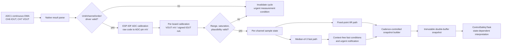

# Measurement Pipeline Detailed Design

## 1. Document control

| Field | Value |
|---|---|
| Document ID | `RCC-FW-FDD-002` |
| Project | Robot Charge Controller |
| Applicable hardware variant | Split Board Design — Control Board + Relay Board |
| Record revision | Draft 0.1 |
| Status | Under review |
| Prepared at | 2026-09-03, Asia/Bangkok (UTC+07:00) |
| Prepared by | Codex drafting support, based on the controlled inputs and the user-selected per-sample dual-path design |
| Requirements source | `RCC-FW-SRS-001`, Draft 0.1 |
| Architecture source | `RCC-FW-ARCH-001`, Draft 0.2 |
| Interface source | `RCC-FW-ICD-001`, Draft 0.1 |
| FDD master source | `RCC-FW-FDD-000`, Draft 0.1 |
| Common-contract source | `RCC-FW-FDD-001`, Draft 0.1 |
| Current-sense calculation source | [INA240A2DR Output Calculation](../../04-calculations/INA240A2DR_Output_Calculation.md) |
| Platform API baseline | [ESP-IDF Programming Guide v6.1 — ESP32 ADC](https://docs.espressif.com/projects/esp-idf/en/v6.1/esp32/api-reference/peripherals/adc/index.html) |
| Firmware source baseline | Pre-implementation; no firmware source revision exists yet |
| Authoritative language | English |

This document defines the firmware measurement-pipeline implementation design. It
does not approve the analog hardware, certify measurement accuracy, accept residual
risk, define charging-state policy, or authorize a production release.

### 1.1 Revision history

| Revision | Date | Change |
|---|---|---|
| Draft 0.1 | 2026-09-03 | Initial ADC acquisition, INA240A2DR conversion, per-sample dual-path filtering, validity, freshness, and publication baseline |

## 2. Purpose, scope, and exclusions

This document specifies how `AdcAcquisitionTask` acquires, identifies, calibrates,
filters, qualifies, and publishes VOUT and IOUT measurements. It makes the algorithms
and failure behavior precise enough for implementation and verification while keeping
all unverified numeric limits evidence-bound.

### 2.1 In scope

- ADC1 continuous-mode acquisition for ADC1_CH6 and ADC1_CH7.
- DMA result parsing, channel-order validation, overrun detection, and timestamps.
- ESP-IDF ADC calibration followed by per-board end-to-end calibration.
- INA240A2DR nominal transfer model and its permitted firmware use.
- The selected per-sample fast and filtered processing paths.
- Measurement status, snapshot consistency, freshness, and urgent notification.
- Initialization, reset, reconfiguration, resource, concurrency, and verification rules.

### 2.2 Out of scope

- Charging-state interpretation of VOUT, relay commands, interlock decisions, and
  fault escalation; these belong to FDD-03 through FDD-05.
- Persistent `CAL_DATA` record encoding, staging, commit, and rollback; these belong
  to FDD-06 and FDD-07.
- External telemetry encoding and command payloads; these belong to the ICD and
  FDD-08.
- Final numeric sample rate, thresholds, dwell times, stale deadline, filter
  coefficient, ADC attenuation, and fault response deadline until their evidence is
  controlled.
- Approval of the INA240A2DR analog design or the ESP32 ADC operating range.

## 3. Controlled facts, assumptions, and evidence boundary

### 3.1 Controlled design inputs

| Item | Design input | Confidence |
|---|---|---|
| Current-sense IC | TI INA240A2DR, nominal gain 50 V/V | `confirmed` design intent; controlled BOM/hardware revision remains to be assigned |
| Shunt network | Three 2 mΩ shunts in parallel; nominal equivalent 0.6667 mΩ | `confirmed` by the current calculation record; layout and fitted values need hardware verification |
| IOUT zero reference | REF1 = 3.3 V and REF2 = 0 V, nominal output reference 1.65 V | `confirmed` by the current calculation record; tolerance needs verification |
| IOUT ADC input | `IOUT_MCU_ADC`, module pin 6, GPIO34, ADC1_CH6 | `confirmed` firmware allocation; split-board mapping needs controlled-revision verification |
| VOUT ADC input | `VOUT_MCU_ADC`, module pin 7, GPIO35, ADC1_CH7 | `confirmed` firmware allocation; split-board mapping and transfer function need verification |
| Acquisition model | ADC1 continuous DMA, fixed alternating IOUT then VOUT | `confirmed` architecture decision |
| Calibration model | ESP-IDF ADC calibration, then per-board end-to-end calibration | `confirmed` requirement |
| Filter model | Option A: validate and convert every sample, then feed a fast path and a filtered path | `confirmed` by user selection on 2026-09-03 |

### 3.2 Superseded evidence

The earlier INA241A2 calculation is not an input to this design. Its gain, shunt,
sensitivity, transfer equation, expected voltage, and expected ADC-code tables shall
not be copied into firmware, tests, calibration tools, or acceptance criteria. The
controlled calculation input for this document is
`INA240A2DR_Output_Calculation.md`.

### 3.3 Unverified inputs that block numeric release

The following remain `needs_verification`:

- controlled hardware revision, fitted INA240 package/orderable code, shunt values,
  polarity, Kelvin routing, REF network, and connector mapping;
- VOUT analog divider/conditioning transfer function and tolerances;
- ADC attenuation and the usable calibrated voltage range on the selected ESP32;
- analog source impedance, RC values, settling time, noise, crosstalk, and bandwidth;
- full-temperature end-to-end residual error and the SRS 25%-of-nearest-margin rule;
- final sample rate, DMA sizing, fast qualification count/time, snapshot cadence,
  stale deadline, IIR coefficient, task WCET, and fault-notification latency.

Consequently, symbolic constants in this document are requirements to derive, not
permission to insert convenient values.

## 4. Design decisions and invariants

### 4.1 Selected design

| Decision ID | Decision |
|---|---|
| `FDD-MEAS-ADR-001` | Use per-sample dual-path processing. Each parsed sample is channel-validated, ADC-calibrated, board-calibrated, and quality-checked before it enters either path. |
| Fast path | Fixed-size three-sample median spike rejection followed by time/consecutive qualification for magnitude conditions; structural acquisition failures bypass the median and invalidate immediately. |
| Filtered path | First-order fixed-point IIR per channel for telemetry and stable control comparisons. |
| Publication | Publish one immutable, age-stamped, self-consistent VOUT/IOUT snapshot at a fixed cadence independent of DMA frame boundaries. |
| Selection source | The project user selected Option A on 2026-09-03. |
| Rationale | It preserves early fault visibility while providing a stable control/telemetry value and keeps latency explicit and bounded. |

### 4.2 Measurement invariants

| ID | Invariant |
|---|---|
| `FDD-MEAS-INV-001` | Only `AdcAcquisitionTask` and `adc_port` access ADC driver/DMA storage. |
| `FDD-MEAS-INV-002` | Every conversion result is identified by ADC unit and channel; array position alone is not trusted. |
| `FDD-MEAS-INV-003` | IOUT and VOUT shall never be substituted, guessed, or relabeled after a pattern error. |
| `FDD-MEAS-INV-004` | A value used for a relay-enabling decision shall be present, fresh, calibrated, in calibrated range, not saturated, plausible, and part of a consistent snapshot. |
| `FDD-MEAS-INV-005` | Missing, stale, malformed, overrun, or uncalibrated input shall never be republished as new valid data. |
| `FDD-MEAS-INV-006` | No ISR performs parsing, calibration, filtering, logging, allocation, or domain policy. |
| `FDD-MEAS-INV-007` | No measurement component commands the relay or interprets VOUT using relay state. |
| `FDD-MEAS-INV-008` | All safety-path arithmetic uses fixed-width integer/fixed-point operations with checked 64-bit intermediates, explicit rounding, and explicit saturation/error behavior. |
| `FDD-MEAS-INV-009` | Monotonic timestamps, not task wakeup counts or wall-clock time, determine age and qualification durations. |
| `FDD-MEAS-INV-010` | Applying a different calibration or filter policy while operational is prohibited. |

## 5. Component and authority boundaries

| Component | Layer | Responsibility | Prohibited responsibility |
|---|---:|---|---|
| `rcc_platform_esp32/adc_backend` | L2 | Configure ESP-IDF ADC continuous driver, own static DMA/read buffers, parse native records, expose FDD-01 ADC batches | Engineering-unit conversion or safety policy |
| `rcc_measurement/adc_validator` | L4 | Validate driver status, sequence, unit, channel, format, timestamps, and completeness | Repair or infer malformed samples |
| `rcc_measurement/adc_calibration` | L4 adapter | Convert raw code to calibrated ADC-pin millivolts using the active ESP-IDF scheme | End-to-end board conversion |
| `rcc_measurement/board_calibration` | L4 | Apply active hardware-bound VOUT/IOUT calibration | Persist or activate staged calibration |
| `rcc_measurement/filter` | L4 | Median-of-three fast conditioning and fixed-point IIR | Fault escalation or charging policy |
| `rcc_measurement/quality` | L4 | Produce positive validity flags and context-free fast-condition bits | Map conditions to state transitions |
| `rcc_measurement/publisher` | L4 | Atomically publish immutable FDD-01 snapshots | Expose mutable internal state or DMA pointers |
| `ControlSafetyTask` | L4 | Interpret VOUT by relay state, enforce thresholds/dwells, map measurement conditions to faults/actions | Access ADC/DMA buffers directly |

## 6. End-to-end data flow



Pipeline order is normative. In particular, the nominal INA240 equation shall not be
applied directly to an idealized ADC code before ADC calibration.

## 7. ESP-IDF v6.1 ADC backend

### 7.1 Required public APIs

The production backend shall use the ESP-IDF v6.1 public APIs documented for ESP32:

- `esp_adc/adc_continuous.h`:
  `adc_continuous_new_handle()`, `adc_continuous_config()`,
  `adc_continuous_register_event_callbacks()`, `adc_continuous_start()`,
  `adc_continuous_read()`, `adc_continuous_parse_data()`,
  `adc_continuous_stop()`, and `adc_continuous_deinit()`;
- `esp_adc/adc_cali.h` and `esp_adc/adc_cali_scheme.h`:
  `adc_cali_check_scheme()`, `adc_cali_create_scheme_line_fitting()`,
  `adc_cali_raw_to_voltage()`, and
  `adc_cali_delete_scheme_line_fitting()`.

The implementation shall be compile-checked against the installed ESP-IDF v6.1
headers and pinned SDK revision before the target gate. Function availability shall
not be inferred from `latest` documentation.

### 7.2 Static driver configuration

| Field | Required design |
|---|---|
| Unit | `ADC_UNIT_1` only |
| Conversion mode | `ADC_CONV_SINGLE_UNIT_1` |
| Pattern | Fixed alternating ADC1_CH6 then ADC1_CH7 |
| Width | ESP32 supported 12-bit conversion format |
| Attenuation | `RCC_ADC_ATTEN` — release-controlled after range/error characterization |
| Sampling | `RCC_ADC_TOTAL_SAMPLE_HZ`; two alternating conversions mean each channel receives half the aggregate rate |
| Frame size | `RCC_ADC_CONV_FRAME_BYTES`, integral native-record and complete-pair multiple |
| Pool size | `RCC_ADC_POOL_BYTES`, derived from worst-case scheduling blockage and WCET |
| Pool flush | Disabled; loss shall be observable as overflow rather than concealed by silently replacing unread history |

`sample_freq_hz`, frame size, pool size, attenuation, and pattern are build-controlled
for the hardware revision. They are not remotely writable operational parameters.

### 7.3 Buffer and callback policy

- DMA/read and parsed-result arrays are statically allocated, aligned, and private to
  the backend/task.
- `adc_continuous_read_parse()` shall not be used in the safety path because its
  automatic buffer management conflicts with the no-dynamic-allocation rule.
- The backend calls `adc_continuous_read()` into static raw storage and then
  `adc_continuous_parse_data()` into static parsed storage.
- `on_conv_done` only wakes/notifies `AdcAcquisitionTask`.
- `on_pool_ovf` records a sticky overflow indication and wakes/notifies the task.
- If the ESP-IDF IRAM-safe option is enabled, callbacks and callback-accessed state
  shall satisfy the ESP-IDF IRAM/internal-memory constraints.
- A timeout, invalid driver state, parse error, or pool overflow produces explicit
  status; the backend does not return a previous batch as current.

## 8. Acquisition and sample validation

### 8.1 Expected sequence

The logical sequence is:

```text
IOUT(CH6), VOUT(CH7), IOUT(CH6), VOUT(CH7), ...
```

For every native result, the validator shall check:

1. driver/result validity;
2. ADC unit equals ADC1;
3. channel is CH6 or CH7 as expected;
4. order matches the alternating sequence;
5. raw code is representable and not at a configured rail/saturation guard;
6. acquisition timestamps are monotonic;
7. no overflow or discontinuity has invalidated the batch.

Unexpected unit/channel/order invalidates the affected acquisition cycle. The next
accepted cycle shall re-synchronize only on an observed CH6 followed by CH7; it shall
not reinterpret a lone CH7 as CH6 or combine samples across a discontinuity.

### 8.2 Pair completeness and statistics

Raw min/max/count statistics are updated only for identified samples. A publish cycle
requires at least one valid new sample for both channels after the previous publish.
If either channel is absent, the new snapshot is invalid rather than mixing a new
channel value with the previous channel value.

## 9. Calibration and engineering-unit conversion

### 9.1 Layered calibration chain

The conversion chain is:

```text
native raw code
  -> ESP-IDF line-fitting calibration
  -> calibrated ADC-pin millivolts
  -> hardware-revision-matched per-board transfer
  -> VOUT millivolts or signed IOUT milliamperes
```

The measurement status sets `RCC_MEAS_STATUS_CALIBRATED` only when both layers are
available, compatible, successfully applied, and within their validated ranges.

### 9.2 VOUT two-point transfer

For calibrated ADC-pin input `x_mv` and two ordered calibration points
`(x0_mv, y0_mv)` and `(x1_mv, y1_mv)`:

```text
vout_mv = y0_mv
          + round_div((x_mv - x0_mv) * (y1_mv - y0_mv),
                      (x1_mv - x0_mv))
```

The denominator shall be nonzero and positive, intermediates shall be signed 64-bit,
and the result shall be range-checked before narrowing. Operational extrapolation
outside the validated calibration interval is prohibited.

### 9.3 IOUT negative-zero-positive transfer

IOUT uses three ordered end-to-end points: negative `(xn, in)`, zero `(xz, iz)`, and
positive `(xp, ip)`. The negative segment is selected when `x_mv <= xz`; the positive
segment is selected when `x_mv > xz`. Each segment uses the same checked linear
interpolation form as VOUT.

Required calibration validation includes:

- `xn < xz < xp` and `in < iz < ip` for the controlled polarity;
- zero and endpoint residuals within the acceptance budget;
- correct hardware revision, schema, CRC/integrity, conditions, and validation state;
- sufficient range to cover every operational decision threshold plus its margin;
- no silent sign inversion or extrapolation.

The calibrated zero point is authoritative. Firmware shall not force zero current at
exactly 1650 mV.

### 9.4 INA240A2DR nominal analytical model

The current calculation defines:

```text
G       = 50 V/V
Rshunt  = 2 mΩ / 3 = 0.6667 mΩ nominal
Vref    = (3.3 V + 0 V) / 2 = 1.65 V nominal
```

Therefore:

```text
Vina_V  = 1.65 + I_A / 30
Vina_mV = 1650 + I_mA / 30
I_mA    = 30 * (Vina_mV - 1650)
```

Nominal checkpoints are:

| Current | INA240 output |
|---:|---:|
| -31.4 A | 0.603 V |
| -20 A | 0.983 V |
| 0 A | 1.650 V |
| +20 A | 2.317 V |
| +27.8 A | 2.577 V |
| +31.4 A | 2.697 V |

This model is permitted for design review, unit-test sanity vectors, manufacturing
calibration seed values, and gross polarity checks. It shall not replace active
per-board `CAL_DATA` in operational firmware.

The ideal equation `raw = V / 3.3 * 4095`, its ideal ADC-code table, and the nominal
24.18 mA/LSB estimate are analytical illustrations only. ESP32 ADC reference
variation, attenuation behavior, nonlinearity, and board tolerances make direct
production conversion from that equation prohibited.

### 9.5 Rounding and numerical behavior

- Use a single reviewed signed round-to-nearest division helper; define tie behavior
  in `rcc_math` and test positive and negative operands.
- Detect multiplication and addition overflow before narrowing.
- A mathematical error invalidates the affected channel and raises a context-free
  calibration/processing condition.
- Saturating an engineering value for telemetry shall also clear `IN_RANGE` and
  `PLAUSIBLE`; a saturated value is never suitable for relay enabling.
- Floating-point arithmetic is prohibited in ISR and normal safety-path processing.

## 10. ADC input-range finding

The current calculation shows that the INA240 output remains between its 0 V and
3.3 V supply rails over the stated current checkpoints. That alone does not establish
accurate ESP32 ADC measurement.

The ESP32 datasheet characterizes the calibrated ADC range at the highest attenuation
only to approximately 2450 mV, with degraded accuracy above that region. The nominal
INA240 values at +27.8 A (2577 mV) and +31.4 A (2697 mV) exceed that characterized
range.

| Finding ID | Assessment |
|---|---|
| `FDD-MEAS-FIND-001` | **High severity, `needs_verification`:** high positive current may place `IOUT_MCU_ADC` above the ADC range for which usable calibrated accuracy is established. Consequence can include inaccurate or delayed overcurrent detection on a high-energy charge path. |

Before numeric release, the project shall measure the actual ADC-pin voltage, confirm
the attenuation and fitted analog network, characterize error across current,
temperature, supply, and boards, and prove the SRS 25%-of-nearest-margin criterion.
If it fails, the analog scaling/range or decision architecture shall be revised. This
FDD does not declare the present hardware adequate.

## 11. Selected per-sample dual-path processing

### 11.1 Common precondition

Only a sample that passes structural validation and both calibration stages may enter
the magnitude-processing paths. Structural failures immediately invalidate the
acquisition cycle and notify Control; they are not delayed by a median or IIR.

### 11.2 Fast path

For each channel, retain the latest three valid engineering-unit samples and compute:

```text
fast_value = median(sample[n-2], sample[n-1], sample[n])
```

The median rejects one isolated spike in a three-sample window. It adds a bounded
latency of at most one channel sample interval after the window is primed. That delay
shall be included in `T_ADC_FAULT_MAX` analysis.

Magnitude conditions are then qualified using explicit monotonic start time and/or
consecutive-count state. The exact mapping of overvoltage, overcurrent, reverse
current, and their assertion/release dwell belongs to FDD-03. This module reports
only context-free condition bits and their earliest observation time.

The following bypass magnitude qualification and assert an urgent measurement
condition immediately:

- DMA/pool overrun or driver failure;
- missing, invalid, unexpected, or reordered channel result;
- calibration absence/incompatibility/arithmetic failure;
- configured raw rail guard or ADC/board-calibration range violation;
- non-monotonic timing or processing discontinuity.

### 11.3 Filtered path

Each channel uses a first-order fixed-point IIR:

```text
delta   = x[n] - y[n-1]
y[n]    = y[n-1] + round_div(alpha_q * delta, 2^Q)
0 < alpha_q <= 2^Q
```

`alpha_q`, `Q`, and the per-channel sample rate are release-controlled constants.
The implementation uses checked signed 64-bit multiplication and a fixed-width
engineering-unit state.

Initialization and discontinuity rules:

- on the first valid sample, set `y = x` rather than ramping from zero;
- keep independent VOUT and IOUT state;
- reset the median and IIR when acquisition restarts, a discontinuity occurs, active
  calibration revision changes, or a channel becomes invalid beyond the allowed
  gap;
- after reset, clear `FRESH` until both paths and the required pair are re-primed;
- never feed an invalid sample or repeat the last sample as though newly acquired.

### 11.4 Strategy restriction

Median/IIR implementations may conform to compile-time strategy interfaces for host
testing and future controlled revisions. Production shall bind exactly one reviewed
policy per hardware/build profile. Arbitrary runtime filter switching is prohibited.

## 12. Quality and validity model

### 12.1 Channel status

The positive flags defined by FDD-01 are set independently for VOUT and IOUT:

| Flag | Set only when |
|---|---|
| `PRESENT` | At least one identified new sample exists in the publish interval |
| `FRESH` | The newest accepted sample age is within `RCC_MEAS_STALE_US` and no discontinuity invalidates it |
| `CALIBRATED` | ESP-IDF and board calibration both applied successfully using compatible active data |
| `IN_RANGE` | Raw/ADC-pin/engineering values are inside validated calibration coverage |
| `NOT_SATURATED` | Raw rail guards and analog/engineering saturation guards are clear |
| `PLAUSIBLE` | Rate/change and cross-check rules applicable without relay context pass |

The operational required mask is all six flags. A consumer shall compare using the
full required mask, not treat any nonzero status as valid.

### 12.2 Plausibility boundary

Measurement may check context-free properties such as impossible numerical jump,
frozen sequence, calibration discontinuity, or physically impossible encoded value.
It shall not decide:

- whether VOUT means charger request or charging voltage;
- whether current direction is permitted in the current control state;
- whether a threshold starts, ends, or rearms a charging session;
- whether the relay should open or close.

Those checks require state context and belong to Control/Fault Supervisor.

## 13. Snapshot publication and freshness

The publisher populates `rcc_measurement_snapshot_t` from one coherent publish cycle:

- `vout_mv` and `iout_ma` are the latest valid board-calibrated values;
- `vout_filtered_mv` and `iout_filtered_ma` are IIR outputs;
- channel and snapshot status describe the data in that same sequence;
- raw statistics cover only the defined publish interval;
- `acquisition_started_us`, `acquisition_completed_us`, and `published_us` are
  monotonic and ordered;
- `earliest_fast_condition_us` is the earliest still-active condition observation;
- hardware and calibration revisions identify the conversion context.

Publication uses the FDD-01 immutable double-buffer/sequence-counter contract. The
writer completes an inactive slot before publishing its sequence. Readers reject a
torn/inconsistent sequence and independently recompute age from the monotonic time
port; a stored `FRESH` flag alone is not sufficient.

Snapshot cadence `RCC_MEAS_PUBLISH_PERIOD_US` is independent of DMA frame size.
Failure to publish before the stale deadline clears freshness and raises
`RCC_URGENT_MEASUREMENT_FAULT`. No last-known-good snapshot can authorize relay ON.

## 14. Fast-condition notification

The measurement task atomically updates `fast_condition_mask` and notifies
`ControlSafetyTask` with `RCC_URGENT_MEASUREMENT_FAULT` whenever a newly asserted
urgent measurement condition occurs. The normal snapshot remains the detailed source
for sequence, values, status, and timestamps.

Notification rules:

- notification is edge-assisted but state is level-readable, so coalescing does not
  lose the active condition;
- urgent notification never waits for a telemetry or command queue;
- clearing a measurement condition does not clear a fault/inhibit; Control owns that
  policy;
- repeated notification may be rate-limited only if the active level remains visible
  and the response deadline remains proven.

## 15. Lifecycle and reconfiguration

### 15.1 Initialization

1. Validate build profile, pin map, buffer geometry, and time service.
2. Validate the active hardware-bound `CAL_DATA` metadata and coefficients.
3. Create the supported ESP32 ADC line-fitting calibration handle.
4. Create/configure the continuous ADC handle and callbacks.
5. Clear all filter, sequence, statistics, and publication state.
6. Start acquisition and wait for a fully valid, primed channel pair.
7. Publish valid data only after required status and freshness conditions pass.

Any failed mandatory step leaves measurement unavailable and reports the condition to
Control. Boot orchestration decides `SERVICE_LOCK`/fault behavior.

### 15.2 Stop and restart

Stop acquisition before deleting calibration or ADC handles. A restart increments
the acquisition generation/sequence context, clears filter priming, and cannot reuse
pre-restart samples.

### 15.3 Applying calibration

New calibration may become active only through the controlled FDD-06 workflow with
relay OFF. The measurement task shall quiesce acquisition, atomically replace the
immutable active calibration reference, reset all processing state, restart, and
require re-priming. Partial or live coefficient replacement is prohibited.

## 16. Timing, capacity, and resource budgets

| Symbol | Meaning | Derivation/acceptance evidence | Status |
|---|---|---|---|
| `RCC_ADC_TOTAL_SAMPLE_HZ` | Aggregate alternating conversion rate | Analog settling/bandwidth, target ADC behavior, noise and latency tests | `needs_verification` |
| `RCC_ADC_CONV_FRAME_BYTES` | Driver conversion-frame size | Native record size, complete channel pairs, notification/WCET tradeoff | `needs_verification` |
| `RCC_ADC_POOL_BYTES` | Internal driver pool capacity | Worst-case scheduler blockage plus margin; target overflow test | `needs_verification` |
| `RCC_MEAS_PUBLISH_PERIOD_US` | Snapshot publication period | Control/telemetry need and measured WCET | `needs_verification` |
| `RCC_MEAS_STALE_US` | Maximum usable sample/snapshot age | End-to-end hazard response allocation | `needs_verification` |
| `RCC_MEAS_IIR_ALPHA_Q` | Filter coefficient(s) | Noise/settling characterization and threshold-margin analysis | `needs_verification` |
| `RCC_ADC_RAIL_GUARD_RAW` | Raw saturation guard | ESP32 characterization and board calibration coverage | `needs_verification` |
| `T_ADC_FAULT_MAX` | Measurement fault-to-required-action budget | Fast-path latency + scheduler + Control + relay timing | `needs_verification` |

The target build shall statically assert buffer alignment, native-record divisibility,
complete-pair frame geometry, integer widths, and legal ADC pattern count. Target
instrumentation shall measure WCET/high-water marks without becoming a production
dependency.

## 17. Failure containment

| Failure | Detection | Measurement response | Control-visible result |
|---|---|---|---|
| ADC start/read/parse failure | Driver status | Invalidate cycle; do not republish old data | Urgent measurement condition + invalid snapshot |
| DMA pool overflow | `on_pool_ovf` sticky indication | Mark discontinuity; reset processing state | Urgent measurement condition |
| Missing/reordered/wrong channel | Per-result validator | Reject cycle; re-synchronize on CH6→CH7 | Invalid snapshot; urgent condition |
| Raw/ADC saturation or out of calibrated range | Range guards | Clear positive validity flags | Invalid channel + condition bit |
| Invalid/incompatible `CAL_DATA` | Boot and conversion checks | Do not calculate operational value | Calibration invalid; boot/control remains conservative |
| Arithmetic overflow/divide error | Checked math | Reject result | Processing/calibration condition |
| Frozen/stale acquisition | Sequence and monotonic age | Clear `FRESH`; no stale republish | Urgent measurement condition |
| IIR/median unprimed after restart | Explicit priming state | Withhold valid publication | Snapshot invalid until primed |
| Snapshot tear | Sequence-counter read check | Reader retries/rejects | No inconsistent values consumed |

## 18. Internal interfaces

Illustrative internal signatures; FDD-01 public contracts remain authoritative:

```c
rcc_status_t rcc_meas_validate_sample(
    const adc_continuous_data_t *native,
    rcc_adc_channel_t expected,
    rcc_adc_raw_sample_t *sample_out);

rcc_status_t rcc_meas_adc_pin_mv(
    rcc_adc_channel_t channel,
    uint16_t raw_code,
    int32_t *adc_pin_mv_out);

rcc_status_t rcc_meas_apply_vout_cal(
    const rcc_calibration_view_t *cal,
    int32_t adc_pin_mv,
    uint32_t *vout_mv_out);

rcc_status_t rcc_meas_apply_iout_cal(
    const rcc_calibration_view_t *cal,
    int32_t adc_pin_mv,
    int32_t *iout_ma_out);

void rcc_meas_process_valid_sample(
    rcc_adc_channel_t channel,
    int32_t engineering_value,
    rcc_monotonic_us_t acquired_us);
```

Implementations shall not expose `adc_continuous_data_t` outside the ESP32 adapter/
validator boundary. Exact calibration object fields are finalized in FDD-06.

## 19. Verification design

### 19.1 Host/unit tests

| Test ID | Required coverage |
|---|---|
| `FDD-MEAS-UT-001` | Nominal INA240 checkpoints, polarity, and units from the current calculation record |
| `FDD-MEAS-UT-002` | VOUT two-point and IOUT negative/zero/positive interpolation, endpoints, rounding, and segment boundary |
| `FDD-MEAS-UT-003` | Invalid ordering, zero denominator, overflow, incompatible revision, and out-of-range rejection |
| `FDD-MEAS-UT-004` | Median-of-three permutations, one-sample spikes, priming, reset, and invalid-sample exclusion |
| `FDD-MEAS-UT-005` | Fixed-point IIR reference vectors, positive/negative delta, rounding, overflow, and reset |
| `FDD-MEAS-UT-006` | Status-mask truth table and prohibition on stale/partial-pair publication |
| `FDD-MEAS-UT-007` | Sequence-counter publication/read consistency under interleaving |
| `FDD-MEAS-UT-008` | Monotonic age and wrap-safe/boundary duration behavior for the selected time type |

### 19.2 Target integration tests

| Test ID | Required coverage |
|---|---|
| `FDD-MEAS-TGT-001` | Compile and run against pinned ESP-IDF v6.1; verify line-fitting scheme availability and API signatures |
| `FDD-MEAS-TGT-002` | Confirm every parsed record reports ADC1_CH6/CH7 in the expected pattern and raw format |
| `FDD-MEAS-TGT-003` | Inject task blockage to prove pool-overflow detection, discontinuity handling, and no stale republish |
| `FDD-MEAS-TGT-004` | Measure acquisition-to-notification and acquisition-to-publication latency, WCET, stack, and pool margin |
| `FDD-MEAS-TGT-005` | Verify restart/calibration replacement clears state and requires re-priming |

### 19.3 Bench/HIL tests

| Test ID | Required coverage |
|---|---|
| `FDD-MEAS-BENCH-001` | Apply traceable VOUT and signed IOUT points across required range and temperature; record ADC-pin voltage, raw code, calibrated output, error, and uncertainty |
| `FDD-MEAS-BENCH-002` | Characterize noise, settling, crosstalk, source impedance/RC interaction, and selected sample/filter response |
| `FDD-MEAS-BENCH-003` | Specifically verify +20 A, +27.8 A, and +31.4 A ADC range/error behavior or the final revised range |
| `FDD-MEAS-BENCH-004` | Prove residual error is at most 25% of the nearest margin for every operational threshold |
| `FDD-MEAS-HIL-001` | Missing/reordered/frozen/saturated inputs cause the required conservative response within the derived deadline |

The ideal INA240 table is not bench acceptance evidence. Reference equipment,
fixture, uncertainty, temperature, supply, board serial, hardware revision, firmware
build, and calibration revision shall be recorded.

## 20. Traceability

| Design area | Upstream source | Verification |
|---|---|---|
| ADC pins and alternating DMA | SRS 5.1, 5.3; `ADR-FW-003`; FDD-01 ADC port | `FDD-MEAS-TGT-001` through `003` |
| Layered per-board calibration | SRS 12.4; Architecture 10 and 18 | `FDD-MEAS-UT-002`, `003`; `FDD-MEAS-BENCH-001`, `004` |
| Current conversion | Current INA240A2DR calculation record | `FDD-MEAS-UT-001`; `FDD-MEAS-BENCH-001`, `003` |
| Fresh immutable snapshot | SRS 5.3 and 8; Architecture 8–10; FDD-01 | `FDD-MEAS-UT-006` through `008`; `FDD-MEAS-TGT-004` |
| Measurement fault containment | `FW-ARC-007`, `FW-ADC-001`; FDD master safety rules | `FDD-MEAS-TGT-003`; `FDD-MEAS-HIL-001` |
| Threshold accuracy margin | SRS 12.4 and 15 | `FDD-MEAS-BENCH-004` |

## 21. Open actions

| Action ID | Required action | Closure evidence | Status |
|---|---|---|---|
| `FDD-MEAS-ACT-001` | Assign the controlled hardware revision and verify IC/package, shunts, REF network, polarity, Kelvin points, connector, CH6, and CH7 mapping | Reviewed schematic/BOM/assembled-board records | `needs_verification` |
| `FDD-MEAS-ACT-002` | Replace every INA241A2-derived firmware/test value with the INA240A2DR model or board calibration source | Repository search + review record | `needs_verification` |
| `FDD-MEAS-ACT-003` | Verify installed ESP-IDF version/tag, exact v6.1 headers, ADC API signatures, and calibration scheme on target | Build log and target spike | `needs_verification` |
| `FDD-MEAS-ACT-004` | Resolve `FDD-MEAS-FIND-001` by proving ADC accuracy/range or revising analog scaling | Calculation, bench report, and reviewed hardware decision | `needs_verification` |
| `FDD-MEAS-ACT-005` | Characterize both analog channels and derive attenuation, sample rate, pool/frame sizes, rail guards, median/IIR parameters, cadence, and stale deadline | Analysis plus target/bench data | `needs_verification` |
| `FDD-MEAS-ACT-006` | Define/freeze FDD-06 calibration schema, units, interpolation points, range, residual acceptance, and revision binding | Reviewed FDD-06 + schema tests | `needs_verification` |
| `FDD-MEAS-ACT-007` | Allocate and verify the complete `T_ADC_FAULT_MAX` timing chain including median, scheduler, Control, and relay | Timing budget + target/HIL evidence | `needs_verification` |
| `FDD-MEAS-ACT-008` | Verify integer-millivolt API quantization plus filtering/calibration resolution meets every decision margin | Error budget and bench results | `needs_verification` |

## 22. Review gate

| Field | Assessment |
|---|---|
| Assessment | `recommended_conditional_pass` for proceeding to adjacent detailed-design documents; not for numeric release or production implementation freeze |
| Confirmed basis | User-selected Option A; ADC1 CH6/CH7 architecture; layered calibration requirement; current INA240A2DR nominal calculation |
| Principal unresolved risk | `FDD-MEAS-FIND-001`: nominal high-current INA240 output exceeds the approximately 2.45 V ESP32 ADC range for which calibrated accuracy is characterized |
| Other residual risks | Hardware revision/mapping, VOUT transfer, analog settling/noise, numerical budgets, task/DMA capacity, calibration residuals, and response timing are not yet verified |
| Required human decision | Review this design baseline and close the open actions with controlled evidence; human design authority retains approval and release decisions |
