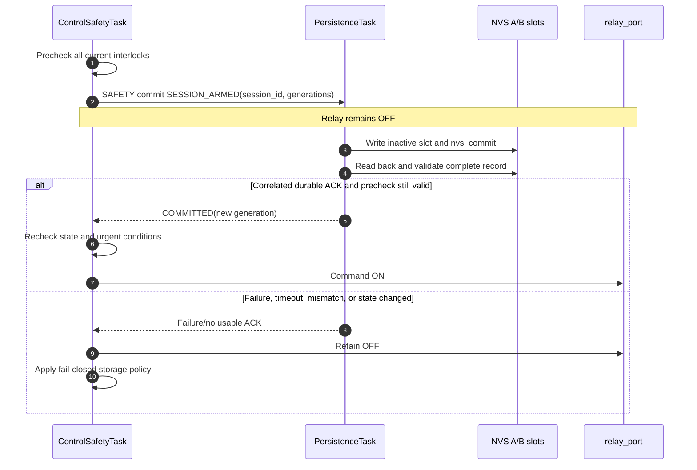
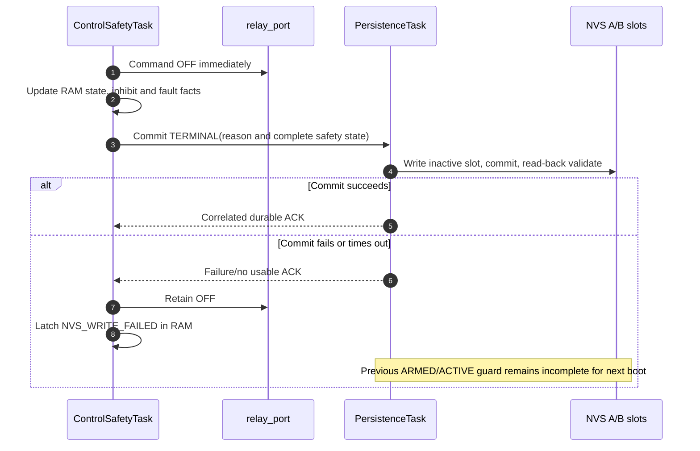

# Persistence and Session Guard Detailed Design

## 1. Document control

| Field | Value |
|---|---|
| Document ID | `RCC-FW-FDD-003` |
| Project | Robot Charge Controller |
| Applicable hardware variant | Split Board Design — Control Board + Relay Board |
| Record revision | Draft 0.1 |
| Status | Under review |
| Prepared at | 2026-09-03, Asia/Bangkok (UTC+07:00) |
| Prepared by | Codex drafting support, based on controlled inputs and the user-selected self-contained A/B slot design |
| Requirements source | `RCC-FW-SRS-001`, Draft 0.1 |
| Architecture source | `RCC-FW-ARCH-001`, Draft 0.2 |
| Interface source | `RCC-FW-ICD-001`, Draft 0.1 |
| FDD master source | `RCC-FW-FDD-000`, Draft 0.1 |
| Common-contract source | `RCC-FW-FDD-001`, Draft 0.1 |
| Measurement source | `RCC-FW-FDD-002`, Draft 0.1 |
| Platform API baseline | [ESP-IDF Programming Guide v6.1 — ESP32 NVS](https://docs.espressif.com/projects/esp-idf/en/v6.1/esp32/api-reference/storage/nvs_flash.html) |
| Reset API baseline | [ESP-IDF Programming Guide v6.1 — ESP32 Miscellaneous System APIs](https://docs.espressif.com/projects/esp-idf/en/v6.1/esp32/api-reference/system/misc_system_api.html) |
| Firmware source baseline | Pre-implementation; no firmware source revision exists yet |
| Authoritative language | English |

This document defines firmware persistence mechanisms and session-interruption
evidence. It does not authorize a relay transition, define fault-clearing policy,
approve flash endurance, certify safety, accept residual risk, or authorize release.

### 1.1 Revision history

| Revision | Date | Change |
|---|---|---|
| Draft 0.1 | 2026-09-03 | Initial versioned-record, self-contained A/B slot, priority, write-ahead session guard, recovery, and power-cut baseline |

## 2. Purpose, scope, and exclusions

This document specifies how `PersistenceTask` stores, validates, selects, updates,
and acknowledges durable state. It also defines the session write-ahead guard that
prevents an interrupted charge session from restarting autonomously without the
required reset/re-arm policy.

### 2.1 In scope

- persistent record envelope, byte encoding, compatibility, and integrity;
- self-contained A/B slots and rollover-safe generation selection;
- boot validation and deterministic power-cut recovery;
- safety, configuration, calibration, identity, and diagnostic record domains;
- session guard states and write-ahead/terminal ordering;
- reset evidence supplied to FDD-04 and FDD-05;
- request priority, correlated durability acknowledgment, concurrency, memory, and
  bounded behavior;
- NVS error handling, capacity/endurance policy, and verification.

### 2.2 Out of scope

- qualification, escalation, and clearing semantics for fault/inhibit bits; FDD-04
  owns those policies;
- charging state transitions, interlock evaluation, and relay timing; FDD-05 owns
  those decisions;
- configuration/calibration payload fields and semantic validation; FDD-06 owns
  those schemas;
- persistent diagnostic event payloads and external reporting; FDD-10 owns those;
- final FreeRTOS queue depths, task priority numbers, stack sizes, and watchdog
  timing; FDD-09 and FDD-11 own the integrated resource budget;
- final NVS partition size, flash endurance, security configuration, and product
  threat model until controlled evidence is available.

## 3. Context and evidence boundary

### 3.1 Controlled inputs

| Input | Consequence | Confidence |
|---|---|---|
| Relay-open safe state | Persistence failure never justifies relay ON | `confirmed` design intent |
| `SESSION_ARMED` before relay ON | Durable correlated ACK is a relay-closing precondition | `confirmed` by `FW-SES-002` and `ARCH-INV-004` |
| Persistent inhibit/fault/session state | Safety record is highest priority and fail closed | `confirmed` by SRS Sections 10–11 |
| ESP-IDF NVS | Values become durably committed only after successful `nvs_commit()` | `datasheet_supported` by ESP-IDF v6.1 API documentation |
| Reset classification | L2 maps `esp_reset_reason()` into the portable FDD-01 reset classes | `confirmed` design contract; target mapping needs verification |
| Two-slot model | Each controlled domain uses self-contained A/B slots with no active-pointer record | `confirmed` by user selection on 2026-09-03 |

### 3.2 Unverified inputs

The following remain `needs_verification` and block a production persistence gate:

- exact ESP-IDF v6.1 tag/commit and target NVS failure behavior;
- NVS partition label, size, encryption policy, provisioning process, and recovery
  authorization;
- fitted flash part endurance/retention and project mission-profile write count;
- worst-case `nvs_commit()`/read-back latency, queue wait, watchdog interaction, and
  brownout behavior;
- configuration, calibration, fault, and diagnostic payload sizes;
- availability and effectiveness of power-fail energy hold-up, if any;
- product security/tamper requirements. CRC detects accidental corruption; it is not
  authentication and does not protect against a capable malicious writer.

## 4. Selected architecture and invariants

### 4.1 Atomic-generation decision

| Field | Decision |
|---|---|
| Decision ID | `FDD-PST-ADR-001` |
| Selected design | Two self-contained slots, A and B, for each controlled record domain; no separately committed active pointer |
| Write sequence | Select inactive/older slot → encode complete new blob → write → commit → read back → validate and compare → publish ACK |
| Boot selection | Validate both slots independently and select the unambiguously newest valid generation |
| Selection source | User selected Option A on 2026-09-03 |
| Rationale | A torn or corrupt candidate cannot invalidate the previous slot, and recovery does not depend on coordinating a payload with a second active-pointer update |
| Alternatives not selected | A/B plus active pointer adds another power-cut boundary; an append-only journal adds reclaim, capacity, and recovery complexity not required by the present safety state |

### 4.2 Persistence invariants

| ID | Invariant |
|---|---|
| `FDD-PST-INV-001` | `PersistenceTask` is the only normal run-time caller of the NVS storage port. |
| `FDD-PST-INV-002` | A safety write failure or ambiguous result never permits relay ON. |
| `FDD-PST-INV-003` | `SESSION_ARMED` is durably committed and correlated before Control may issue relay ON. |
| `FDD-PST-INV-004` | STOP, fault, completion, or shutdown commands relay OFF before requesting terminal persistence. |
| `FDD-PST-INV-005` | A terminal-write failure leaves the previous `ARMED`/`ACTIVE` generation intact so the next boot detects an interrupted session. |
| `FDD-PST-INV-006` | Unknown schema, invalid length/CRC, incompatible revision, or ambiguous newest generation is never treated as valid default data. |
| `FDD-PST-INV-007` | Configuration and calibration staging cannot modify the currently selected valid generation until the complete candidate is validated and committed. |
| `FDD-PST-INV-008` | Safety requests cannot be blocked by diagnostic queue or storage-pool exhaustion. |
| `FDD-PST-INV-009` | No telemetry sample, periodic heartbeat, or task-loop activity is written to NVS. |
| `FDD-PST-INV-010` | A successful NVS API call is not a safety acknowledgment until read-back validation succeeds and the request correlation matches. |
| `FDD-PST-INV-011` | Automatic whole-partition erase on initialization error is prohibited in production. |
| `FDD-PST-INV-012` | Persistence reports facts and durability; it does not clear inhibits, select a control state, or command the relay. |

## 5. Component and authority boundaries

| Component | Layer | Responsibility | Prohibited responsibility |
|---|---:|---|---|
| `rcc_platform_esp32/nvs_backend` | L2 | Initialize/open NVS, bounded blob read/write/commit, health mapping | Record selection, CRC policy, session semantics, raw recovery erase |
| `rcc_persistence/codec` | L3 | Explicit little-endian encode/decode, length/range/reserved-field checks, CRC | Native-struct serialization |
| `rcc_persistence/selector` | L3 | Validate A/B slots and choose newest valid generation | Repair ambiguous/corrupt state by guessing |
| `rcc_persistence/transaction` | L3 | Expected-generation check, target-slot write, commit, read-back, ACK | Relay or state-machine action |
| `rcc_persistence/session_guard` | L3 | Encode/decode session evidence and expose completeness state | Decide whether reset inhibit may clear |
| `PersistenceTask` | L3 runtime | Own serialized NVS access, queues, buffers, priorities, and lifecycle | Wait on telemetry or external communication |
| `rcc_config` / `rcc_calibration` | L4 | Build and semantically validate candidate payloads | Call NVS directly |
| `rcc_fault` / `rcc_control` | L4 | Decide desired safety state and respond to persistence ACK/failure | Modify persistent bytes or claim durability before ACK |
| `rcc_app` | L5 | Force relay OFF, initialize ports, load validation result, compose tasks | Treat missing/invalid safety data as factory defaults |

## 6. Record domains and priority

| Domain symbol | Domain ID | Examples | Required at boot | Priority | Payload owner |
|---|---:|---|---|---|---|
| `RCC_PST_DOMAIN_SAFETY` | 1 | Inhibit mask, latched faults, session guard, terminal reason, reset evidence | Yes | Safety | FDD-03 envelope; FDD-04 safety semantics |
| `RCC_PST_DOMAIN_CONFIG` | 2 | Active operational configuration | Yes for operation | Configuration | FDD-06 |
| `RCC_PST_DOMAIN_CALIBRATION` | 3 | Board-bound `CAL_DATA` | Yes for operation | Configuration | FDD-06 |
| `RCC_PST_DOMAIN_IDENTITY` | 4 | Boot counter/identity and controlled sequence checkpoint | Yes | Configuration | FDD-03/FDD-10 |
| `RCC_PST_DOMAIN_DIAGNOSTIC` | 5 | Bounded critical-event summary/index | No | Diagnostic | FDD-10 |

Unknown domain IDs are invalid. Safety, configuration, calibration, and identity use
the A/B algorithm. The bounded diagnostic ring may use multiple self-contained entry
keys plus an A/B index; it shall not share or consume reserved safety request/buffer
capacity.

## 7. NVS partition, namespace, and key registry

The baseline logical registry is:

| Item | Name | Rule |
|---|---|---|
| Partition label | `rcc_data` | Dedicated data/NVS partition; final size and encryption policy are release-controlled |
| Controlled namespace | `rcc_pst` | Contains A/B controlled records |
| Safety slots | `safe_a`, `safe_b` | Self-contained safety records |
| Configuration slots | `cfg_a`, `cfg_b` | Self-contained configuration envelopes/payloads |
| Calibration slots | `cal_a`, `cal_b` | Self-contained calibration envelopes/payloads |
| Identity slots | `ident_a`, `ident_b` | Self-contained identity records |
| Diagnostic namespace | `rcc_diag` | Optional bounded diagnostic ring owned by FDD-10 |

All names fit the ESP-IDF NVS key length limit. The numeric `rcc_storage_key_t`
mapping to these names is a private, compile-controlled L2 table. A received command
or persistent payload cannot supply an arbitrary namespace/key.

Production initialization uses `nvs_flash_init_partition()` and
`nvs_open_from_partition()` or their exact v6.1 equivalents through the L2 backend.
If initialization reports no free pages, new-version incompatibility, corruption, or
another destructive-recovery condition, firmware retains relay OFF and exposes
service recovery. It shall not automatically call partition erase and continue.

## 8. Canonical record envelope

### 8.1 Serialized layout

Each A/B blob is encoded explicitly in little-endian order. It is not a native C ABI.

| Offset | Field | Width | Validation |
|---:|---|---:|---|
| 0 | `magic` | 4 | `0x50434352`, serialized as ASCII bytes `RCCP` in little-endian order |
| 4 | `schema_version` | 2 | Exact supported version or defined compatible migration |
| 6 | `header_length` | 2 | Equals the controlled header length for this schema |
| 8 | `total_length` | 4 | Header + payload + trailing CRC; bounded by domain capacity |
| 12 | `record_domain` | 2 | Matches the NVS slot registry |
| 14 | `flags` | 2 | Unknown/reserved bits shall be zero |
| 16 | `generation` | 4 | Compared with the rollover-safe rule in Section 10 |
| 20 | `payload_length` | 4 | Equals `total_length - header_length - 4` |
| 24 | `hardware_revision` | 4 | Required compatibility binding where domain policy applies |
| 28 | `producer_schema_min` | 2 | Lowest reader schema intended to accept this payload |
| 30 | `producer_schema_max` | 2 | Highest reader schema intended to accept this payload |
| 32 | `payload` | bounded | Domain-specific explicitly encoded bytes |
| final 4 | `record_crc32` | 4 | CRC over all preceding serialized bytes in the record |

`header_length` is 32 bytes for schema version 1. All arithmetic that derives sizes
uses checked 64-bit intermediates before conversion to the bounded `uint32_t` sizes.
No padding, pointer, enum object representation, or compiler bitfield is serialized.

### 8.2 CRC definition

Schema version 1 uses CRC-32/ISO-HDLC:

| Parameter | Value |
|---|---|
| Polynomial | `0x04C11DB7` normal representation (`0xEDB88320` reflected implementation) |
| Initial value | `0xFFFFFFFF` |
| Reflect input/output | Yes |
| Final XOR | `0xFFFFFFFF` |
| Check value for ASCII `123456789` | `0xCBF43926` |

The codec owns a portable reviewed implementation or verified ESP-IDF adapter and
golden vectors. CRC provides accidental-corruption detection only, not authenticity.

### 8.3 Compatibility rules

- Unsupported major/schema encoding is invalid; there is no best-effort field parse.
- Length, domain, reserved flags, hardware binding, and payload semantic validation
  all pass before a slot becomes selectable.
- Configuration/calibration compatibility follows FDD-06 and may be stricter than
  the common envelope.
- Safety records with unknown inhibit/fault bits remain conservative and are not
  automatically cleared. FDD-04 defines whether they cause `SERVICE_LOCK` or a
  retained unknown safety condition.
- Migration, if later required, reads a supported old schema into RAM, validates the
  transformed object, and commits a new generation through the normal transaction.
  In-place byte patching is prohibited.

## 9. Safety-record payload

### 9.1 Session guard states

```c
typedef enum {
    RCC_SESSION_GUARD_CLEAR = 0,
    RCC_SESSION_GUARD_ARMED = 1,
    RCC_SESSION_GUARD_ACTIVE = 2,
    RCC_SESSION_GUARD_TERMINAL = 3
} rcc_session_guard_state_t;
```

| State | Durable meaning | Boot interpretation |
|---|---|---|
| `CLEAR` | Provisioned safety state exists; no session has yet been armed | No interruption solely from the guard |
| `ARMED` | Precheck passed and a session may have commanded relay ON; terminal outcome is absent | Incomplete session; retain/set `RESET_INHIBIT` |
| `ACTIVE` | Charging establishment was observed after relay close; terminal outcome is absent | Incomplete active session; retain/set `RESET_INHIBIT` |
| `TERMINAL` | Relay OFF was commanded and terminal cause/safety state was committed | No incomplete guard; other reset/inhibit rules still apply |

`CLEAR` is allowed only for factory/service provisioning before the first session or
after an explicitly controlled factory reset. Normal session termination uses
`TERMINAL` so the reason and history are not erased.

### 9.2 Terminal reasons

```c
typedef enum {
    RCC_SESSION_TERM_NONE = 0,
    RCC_SESSION_TERM_COMPLETE = 1,
    RCC_SESSION_TERM_REMOTE_STOP = 2,
    RCC_SESSION_TERM_RECOVERABLE_FAULT = 3,
    RCC_SESSION_TERM_LATCHED_FAULT = 4,
    RCC_SESSION_TERM_NOT_ESTABLISHED = 5,
    RCC_SESSION_TERM_MAX_DURATION = 6,
    RCC_SESSION_TERM_INTERRUPTED_RESET = 7,
    RCC_SESSION_TERM_START_ABORTED = 8
} rcc_session_terminal_reason_t;
```

These are internal logical symbols. Final fault/reason registry alignment belongs to
FDD-04/FDD-05 and explicit codecs; numeric values shall not be copied directly to an
external wire protocol.

### 9.3 Payload fields

The schema-v1 safety payload contains, in explicit fixed-width encoding:

| Field | Logical type | Rule |
|---|---|---|
| `inhibit_mask` | `rcc_inhibit_mask_t` | Independent bits coexist; unknown bits are conservative |
| `latched_fault_mask` | `rcc_fault_mask_t` | Detailed policy/registry owned by FDD-04 |
| `primary_fault` | `rcc_fault_id_t` | Diagnostic summary; mask/policy remains authoritative |
| `guard_state` | `rcc_session_guard_state_t` | One valid state from Section 9.1 |
| `terminal_reason` | `rcc_session_terminal_reason_t` | `NONE` for `ARMED/ACTIVE`; non-`NONE` for `TERMINAL` |
| `session_id` | `rcc_session_id_t` | Nonzero for `ARMED/ACTIVE/TERMINAL` session records |
| `session_start_kind` | `rcc_session_start_kind_t` | Autonomous or remote source, never inferred after reset |
| `session_source_interface` | `rcc_source_interface_t` | `NONE` for autonomous; trusted source for remote start |
| `session_boot_id` | `rcc_boot_id_t` | Boot in which the session was armed |
| `armed_at_us` | `rcc_monotonic_us_t` | Diagnostic ordering within `session_boot_id`; not compared across boots |
| `active_at_us` | `rcc_monotonic_us_t` | Zero until ACTIVE; diagnostic only |
| `terminal_at_us` | `rcc_monotonic_us_t` | Zero until TERMINAL; diagnostic only |
| `config_generation` | `rcc_generation_t` | Active config used at arming |
| `calibration_generation` | `rcc_generation_t` | Active CAL_DATA used at arming |
| `last_reset_class` | `rcc_reset_class_t` | Portable reset classification recorded by boot policy |
| `last_reset_raw_detail` | `uint32_t` | Diagnostic platform detail; never substitutes for portable class |

The exact encoded offsets follow the final FDD-04 registry and are frozen before
source implementation. All reserved bytes are zero and included in the CRC.

## 10. A/B validation and generation selection

### 10.1 Slot validation

A slot is valid only if all of these checks pass in order:

1. read completes without truncation and returns a length within the domain bound;
2. magic, header length, total length, and payload length are self-consistent;
3. domain matches the key being read and reserved flags are zero;
4. CRC equals the canonical-record calculation;
5. schema/producer compatibility is supported;
6. hardware compatibility required by the domain passes;
7. domain payload structural and semantic validation passes.

Failure of a check marks only that slot invalid and records a bounded reason. The
selector never repairs bytes or weakens a later check because the other slot is also
invalid.

### 10.2 Rollover-safe comparison

For two distinct unsigned 32-bit generations `a` and `b`:

```text
delta = (a - b) modulo 2^32
a is newer than b when 0 < delta < 2^31
```

- `a == b` with byte-identical valid records is a mirrored duplicate; select either
  deterministically and report a low-level diagnostic.
- `a == b` with different valid record bytes is ambiguous and invalid for boot.
- `delta == 2^31` is ambiguous and invalid for boot.
- No cast from an out-of-range unsigned value to signed integer is used to implement
  this comparison.

The normal writer increments the selected generation by one; if the result is zero,
it skips the reserved sentinel and emits generation 1. With only two retained
successive records, the resulting difference of one, or two across the skipped-zero
wrap, remains unambiguous under the comparison rule.

### 10.3 Controlled bootstrap

When both slots are missing, normal operational firmware reports the required domain
as invalid; it does not create defaults. Factory provisioning or authorized service
recovery may bootstrap a domain only while relay OFF and the applicable service
interlocks are satisfied. Bootstrap uses `expected_generation = 0`, writes slot A
with generation 1 through the complete commit/read-back algorithm, and then writes
slot B only on the next normal update. Generation 0 is therefore the no-selected-
generation sentinel and is not emitted as a valid schema-v1 record.

### 10.4 Boot selection table

| Slot A | Slot B | Result |
|---|---|---|
| Valid | Invalid/missing | Select A |
| Invalid/missing | Valid | Select B |
| Valid | Valid, generations unambiguous | Select newer |
| Valid identical generation and bytes | Select deterministic slot; diagnostic |
| Valid same generation but different bytes | Domain invalid/ambiguous |
| Valid generations separated by `2^31` | Domain invalid/ambiguous |
| Invalid/missing | Invalid/missing | Required domain invalid; optional diagnostic domain empty |

For a required domain, ambiguous or absent selection produces a conservative boot
result. Persistence does not synthesize a default active record.

## 11. Transaction algorithm

### 11.1 Preconditions

Before accepting a request, `PersistenceTask` validates:

- request ID, domain, operation, and priority agree;
- immutable object reference pool/slot/generation/length/CRC are current;
- candidate length fits the statically allocated domain buffer;
- caller-supplied `expected_generation` equals the currently selected generation;
- payload owner has marked semantic validation complete where required;
- no transaction for that domain is already in progress.

A stale expected generation returns an explicit conflict and does not write.

### 11.2 Commit sequence

For selected current slot `S_current` and other slot `S_target`:

1. Construct the complete canonical candidate in a private static buffer.
2. Assign `generation = current_generation + 1` modulo `2^32`; replace a zero result
   with generation 1 because zero is the no-selection sentinel.
3. Calculate and append CRC.
4. Re-validate the serialized candidate before I/O.
5. Call storage `write_blob(S_target, candidate)`.
6. Call storage `commit()`; ESP-IDF backend maps this to `nvs_commit()`.
7. Read `S_target` into an independent static verification buffer.
8. Require exact length, byte equality, canonical decode, CRC, compatibility, and
   payload validation.
9. Update the in-RAM selected slot/generation only after Step 8 passes.
10. Return a correlated ACK with `status == RCC_STATUS_OK`, the committed generation,
    and `durability == RCC_PERSISTENCE_DURABILITY_COMMITTED`.

Failure at any step preserves the prior in-RAM selection, reports failure, and never
returns committed durability. The failed target may remain missing, old, or invalid;
boot selection remains deterministic because the previous valid slot was not erased.

### 11.3 ACK correlation

Control may use an ACK for `SESSION_ARMED` only when all match:

- request ID;
- safety domain;
- session-armed operation;
- expected session ID;
- committed generation;
- `RCC_STATUS_OK`;
- `RCC_PERSISTENCE_DURABILITY_COMMITTED`.

A late, duplicate, mismatched, or stale ACK cannot authorize relay close. After a
valid ACK, Control rechecks state, urgent notifications, measurements, faults,
inhibits, and the start request before issuing relay ON.

## 12. Session-guard sequences

### 12.1 Session start/write-ahead



An autonomous request and a remote START use the same write-ahead sequence. Remote
authority does not bypass durability or any Control interlock.

### 12.2 Transition to ACTIVE

After Control has verified charging-current establishment, it requests a safety
generation changing `ARMED` to `ACTIVE`. The existing durable `ARMED` record already
protects an interruption during this update. If the ACTIVE safety update fails,
`FW-PST-001` applies: Control commands/retains relay OFF, latches the in-RAM storage
failure, and attempts no new session.

### 12.3 STOP, fault, completion, or abort



For a start aborted before relay ON, Control may commit `TERMINAL/START_ABORTED` after
the already durable ARMED record. Until that terminal commit succeeds, the guard
remains conservatively incomplete.

### 12.4 Combined safety-state atomicity

Inhibit mask, latched-fault summary, guard state, and terminal reason are one safety
payload. A STOP terminal update therefore commits `REMOTE_INHIBIT` and the terminal
session fact in the same generation. Recoverable/latched fault updates likewise avoid
cross-key combinations such as “terminal session but missing required inhibit.”

FDD-04 decides the requested new mask and clear eligibility. Persistence only checks
structural consistency and commits the exact complete desired state.

## 13. Boot recovery and reset evidence

### 13.1 Boot ordering

1. `rcc_app` forces relay output OFF before general service initialization.
2. L2 obtains the raw reset reason with `esp_reset_reason()` and maps it to
   `rcc_reset_class_t`, retaining bounded raw detail.
3. Initialize the dedicated NVS partition without automatic destructive erase.
4. Read and validate both slots of every required domain.
5. Produce a boot persistence report containing selected generations, integrity,
   compatibility, guard state, inhibit/fault state, and storage health.
6. Control/FDD-04 applies reset and inhibit policy during `SELF_TEST`.
7. If policy changes safety state, request a new safety generation and wait for its
   bounded ACK while relay remains OFF.

### 13.2 Reset/guard matrix

| Reset evidence | Selected guard | Persistence fact supplied to Control |
|---|---|---|
| Power-on or classified normal software reset | `CLEAR`/`TERMINAL` | No interruption solely from guard; all other records/interlocks still apply |
| Any reset class | `ARMED`/`ACTIVE` | Interrupted session; set/retain `RESET_INHIBIT` policy input |
| Watchdog, panic, or brownout | Any valid guard | Set/retain `RESET_INHIBIT` policy input |
| Unknown reset class | Any valid guard | Conservative reset input; FDD-04 shall not treat it as normal |
| Required safety record invalid/ambiguous | Unknown | Storage-invalid boot result; relay OFF and `SERVICE_LOCK` path |
| Config or CAL_DATA invalid/incompatible | Any | Required-data-invalid boot result; relay OFF and `SERVICE_LOCK` path |

When an interrupted guard is found, the preferred new safety record is
`TERMINAL/INTERRUPTED_RESET` with `RESET_INHIBIT` retained and the previous session
identity preserved. If that recovery commit fails, the original ARMED/ACTIVE record
remains conservative and boot remains non-operational.

### 13.3 Boot identity

The identity A/B record stores a 64-bit boot counter/ID and its generation. The next
boot identity becomes usable only after its candidate is committed and read-back
validated. If required boot identity cannot be established, event identity is marked
unavailable and operation remains conservative according to FDD-04/FDD-05; firmware
shall not silently reuse an old boot ID as though it were new.

Monotonic timestamps are meaningful only together with their boot ID. UTC time is
never required for selection, session safety, or autonomous operation.

## 14. Request scheduling, capacity, and ACK delivery

### 14.1 Separate channels

The runtime uses three bounded request channels and object capacities:

| Channel | Producers | Capacity rule | Overload behavior |
|---|---|---|---|
| Safety | Control/Fault path only | Dedicated queue slot(s) and private safety buffers reserved at build time | Failure to enqueue is immediately visible and fail closed |
| Configuration | Config/calibration managers and identity checkpoint | Independent bounded queue/pool | Reject/defer new work; active records unchanged |
| Diagnostic | Diagnostics service | Independent lowest-priority queue/pool | Drop/coalesce/rate-limit before affecting safety |

`PersistenceTask` always services pending safety work before configuration and
diagnostic work. After safety empties it may process bounded non-safety work; it
rechecks safety between transactions. A single NVS transaction cannot be preempted,
so its measured worst-case duration is part of the safety response budget.

### 14.2 Object ownership

- Request payloads use FDD-01 immutable `rcc_object_ref_t` values into statically
  bounded pools.
- Persistence validates pool ID, slot, generation, length, access state, and object
  CRC before copying/encoding.
- The producer cannot reuse the object slot until the correlated ACK or defined
  cancellation/timeout reclamation protocol completes.
- A requester timeout does not cancel an in-progress flash transaction. Its eventual
  ACK is marked late and cannot authorize a stale Control action.
- All request/ACK queue and notification mechanics are finalized in FDD-09.

## 15. ESP-IDF v6.1 backend behavior

The production storage adapter uses public v6.1 APIs from `nvs_flash.h` and `nvs.h`,
including the applicable partition initialization/open calls, `nvs_get_blob()`,
`nvs_set_blob()`, `nvs_commit()`, and `nvs_close()`.

Required mappings include at least:

| ESP-IDF outcome | L2 result | Higher-level consequence |
|---|---|---|
| `ESP_OK` from read/write/commit | `RCC_STATUS_OK` at mechanism boundary | Continue validation; not yet a durable safety ACK until read-back passes |
| Key/namespace not found | Defined not-found/not-ready mapping | Slot missing; selector may use the other valid slot |
| Not enough space | `RCC_STATUS_NO_SPACE` | Safety write failure or non-safety rejection; never erase automatically |
| Invalid state/handle/argument | Deterministic status plus bounded detail | Backend failure; no committed ACK |
| Corrupt/new-version/no-free-pages initialization state | Integrity/version/no-space status | Relay OFF; service recovery required |
| Read length exceeds caller capacity | `RCC_STATUS_NO_SPACE` or integrity result | No partial blob accepted |

The exact installed v6.1 headers and error enumerations shall be compile-verified.
The backend may open handles once during controlled initialization and retain them for
the application lifetime. It shall not allocate unbounded memory during normal safety
transactions.

## 16. Power-cut recovery matrix

| Interruption point | Expected surviving state | Boot result |
|---|---|---|
| Before target-slot write | Previous slot valid | Select previous generation |
| During `nvs_set_blob()` preparation | Previous slot valid; target old/missing/invalid | Select previous generation |
| After set, before `nvs_commit()` | Previous slot valid; target not assumed durable | Select newest independently valid slot; never trust RAM state |
| During `nvs_commit()` | Previous slot valid; target may be old, new, or invalid | CRC/schema checks yield previous or new valid generation |
| After commit, before read-back | Both may be valid | Boot selects unambiguously newer valid generation |
| During read-back verification | Flash state already determines selection | Boot re-runs full selection; no ACK existed before verification |
| After read-back, before ACK delivery | New generation valid; requester may time out | Boot selects new; late ACK cannot authorize stale action |
| During terminal update after relay OFF | Previous ARMED/ACTIVE may remain | Next boot detects interruption and retains reset inhibit |
| During ARMED update before relay ON | Previous state or ARMED survives | Relay was never authorized; ARMED may conservatively inhibit next boot |

Power-cut testing shall interrupt real target power at controlled boundaries across
repeated trials. A software exception alone does not reproduce flash brownout
behavior.

## 17. Storage failure and recovery policy

### 17.1 Runtime failure

- Safety commit/verification failure: Control commands or retains relay OFF, latches
  in-RAM `NVS_WRITE_FAILED`, rejects new sessions, and preserves the old flash slot.
- Configuration/calibration commit failure: retain the previous valid generation;
  report explicit failure; do not activate the candidate.
- Diagnostic failure: report/coalesce a warning in RAM when possible; never delay a
  safe physical action.
- Repeated retries are bounded and disabled for error classes where retry increases
  wear without changing the cause. Exact retry count/backoff is release-controlled
  after target fault testing.

### 17.2 Service recovery

Raw erase is not available through the general persistence request API. Recovery of
an unusable partition requires:

- relay physically commanded OFF;
- service-UART authorization and the FDD-04/FDD-06 recovery state;
- charger absence/interlocks required by the service policy;
- explicit operator request with diagnostic capture where possible;
- erase/reinitialize through a separate narrow backend capability;
- reprovision and validate safety, configuration, calibration, and identity records;
- full `SELF_TEST` before operational eligibility.

Erasing storage removes evidence and may change safety behavior; this document does
not treat continued operation after automatic erase as acceptable.

## 18. Endurance, capacity, and data-retention policy

### 18.1 Write minimization

Persistent writes occur only at controlled event boundaries:

- safety provisioning/change, `SESSION_ARMED`, `SESSION_ACTIVE`, terminal session,
  inhibit/fault changes, and reset-recovery record;
- committed configuration or calibration activation;
- boot identity/counter checkpoint;
- bounded, rate-limited critical diagnostic summaries.

The following are RAM/telemetry only: ADC samples, periodic status, control-loop
iterations, dwell progress, repeated identical conditions, and UTC synchronization
updates that are not otherwise required records.

### 18.2 Endurance budget

Before release, use the controlled mission profile:

```text
W_year = N_boot
       + 3 * N_session
       + N_inhibit_change
       + N_fault_change
       + N_config_commit
       + N_cal_commit
       + N_reset_recovery
       + N_persistent_diag
```

`3 * N_session` is the conservative baseline for ARMED, ACTIVE, and TERMINAL writes.
The analysis shall include NVS entries consumed per actual encoded blob, garbage
collection, partition occupancy, fitted flash erase endurance/retention, temperature,
product life, write bursts, safety factor, and diagnostic limits. ESP-IDF NVS wear
distribution is supporting mechanism evidence, not by itself a closed lifetime proof.

Partition capacity shall reserve space for at least both maximum-sized slots of all
required domains plus NVS metadata, reclaim margin, and the bounded diagnostic area.
Use `nvs_get_stats()` or the applicable v6.1 inspection API during target tests; do
not derive capacity only from payload byte counts.

## 19. Concurrency, memory, and timing

- `PersistenceTask` serializes all storage-port calls and owns both verification
  buffers, selected-slot metadata, and NVS handles.
- Producers never hold a Control/shared lock while submitting or waiting for a
  persistence result.
- Relay OFF never waits for persistence. Relay ON waits for the specific ARMED ACK.
- All buffers, queue items, pools, record maxima, and codec workspaces are statically
  bounded in production.
- No NVS call occurs in ISR context.
- Watchdog feeding does not convert an unbounded NVS operation into an acceptable
  delay; every transaction has a measured/control-visible deadline.
- A task timeout changes requester behavior but does not assume the flash transaction
  was canceled.

| Symbol | Meaning | Closure evidence | Status |
|---|---|---|---|
| `RCC_PST_SAFETY_QUEUE_DEPTH` | Reserved safety request capacity | Simultaneous producer/load analysis | `needs_verification` |
| `RCC_PST_CONFIG_QUEUE_DEPTH` | Configuration/calibration capacity | Workflow concurrency analysis | `needs_verification` |
| `RCC_PST_DIAG_QUEUE_DEPTH` | Diagnostic capacity | Burst/drop/coalesce test | `needs_verification` |
| `RCC_PST_MAX_RECORD_BYTES` | Largest supported canonical blob | Frozen FDD-04/FDD-06/FDD-10 schemas | `needs_verification` |
| `RCC_PST_COMMIT_TIMEOUT_MS` | Requester wait bound | Measured worst-case NVS transaction/read-back plus scheduling margin | `needs_verification` |
| `RCC_PST_PARTITION_BYTES` | Dedicated partition capacity | Actual partition table and NVS capacity/endurance analysis | `needs_verification` |

## 20. Internal interfaces

FDD-01 request/ACK and storage-port contracts remain authoritative. Illustrative
private/public L3 interfaces are:

```c
typedef struct {
    bool domain_valid;
    uint16_t record_domain;
    uint8_t selected_slot;
    rcc_generation_t selected_generation;
    uint32_t validation_detail;
} rcc_persistence_domain_status_t;

typedef struct {
    rcc_persistence_domain_status_t safety;
    rcc_persistence_domain_status_t configuration;
    rcc_persistence_domain_status_t calibration;
    rcc_persistence_domain_status_t identity;
    uint32_t storage_health;
} rcc_persistence_boot_report_t;

rcc_status_t rcc_persistence_load_boot_report(
    rcc_persistence_boot_report_t *out_report);

rcc_status_t rcc_persistence_submit(
    const rcc_persistence_request_t *request);

rcc_status_t rcc_persistence_receive_ack(
    uint32_t request_id,
    rcc_duration_ms_t timeout_ms,
    rcc_persistence_ack_t *out_ack);
```

FDD-09 may replace the illustrative submit/receive mechanics with explicit queue and
notification bindings without changing correlation, ownership, or durability rules.

## 21. Verification design

### 21.1 Host/model tests

| Test ID | Required coverage |
|---|---|
| `FDD-PST-UT-001` | Golden encode/decode vectors, little-endian fields, all lengths, reserved bits, and CRC check vector |
| `FDD-PST-UT-002` | A/B selection for missing, corrupt, old/new, identical, equal-different, rollover, and half-range ambiguous generations |
| `FDD-PST-UT-003` | Every transaction failure boundary preserves the previous selected generation and never returns committed durability |
| `FDD-PST-UT-004` | Expected-generation conflict, stale object reference, duplicate/late/mismatched ACK, and bounded-buffer errors |
| `FDD-PST-UT-005` | Safety payload state/terminal invariants and unknown enum/bit rejection/conservative handling |
| `FDD-PST-UT-006` | Boot reset/guard matrix including unknown reset and invalid required domains |
| `FDD-PST-UT-007` | Queue priority model proves diagnostic/configuration pressure cannot consume reserved safety capacity |
| `FDD-PST-UT-008` | Model-based random power cut at every write/commit/read-back transition yields previous or new valid generation only |

### 21.2 Target NVS tests

| Test ID | Required coverage |
|---|---|
| `FDD-PST-TGT-001` | Compile and run against the pinned ESP-IDF v6.1 headers; verify partition/open/get/set/commit/error mappings |
| `FDD-PST-TGT-002` | Write, commit, close/reopen, read-back, and validate every maximum-sized domain blob |
| `FDD-PST-TGT-003` | Inject no-space, corrupt, no-free-pages, new-version, read, write, and commit failures without automatic erase |
| `FDD-PST-TGT-004` | Measure queue wait, NVS operation, commit, read-back, total ACK latency, task stack, and buffer/partition margin |
| `FDD-PST-TGT-005` | Saturate configuration/diagnostic requests and demonstrate bounded safety admission/service |
| `FDD-PST-TGT-006` | Verify reset-reason mapping for obtainable power-on, software, watchdog, panic, and brownout cases |

### 21.3 Power-cut and HIL tests

| Test ID | Required coverage |
|---|---|
| `FDD-PST-PWR-001` | Repeated physical power cuts before/during/after target-slot commit; boot always selects previous or new fully valid record |
| `FDD-PST-PWR-002` | Power cut after durable ARMED and before relay ON causes incomplete-session/reset inhibit, never autonomous close |
| `FDD-PST-PWR-003` | Power cut while relay active or during ACTIVE update causes interrupted-session/reset inhibit |
| `FDD-PST-PWR-004` | Power cut during terminal update after relay OFF retains conservative ARMED/ACTIVE evidence when terminal is incomplete |
| `FDD-PST-HIL-001` | ARMED failure/timeout prevents relay ON; late ACK after STOP/state change cannot authorize close |
| `FDD-PST-HIL-002` | Terminal write failure does not delay OFF and blocks new sessions with in-RAM storage fault |

Each power-cut run records DUT hardware revision/serial, flash part, firmware build,
partition image, previous/candidate generation, cut timing, reboot reset class, both
raw slot blobs, selected result, and acceptance outcome. Tool execution or reboot
success alone is not a verified atomicity result.

## 22. Traceability

| Design area | Upstream requirement/design | Verification |
|---|---|---|
| Write-ahead ARMED guard | `FW-SES-001` through `FW-SES-003`; `ARCH-INV-004`; `ADR-FW-008` | `FDD-PST-UT-003`, `004`; `FDD-PST-PWR-002`; `FDD-PST-HIL-001` |
| Old-or-new atomic generation | `FW-PST-004`; Architecture 17.2 | `FDD-PST-UT-002`, `003`, `008`; `FDD-PST-PWR-001` |
| Conservative failed terminal write | `FW-PST-005`; Architecture Section 13 | `FDD-PST-PWR-004`; `FDD-PST-HIL-002` |
| Fail-closed NVS errors | `FW-PST-001`, `FW-PST-002`; `ARCH-INV-008` | `FDD-PST-TGT-003`; `FDD-PST-HIL-001`, `002` |
| Non-blocking diagnostic failure | `FW-PST-003`; SRS 14.1 | `FDD-PST-UT-007`; `FDD-PST-TGT-005` |
| Safety priority | SRS 11.1, 14.1; Architecture 17.1/17.3/19.2 | `FDD-PST-UT-007`; `FDD-PST-TGT-005` |
| Reset/incomplete-session evidence | SRS 10.2–10.3; Architecture Sections 11 and 20 | `FDD-PST-UT-006`; `FDD-PST-TGT-006`; `FDD-PST-PWR-002`, `003` |
| Persistent STOP/inhibit state | `FW-RCMD-003` through `FW-RCMD-006`; SRS 10.2 | `FDD-PST-UT-005`; `FDD-PST-HIL-002`; downstream FDD-04/FDD-05 tests |
| Config/CAL old-or-new activation | SRS Sections 11–12; Architecture Section 18 | `FDD-PST-UT-003`; `FDD-PST-TGT-002`; downstream FDD-06 tests |
| No uncontrolled dynamic allocation | FDD master resource rules; FDD-01 Sections 9 and 17 | Target map/static analysis plus `FDD-PST-TGT-004` |

## 23. Findings and open actions

### 23.1 Findings

| Finding ID | Severity | Condition and consequence | Evidence/confidence | Required action |
|---|---|---|---|---|
| `FDD-PST-FIND-001` | High | Final flash endurance, retention, NVS occupancy, and session/boot write mission profile are unknown; premature numeric release could exhaust or fragment required safety storage | `needs_verification` | Close the endurance/capacity analysis in Section 18 using fitted flash and actual encoded records |
| `FDD-PST-FIND-002` | High | Worst-case NVS commit/read-back time and power-cut behavior on the target are unmeasured; relay-close authorization and storage-fault response timing are therefore not proven | `needs_verification` | Execute target latency and physical power-cut matrix |
| `FDD-PST-FIND-003` | Medium | CRC does not authenticate a record against malicious flash modification | `confirmed` mechanism limitation; threat applicability unknown | Complete product threat model and decide flash/NVS encryption, secure boot, and access controls |

### 23.2 Open actions

| Action ID | Required action | Closure evidence | Status |
|---|---|---|---|
| `FDD-PST-ACT-001` | Freeze schema-v1 encoded offsets after FDD-04/FDD-06 payload registries are complete | Golden binary vectors and reviewed schema | `needs_verification` |
| `FDD-PST-ACT-002` | Verify the exact installed ESP-IDF v6.1 tag, NVS/reset headers, error mapping, and target behavior | Build log, SDK identity, target test report | `needs_verification` |
| `FDD-PST-ACT-003` | Define dedicated partition table entry, size, provisioning, encryption/security, and authorized erase/recovery process | Reviewed partition/security/recovery record | `needs_verification` |
| `FDD-PST-ACT-004` | Measure maximum record sizes, NVS entry use, reclaim margin, and flash endurance/retention over the mission profile | Capacity/endurance calculation and stress evidence | `needs_verification` |
| `FDD-PST-ACT-005` | Derive queue/pool/buffer sizes and total safety transaction deadline | Load analysis and target WCET/high-water measurements | `needs_verification` |
| `FDD-PST-ACT-006` | Execute the complete physical power-cut matrix and archive both raw slots after each reboot | Controlled test report with previous/new-only acceptance | `needs_verification` |
| `FDD-PST-ACT-007` | Finalize reset-class mapping and FDD-04 cause-specific inhibit behavior, including unknown reset | Reviewed FDD-04 plus target reset tests | `needs_verification` |
| `FDD-PST-ACT-008` | Define FDD-10 diagnostic ring limits so diagnostics cannot threaten required domains | Reviewed FDD-10 and storage-load test | `needs_verification` |

## 24. Review gate

| Field | Assessment |
|---|---|
| Gate ID | `FDD-PST-GATE-001` |
| Artifact assessed | `RCC-FW-FDD-003`, Draft 0.1 |
| Scope | Record envelope, A/B selection, session guard, boot recovery, priority, NVS integration, failure and verification design |
| AI assessment | `recommended_conditional_pass` for proceeding to FDD-04; not for persistence implementation freeze or production release |
| Assessment basis | SRS persistence/session/reset requirements; Architecture `ADR-FW-008`; FDD-01 storage and request/ACK contracts; user-selected self-contained A/B design |
| Open conditions | Close `FDD-PST-ACT-001` through `FDD-PST-ACT-008` at their responsible design/integration gates |
| Residual risks | Flash endurance/capacity, NVS latency/power-cut behavior, schema offsets, security, reset mapping, and integrated resource/timing limits remain unverified |
| Human decision | `pending_human_decision` |
