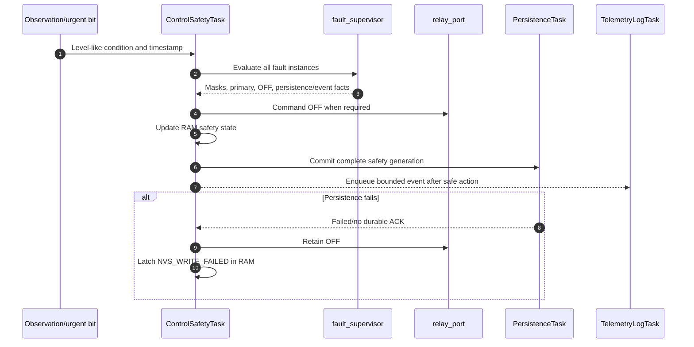

# Fault, Inhibit, and Reset Detailed Design

## 1. Document control

| Field | Value |
|---|---|
| Document ID | `RCC-FW-FDD-004` |
| Project | Robot Charge Controller |
| Applicable hardware variant | Split Board Design — Control Board + Relay Board |
| Record revision | Draft 0.1 |
| Status | Under review |
| Prepared at | 2026-09-03, Asia/Bangkok (UTC+07:00) |
| Prepared by | Codex drafting support, based on controlled inputs and the user-selected table-driven per-fault runtime design |
| Requirements source | `RCC-FW-SRS-001`, Draft 0.1 |
| Architecture source | `RCC-FW-ARCH-001`, Draft 0.2 |
| Interface source | `RCC-FW-ICD-001`, Draft 0.1 |
| FDD master source | `RCC-FW-FDD-000`, Draft 0.1 |
| Common-contract source | `RCC-FW-FDD-001`, Draft 0.1 |
| Measurement source | `RCC-FW-FDD-002`, Draft 0.1 |
| Persistence source | `RCC-FW-FDD-003`, Draft 0.1 |
| Platform API baseline | [ESP-IDF Programming Guide v6.1 — ESP32 Miscellaneous System APIs](https://docs.espressif.com/projects/esp-idf/en/v6.1/esp32/api-reference/system/misc_system_api.html) |
| Watchdog API baseline | [ESP-IDF Programming Guide v6.1 — ESP32 Watchdogs](https://docs.espressif.com/projects/esp-idf/en/v6.1/esp32/api-reference/system/wdts.html) |
| Firmware source baseline | Pre-implementation; no firmware source revision exists yet |
| Authoritative language | English |

This document defines firmware fault, inhibit, reset, qualification, clearing, and
escalation design. It does not approve hard electrical limits, prove that relay OFF
physically interrupts current, certify functional safety, accept residual risk, or
authorize release.

### 1.1 Revision history

| Revision | Date | Change |
|---|---|---|
| Draft 0.1 | 2026-09-03 | Initial table-driven fault policy, independent runtime instance, inhibit, reset classification, clear, recurrence, escalation, and verification baseline |

## 2. Purpose, scope, and exclusions

This document specifies the deterministic fault supervisor evaluated synchronously
inside `ControlSafetyTask`. It converts normalized observations and reset/persistence
evidence into active-fault facts, inhibit requests, relay-OFF requirements,
persistence requests, and diagnostic events without giving any other task relay
authority.

### 2.1 In scope

- stable internal fault registry and compact mask mapping;
- release-controlled fault policy table;
- one independent runtime lifecycle instance per fault;
- assertion/release qualification, missing-evidence behavior, and event precedence;
- warning, recoverable, and latched behavior;
- coexistence and cause-specific clearing of inhibit bits;
- reset-reason mapping, planned software-reset evidence, and reset inhibit;
- recurrence windows and recoverable-to-latched escalation;
- persistence ordering and failure containment;
- concurrency, resource limits, interfaces, tests, and traceability.

### 2.2 Out of scope

- final hard voltage, current, reverse-current, and response values until supported by
  hardware/system evidence;
- ADC acquisition/filter implementation, owned by FDD-02;
- NVS record mechanics, owned by FDD-03;
- complete charging-state transitions, session completion, and relay timing, owned by
  FDD-05;
- command routing and service-UART authentication, owned by FDD-07/FDD-08;
- detailed event-log payload/ring implementation, owned by FDD-10;
- hardware-independent claims that software can detect welded relay contacts,
  shorted drivers, or common-cause sensor failures without corresponding hardware
  observability;
- product safety/compliance approval.

## 3. Context, risk, and evidence boundary

### 3.1 Project context

| Area | Controlled input | Consequence | Confidence |
|---|---|---|---|
| Energy | 60 VDC / 20 A are maximum normal operating values | Fault response can affect a high-energy path; these values are not fault thresholds | `confirmed` |
| Safe state | Relay command OFF/open | Every safety response requests OFF before persistence/logging | `confirmed` design intent; physical isolation coverage remains unverified |
| Ownership | `ControlSafetyTask` is sole relay/state owner | Fault supervisor returns decisions/facts but never calls `relay_port` | `confirmed` |
| Measurements | Calibrated dual-path VOUT/IOUT snapshot and urgent condition mask | Fault logic rejects invalid/stale inputs and uses FDD-02 timestamps/status | `confirmed` interface; numeric behavior needs verification |
| Persistence | Combined A/B safety record | Fault/inhibit changes are committed as one safety generation | `confirmed` by FDD-03 baseline |
| Reset | ESP-IDF reset cause translated through FDD-01 time/reset port | Platform enums never leak into portable L4 policy | `confirmed` architecture; exact target mapping needs verification |

The provisional engineering risk level is Level 3 because incorrect fault handling
can leave a 60 V / 20 A charge path energized. Software remains supervisory; required
independent hardware protection and qualified-human safety review are not replaced by
this design.

### 3.2 Blocking evidence gaps

The following are `needs_verification`:

- hard VOUT/IOUT/reverse-current thresholds, hysteresis, assert/release times, and
  maximum response deadlines;
- relay-driver/relay physical opening time, feedback availability, welded-contact and
  short-on diagnostic coverage;
- actual ADC range/error at high positive current identified by FDD-02;
- complete hardware/system FMEA, protection-chain behavior, BMS/charger behavior, and
  environmental limits;
- recurrence counts/windows and escalation destinations derived from failure
  mechanism and relay/power-path cycling limits;
- exact ESP-IDF v6.1 reset enumerations for the installed target SDK and behavior of
  reset causes under brownout, panic, watchdog, JTAG, and power glitch;
- complete safety-record recurrence schema and target persistence timing.

No missing number may be replaced with 60 V, 20 A, a typical datasheet value, or an
unreviewed placeholder.

## 4. Selected architecture and invariants

### 4.1 Fault-engine decision

| Field | Decision |
|---|---|
| Decision ID | `FDD-FAULT-ADR-001` |
| Selected design | One immutable release-controlled policy row and one independent mutable runtime instance for every registered fault |
| Execution | Synchronous evaluation inside `ControlSafetyTask`; no separate fault task |
| Selection source | User selected Option A on 2026-09-03 |
| Rationale | Keeps multi-fault evidence independent, centralizes common safety ordering, supports table-driven tests, and avoids handler-specific policy drift |
| Alternatives not selected | One central switch intermixes policy/state; one handler/state machine per fault adds boilerplate and weakens common-rule enforcement |

### 4.2 Invariants

| ID | Invariant |
|---|---|
| `FDD-FAULT-INV-001` | Only `ControlSafetyTask` evaluates mutable fault state and commands the relay. |
| `FDD-FAULT-INV-002` | A fault response may request `NO_ACTION` or `RELAY_OFF`; no fault policy can request relay ON. |
| `FDD-FAULT-INV-003` | STOP, fault, inhibit, and shutdown issue physical OFF before persistence or diagnostics. |
| `FDD-FAULT-INV-004` | Every registered fault has independent qualification, active state, clear state, and recurrence state. |
| `FDD-FAULT-INV-005` | Multiple simultaneous causes remain represented; setting or clearing one cannot erase another. |
| `FDD-FAULT-INV-006` | Primary-fault selection affects reporting only and never suppresses another fault's action, inhibit, persistence, or event. |
| `FDD-FAULT-INV-007` | Unknown, missing, stale, inconsistent, or invalid safety evidence follows the policy's explicit conservative behavior; it is never assumed healthy. |
| `FDD-FAULT-INV-008` | Hard electrical and escalation policy is compile/release-controlled and bound to firmware/hardware identity. |
| `FDD-FAULT-INV-009` | A clear request cannot directly enter a relay-enabled state and cannot bypass `SELF_TEST` or current interlocks. |
| `FDD-FAULT-INV-010` | Any clear that could restore future charging eligibility becomes effective only after the combined safety record is durably committed. |
| `FDD-FAULT-INV-011` | Historical event evidence remains after live fault/inhibit clearing. |
| `FDD-FAULT-INV-012` | A software reset not proven to be an intentional controlled reset is handled conservatively. |

## 5. Component and authority boundaries

| Component | Layer | Responsibility | Prohibited responsibility |
|---|---:|---|---|
| `rcc_platform_esp32/reset_backend` | L2 | Read `esp_reset_reason()`, retain raw detail, expose portable mechanism data | Decide reset inhibit or fault clearing |
| `rcc_measurement` | L4 peer | Publish calibrated values, positive validity status, age, and context-free fast-condition bits | Assign domain fault severity or relay action |
| `rcc_fault/policy` | L4 | Immutable registry/policy and build-time validation | Mutable state or platform API access |
| `rcc_fault/evaluator` | L4 | Normalize conditions, qualify each instance, derive active masks/actions | Direct relay, NVS, or transport access |
| `rcc_fault/reset_policy` | L4 | Combine portable reset class, planned-reset evidence, and session guard | Call ESP-IDF directly |
| `rcc_fault/clear_policy` | L4 | Validate cause-specific clear prerequisites and construct proposed safety state | Authenticate service UART or persist bytes directly |
| `rcc_control` | L4 | Invoke evaluator synchronously, command OFF, request persistence, own state transition | Rewrite compile-time fault policy at runtime |
| `rcc_persistence` | L3 | Commit complete safety state and return durability facts | Decide which fault/inhibit is eligible to clear |
| `rcc_command_router` | L5 | Authorize/normalize `CLEAR_FAULT`, START, STOP, and trusted source | Clear fault/inhibit or command relay |

## 6. Fault identity and mask registry

### 6.1 Stable identity versus compact bit position

`rcc_fault_id_t` is a stable 16-bit identity. `rcc_fault_mask_t` is a compact 32-bit
set and therefore uses an explicit `mask_bit` from the registry. Firmware shall never
compute `1 << fault_id`.

```c
typedef enum {
    RCC_FAULT_NONE                    = 0x0000,
    RCC_FAULT_CONTROL_INTERNAL        = 0x0101,
    RCC_FAULT_NVS_WRITE_FAILED        = 0x0102,
    RCC_FAULT_RELAY_COMMAND_FAILED    = 0x0201,
    RCC_FAULT_RELAY_FEEDBACK_CONFLICT = 0x0202,
    RCC_FAULT_ADC_UNAVAILABLE         = 0x0301,
    RCC_FAULT_ADC_STALE               = 0x0302,
    RCC_FAULT_ADC_PATTERN_INVALID     = 0x0303,
    RCC_FAULT_ADC_SATURATED           = 0x0304,
    RCC_FAULT_VOUT_INVALID            = 0x0305,
    RCC_FAULT_IOUT_INVALID            = 0x0306,
    RCC_FAULT_VOUT_OVERVOLTAGE        = 0x0401,
    RCC_FAULT_IOUT_OVERCURRENT        = 0x0402,
    RCC_FAULT_IOUT_REVERSE_CURRENT    = 0x0403,
    RCC_FAULT_CHARGE_NOT_ESTABLISHED  = 0x0501,
    RCC_FAULT_CHARGE_MAX_DURATION     = 0x0502,
    RCC_FAULT_CAN_DEGRADED            = 0x0601,
    RCC_FAULT_RS485_DEGRADED          = 0x0602,
    RCC_FAULT_OPERATIONAL_UART_DEGRADED = 0x0603,
    RCC_FAULT_DIAGNOSTIC_DEGRADED     = 0x0604
} rcc_fault_id_registry_t;
```

### 6.2 Baseline mask allocation

| Bit | Fault ID | Baseline class | Policy status |
|---:|---|---|---|
| 0 | `CONTROL_INTERNAL` | Latched, RAM-first | Class confirmed; exact detection coverage open |
| 1 | `NVS_WRITE_FAILED` | Latched, RAM-first | Confirmed by SRS |
| 2 | `RELAY_COMMAND_FAILED` | Latched | Conditional on port error/coverage verification |
| 3 | `RELAY_FEEDBACK_CONFLICT` | Latched | Disabled unless genuine independent feedback exists |
| 4 | `ADC_UNAVAILABLE` | Recoverable → escalation | Timing/escalation unbound |
| 5 | `ADC_STALE` | Recoverable → escalation | Timing/escalation unbound |
| 6 | `ADC_PATTERN_INVALID` | Recoverable → escalation | Source defined by FDD-02; escalation unbound |
| 7 | `ADC_SATURATED` | Recoverable → escalation | Range/response unbound |
| 8 | `VOUT_INVALID` | Recoverable → escalation | Qualification unbound |
| 9 | `IOUT_INVALID` | Recoverable → escalation | Qualification unbound |
| 10 | `VOUT_OVERVOLTAGE` | Recoverable → latched candidate | Threshold, dwell, response, and class need hardware evidence |
| 11 | `IOUT_OVERCURRENT` | Recoverable → latched candidate | Threshold, dwell, response, and class need hardware evidence |
| 12 | `IOUT_REVERSE_CURRENT` | Recoverable → latched candidate | Threshold, dwell, response, and class need system evidence |
| 13 | `CHARGE_NOT_ESTABLISHED` | Recoverable → escalation | State/timing owned jointly with FDD-05 |
| 14 | `CHARGE_MAX_DURATION` | Recoverable → escalation candidate | Terminal policy owned jointly with FDD-05 |
| 15 | `CAN_DEGRADED` | Warning | Shall not stop autonomous/active session solely due to communication loss |
| 16 | `RS485_DEGRADED` | Warning | Same isolation rule |
| 17 | `OPERATIONAL_UART_DEGRADED` | Warning | Same isolation rule |
| 18 | `DIAGNOSTIC_DEGRADED` | Warning | Shall not delay a safe action |

Bits 19–31 and unassigned fault-ID ranges are reserved. The table is a symbolic
registry baseline, not evidence that every electrical fault threshold is ready.
Production policy generation shall fail if an enabled row remains marked unbound.

Invalid configuration or CAL_DATA is a boot/service interlock reason, not a live
electrical fault synthesized with a fake measurement. It directs `SERVICE_LOCK` under
FDD-03/FDD-05. A later integrity loss may additionally raise
`CONTROL_INTERNAL`/measurement faults according to the detected mechanism.

## 7. Policy-table model

### 7.1 Common enums

```c
typedef enum {
    RCC_FAULT_SEVERITY_WARNING = 0,
    RCC_FAULT_SEVERITY_RECOVERABLE = 1,
    RCC_FAULT_SEVERITY_LATCHED = 2
} rcc_fault_severity_t;

typedef enum {
    RCC_FAULT_RELAY_NO_ACTION = 0,
    RCC_FAULT_RELAY_OFF = 1
} rcc_fault_relay_action_t;

typedef enum {
    RCC_FAULT_CLEAR_AUTOMATIC = 0,
    RCC_FAULT_CLEAR_START_OR_REARM = 1,
    RCC_FAULT_CLEAR_SERVICE_ONLY = 2,
    RCC_FAULT_CLEAR_NEVER_IN_FIELD = 3
} rcc_fault_clear_authority_t;

typedef enum {
    RCC_EVIDENCE_FALSE = 0,
    RCC_EVIDENCE_TRUE = 1,
    RCC_EVIDENCE_UNKNOWN = 2
} rcc_evidence_state_t;

typedef enum {
    RCC_UNKNOWN_RESET_ASSERTION = 0,
    RCC_UNKNOWN_HOLD_ACTIVE = 1,
    RCC_UNKNOWN_TREAT_AS_FAULT = 2
} rcc_unknown_evidence_policy_t;
```

`RCC_UNKNOWN_TREAT_AS_FAULT` means the registered fault's condition is asserted; it
does not create an unnamed fault. A safety measurement fault normally uses this
policy. A warning may reset qualification instead. An already active safety fault
shall normally hold active while evidence is unknown.

### 7.2 Policy row

```c
typedef struct {
    rcc_fault_id_t fault_id;
    uint8_t mask_bit;
    uint8_t primary_priority;
    uint16_t condition_id;
    rcc_fault_severity_t initial_severity;
    rcc_fault_relay_action_t relay_action;
    rcc_inhibit_mask_t inhibit_bits_on_assert;
    rcc_fault_clear_authority_t clear_authority;
    rcc_unknown_evidence_policy_t unknown_policy;
    rcc_duration_ms_t assert_dwell_ms;
    rcc_duration_ms_t release_dwell_ms;
    uint16_t recurrence_limit;
    rcc_duration_ms_t recurrence_window_ms;
    rcc_fault_severity_t escalation_severity;
    uint16_t event_policy_id;
    uint16_t flags;
} rcc_fault_policy_t;
```

Every field is compile/release-controlled when it affects hard safety, response, or
escalation. Operational configuration cannot modify this table. A generator/static
validator shall prove:

- unique nonzero fault IDs and unique mask bits below 32;
- unique deterministic primary priorities or a documented tie rule;
- only `NO_ACTION` or `OFF`, never ON;
- warnings set no safety inhibit unless an independent controlled rule requires it;
- recoverable rows that block charging set `RCC_INHIBIT_RECOVERY`;
- latched rows require service-only or stricter clear authority;
- recurrence fields are both disabled or both valid;
- every enabled hard row has evidence-linked threshold/dwell/response data;
- reserved fields/flags are zero.

### 7.3 Condition separation

The policy table identifies a normalized `condition_id`; it does not contain arbitrary
runtime callbacks or transport pointers. A bounded condition adapter converts current
Control inputs into `TRUE`, `FALSE`, or `UNKNOWN`. This preserves table-driven policy
while making sensor/state dependencies explicit and statically reviewable.

## 8. Runtime fault instance

### 8.1 Lifecycle

```c
typedef enum {
    RCC_FAULT_STATE_INACTIVE = 0,
    RCC_FAULT_STATE_QUALIFY_ASSERT = 1,
    RCC_FAULT_STATE_ACTIVE = 2,
    RCC_FAULT_STATE_QUALIFY_RELEASE = 3,
    RCC_FAULT_STATE_LATCHED = 4
} rcc_fault_runtime_state_t;

typedef struct {
    rcc_fault_runtime_state_t state;
    rcc_fault_severity_t effective_severity;
    rcc_monotonic_us_t qualify_started_us;
    rcc_monotonic_us_t active_since_us;
    rcc_monotonic_us_t last_observed_us;
    uint16_t recurrence_count;
    rcc_duration_ms_t healthy_window_elapsed_ms;
    bool persistence_pending;
    bool event_assert_pending;
    bool event_clear_pending;
} rcc_fault_runtime_t;
```

The runtime array is indexed by registry row, not by fault ID. It is private to
`ControlSafetyTask`, statically sized, and reset only by controlled initialization.

### 8.2 State transitions

| Current state | Evidence | Result |
|---|---|---|
| `INACTIVE` | FALSE | Remain inactive |
| `INACTIVE` | TRUE | Assert immediately when dwell is zero; otherwise enter `QUALIFY_ASSERT` |
| `QUALIFY_ASSERT` | continuously TRUE until dwell | Enter ACTIVE/LATCHED, record first occurrence, actions and event |
| `QUALIFY_ASSERT` | FALSE | Cancel qualification and return INACTIVE |
| `QUALIFY_ASSERT` | UNKNOWN | Apply row's unknown policy; never advance from elapsed wall-clock guess |
| `ACTIVE` | TRUE | Remain active; no repeated assertion count for every loop |
| `ACTIVE` | FALSE | Enter `QUALIFY_RELEASE` when a release dwell is required, otherwise mark condition inactive but retain policy-required inhibit until authorized clear |
| `ACTIVE` | UNKNOWN | Normally hold active for safety rows |
| `QUALIFY_RELEASE` | continuously FALSE until dwell | Mark physical/logical condition inactive and eligible for its clear authority |
| `QUALIFY_RELEASE` | TRUE | Return ACTIVE and cancel release qualification |
| `LATCHED` | any observation | Remain latched until service clear transaction completes |

All dwell evaluation uses rollover-safe `rcc_monotonic_us_t` elapsed-time helpers.
The observation timestamp must be current and monotonic; stale evidence is UNKNOWN.
No loop-count-based timing is used.

## 9. Evaluation cycle and event precedence

At each bounded `ControlSafetyTask` iteration:

1. Enforce any already-required relay OFF action.
2. Atomically fetch and clear-deliver urgent notification bits while reading the
   retained level-like underlying condition.
3. Read a self-consistent current measurement snapshot and compute its age.
4. Collect relay-port, persistence, command, state-deadline, and boot evidence.
5. Normalize all registered conditions to TRUE/FALSE/UNKNOWN.
6. Update every independent fault instance in registry order.
7. Aggregate all relay actions, inhibit contributions, active/latched masks, and
   pending events; do not stop after the first fault.
8. Select `primary_fault` deterministically for reporting.
9. Control commands relay OFF immediately if any result requires it.
10. Control updates its RAM safety state and submits the complete FDD-03 safety record.
11. Perform at most the bounded normal state/command work allowed by FDD-05.
12. Publish one immutable system-state snapshot and enqueue bounded diagnostics.

The precedence remains: existing/urgent OFF enforcement; invalid measurement and
hard faults; urgent STOP; active fault/inhibit maintenance; state deadlines; normal
commands; autonomous/re-arm; telemetry. STOP and a simultaneous fault both remain
recorded even though both request OFF.

## 10. Condition-source rules

### 10.1 Measurement health

| Condition | Source | TRUE | FALSE | UNKNOWN |
|---|---|---|---|---|
| ADC unavailable | FDD-02 snapshot/urgent status | Driver/acquisition unavailable | Current valid acquisition present | No coherent snapshot |
| ADC stale | Snapshot timestamps | Age exceeds evidence-bound stale limit | Age within limit | Time/snapshot inconsistent |
| ADC pattern invalid | FDD-02 condition bit | Pattern/discontinuity asserted | Valid re-primed pattern | Condition state unavailable |
| ADC saturated | Channel positive-status mask | Required `NOT_SATURATED` absent for saturation cause | Required channel not saturated | Channel absent/unclassified |
| VOUT invalid | Full required VOUT mask | Required validity mask not met | Full mask met | Snapshot inconsistent |
| IOUT invalid | Full required IOUT mask | Required validity mask not met | Full mask met | Snapshot inconsistent |

The evaluator shall avoid double-counting one root cause as repeated recurrence on
every loop. Related faults may coexist for diagnostic specificity, but escalation
count increments on inactive-to-active occurrences only.

### 10.2 Electrical magnitude

VOUT overvoltage, IOUT overcurrent, and reverse current use the FDD-02 fast-path
values and earliest-condition timestamp, not the telemetry IIR alone. The final
policy shall define:

- calibrated engineering-unit assert and release thresholds;
- polarity/sign convention and applicable control states;
- filter/median latency included in maximum response;
- assertion/release dwell or immediate behavior;
- behavior when the associated channel becomes invalid;
- tolerance/error/hysteresis budget meeting the SRS 25%-of-nearest-margin rule;
- hardware protection coordination and residual energy.

Until these values are derived and verified, the three magnitude rows remain
`POLICY_UNBOUND` and cannot pass the production policy build gate.

### 10.3 Relay conditions

`RELAY_COMMAND_FAILED` may assert on a relay-port OFF/ON mechanism error. A command
success does not prove physical contact position. `RELAY_FEEDBACK_CONFLICT` is enabled
only if the controlled hardware supplies genuine independent feedback and its
truth-table/timing is verified. Echoing the commanded state is not feedback.

Welded-contact, driver short-on, or externally sustained current can be claimed
detected only when a verified independent observation exists. Otherwise they remain
system FMEA gaps and require hardware mitigation/verification.

### 10.4 Communication and diagnostics

CAN, RS485, operational UART, and diagnostics degradation are warnings by default.
They do not set an inhibit or stop a valid autonomous/active session solely because
traffic is absent or a consumer is slow. A specific message becoming a required
safety input would require an SRS/Architecture change and a new analysis.

## 11. Severity behavior

| Severity | Assertion behavior | Persistence | Clearing |
|---|---|---|---|
| `WARNING` | Record/report degradation; relay action only if a separate explicit row requires it | Normally bounded diagnostic only | Automatic after condition FALSE for release dwell |
| `RECOVERABLE` | Control commands OFF, activates fault, contributes `RECOVERY_INHIBIT` | Commit combined safety state after OFF | Condition inactive plus row-specific valid START/re-arm and required self-test/interlocks |
| `LATCHED` | Control commands OFF and retains latched state | Commit latched fault when storage healthy; retain RAM latch on failure | Service-UART `CLEAR_FAULT`, condition inactive, required dwell, successful SELF_TEST, then durable clear |

`NVS_WRITE_FAILED` is latched in RAM first because the same failing mechanism may be
unable to persist its own fault. If storage later proves healthy, a controlled
best-effort safety commit may record it, but operation never depends on that success.

## 12. Inhibit model

### 12.1 Independent causes

The FDD-01 mask remains:

```c
#define RCC_INHIBIT_REMOTE   (UINT32_C(1) << 0)
#define RCC_INHIBIT_RESET    (UINT32_C(1) << 1)
#define RCC_INHIBIT_RECOVERY (UINT32_C(1) << 2)
```

| Cause | Set when | Eligible clear trigger | Additional conditions |
|---|---|---|---|
| `REMOTE_INHIBIT` | Valid STOP is processed | Valid new-session START or verified charger removal/re-arm | All other inhibits/faults/interlocks independently pass |
| `RESET_INHIBIT` | Watchdog, panic, brownout, unknown/unsafe reset, or incomplete ARMED/ACTIVE guard | Valid START or verified charger removal | Successful SELF_TEST and cause-specific checks; no direct ON |
| `RECOVERY_INHIBIT` | One or more active recoverable faults require it | Fault-specific START/re-arm path | Every contributing fault condition is inactive and its release/clear rule passes |

### 12.2 Derived recovery inhibit

Because one bit represents multiple recoverable causes, firmware derives it from the
set of uncleared contributing fault instances:

```text
RECOVERY_INHIBIT = OR(policy requires recovery inhibit
                      AND fault instance not fully cleared)
```

It is not cleared merely because one recoverable fault disappears. The proposed
safety record clears the bit only when the derived expression is false.

### 12.3 Unknown and multiple bits

- The top-level system remains `INHIBITED` while any known inhibit bit is active,
  unless a latched/service condition requires a more conservative state.
- Clearing one bit never clears or rewrites another cause.
- Unknown persisted inhibit bits are retained and cause conservative service handling;
  they are not masked away with `RCC_INHIBIT_KNOWN_MASK` and ignored.
- A historical event is appended/coalesced after a successful live clear; event
  history is not the source of the current mask.

## 13. Clear transactions

### 13.1 Common two-phase clear

Any clear that can restore future charging eligibility uses:

1. **Prepare:** validate trusted authority/trigger, relay OFF, condition inactive,
   release dwell, current measurements, required persistence/config/calibration, and
   all cause-specific prerequisites.
2. **Prove safe-to-clear:** run the required `SELF_TEST` while the original
   fault/inhibit remains active and the relay remains OFF. A failure leaves both RAM
   and durable safety state unchanged.
3. **Construct:** copy the complete current safety state and remove only eligible
   fault/inhibit contributions; recompute masks and primary fault.
4. **Persist:** commit the proposed combined safety generation through FDD-03 and wait
   for a correlated durable ACK while relay remains OFF.
5. **Commit RAM:** only after the ACK, replace live fault/inhibit state with the
   proposed state.
6. **Re-evaluate:** immediately evaluate all current evidence and publish the resulting
   conservative OFF state. No clear transaction commands relay ON.

Failure, timeout, stale ACK, new fault, STOP, condition recurrence, or state change
aborts the prepared clear and retains the old RAM/flash safety state.

### 13.2 Recoverable clear

- An inactive physical condition alone does not clear `RECOVERY_INHIBIT`.
- START/re-arm validity is evaluated by Control using the fault row's authority rule.
- All contributing faults are checked independently; eligible faults may clear while
  ineligible faults remain, but the shared recovery inhibit remains asserted.
- A START used as clear authorization still rechecks every interlock and does not
  imply immediate relay closure.

### 13.3 Latched clear

`CLEAR_FAULT` is accepted only from the trusted service UART path. The request may
target one fault or the controlled all-eligible scope. For each target:

- fault ID and current latched state must match;
- initiating condition must be FALSE continuously for its service-clear dwell;
- any required physical inspection/service evidence must be supplied through a
  separately controlled procedure, not a payload boolean accepted on trust;
- clearing must not hide an active related fault;
- the durable combined safety clear must succeed;
- the pre-clear `SELF_TEST` must pass while the original latch remains effective.

A failed self-test preserves the original RAM and durable fault/inhibit without a
transient clear. A successful clear ends in an OFF state; FDD-05 governs any later
new-session start.

## 14. Reset classification

### 14.1 Portable mapping

The L2 backend calls `esp_reset_reason()` and maps the installed ESP-IDF v6.1
`esp_reset_reason_t` into FDD-01 `rcc_reset_class_t`:

| ESP-IDF reason | Portable class | Policy input |
|---|---|---|
| `ESP_RST_POWERON` | `RCC_RESET_CLASS_POWER_ON` | Normal only when safety/session records are valid and complete |
| `ESP_RST_SW` with valid one-shot planned-reset evidence | `RCC_RESET_CLASS_EXPLICIT_SOFTWARE` | Eligible normal reset after SELF_TEST |
| `ESP_RST_SW` without valid planned-reset evidence | `RCC_RESET_CLASS_OTHER` | Conservative reset inhibit |
| `ESP_RST_PANIC` | `RCC_RESET_CLASS_PANIC` | Reset inhibit |
| `ESP_RST_INT_WDT`, `ESP_RST_TASK_WDT`, `ESP_RST_WDT` | `RCC_RESET_CLASS_WATCHDOG` | Reset inhibit |
| `ESP_RST_BROWNOUT` | `RCC_RESET_CLASS_BROWNOUT` | Reset inhibit |
| `ESP_RST_UNKNOWN` | `RCC_RESET_CLASS_UNKNOWN` | Conservative reset inhibit |
| Other target-supported reasons | `RCC_RESET_CLASS_OTHER` unless explicitly reviewed | Conservative reset inhibit |

Deep-sleep, JTAG, USB, SDIO, power-glitch, CPU-lockup, eFuse-error, or other newer
enumerations shall not silently become normal. Firmware v1 does not use deep sleep.
The exact mapping is compiled against and tested on the installed ESP32 v6.1 SDK.

### 14.2 Planned software-reset evidence

Calling `esp_restart()` yields a software-reset reason but does not by itself prove
that the reset was an authorized normal operation. All intentional resets shall use
one controlled wrapper that writes a one-shot record to retention memory with:

- magic and version;
- current boot ID;
- monotonically increasing reset nonce;
- allowed reset-purpose enum;
- CRC;
- armed marker written last.

On boot, the token is valid only for `ESP_RST_SW`, matching boot lineage/purpose and a
valid CRC. It is consumed/cleared before broader initialization. Absence, corruption,
reuse, wrong cause, or wrong lineage maps the software reset conservatively. Retention
memory behavior across all target resets and power cycles remains to be verified; it
is supporting evidence, never a substitute for the persistent session guard.

### 14.3 Reset plus session guard

Reset policy combines reset class with FDD-03 guard state:

| Reset class | Guard `CLEAR/TERMINAL` | Guard `ARMED/ACTIVE` |
|---|---|---|
| Power-on | No reset inhibit solely from cause | Reset inhibit due to interrupted session |
| Valid planned software | No reset inhibit solely from cause | Reset inhibit due to interrupted session |
| Watchdog/panic/brownout | Reset inhibit | Reset inhibit plus interrupted-session evidence |
| Unknown/other unsafe | Reset inhibit | Reset inhibit plus interrupted-session evidence |

The relay is already forced OFF before this evaluation. If persistence is healthy,
Control requests the FDD-03 `TERMINAL/INTERRUPTED_RESET` safety record with reset
inhibit. If persistence fails, the original incomplete guard remains conservative and
the system remains non-operational.

## 15. Recurrence and escalation

### 15.1 Counting rules

- Recurrence increments only on a newly qualified inactive-to-active assertion, not
  on every control iteration and not on repeated notification of the same condition.
- Each fault has an independent count and window.
- When `recurrence_limit == 0`, recurrence escalation is disabled for that row.
- At the configured limit within the retained window, effective severity changes to
  the row's escalation severity, normally LATCHED.
- Escalation is monotonic for the current fault occurrence and remains latched until
  its authorized clear.

### 15.2 Behavior across reset without UTC

UTC is not required and powered-off time cannot be measured reliably. Therefore a
reset/power-off shall not age out a recurrence history. For each escalatable safety
fault, the combined safety record persists a bounded recurrence entry containing:

```text
fault_id, recurrence_count, remaining_healthy_window_ms,
last_occurrence_boot_id, escalated flag
```

After reboot, the count remains and the healthy window resumes only while the device
is powered, monotonic time is valid, and the fault condition is continuously healthy.
When the required healthy interval elapses, Control may prepare a persistent reset of
that recurrence entry while relay OFF or while policy explicitly permits the
non-enabling update. Loss of power never counts as demonstrated healthy time.

The implementation does not periodically checkpoint elapsed healthy time. If reset or
power loss occurs before the healthy interval is durably retired, uncommitted healthy
progress is discarded and the persisted remaining interval is resumed. This is
intentionally conservative and prevents recurrence tracking from causing periodic NVS
writes.

FDD-03 schema v1 shall be revised before implementation to encode this bounded
recurrence array and its maximum entry count. If that update cannot be made atomically
with the related fault/inhibit state, recurrence escalation is not ready for release.

### 15.3 Unbound escalation values

Exact count/window values shall come from the failure mechanism, relay/contact cycle
limits, charger/BMS response, hardware protection, and verification. Until then,
recoverable rows marked “escalation unbound” may be used for host design tests with
test policy data but shall fail the production policy completeness check.

## 16. Primary fault and published summary

The evaluator returns all active facts plus one primary fault for concise reporting:

1. consider every ACTIVE/LATCHED instance;
2. select the lowest `primary_priority` value from the immutable policy;
3. if a controlled table revision permits a tie, select the lower stable fault ID;
4. return `RCC_FAULT_NONE` only when the active mask is zero.

`primary_fault` is recomputed, not trusted as an independent source of safety state.
On boot, a persisted summary inconsistent with the latched mask/registry is an
integrity/policy error and is handled conservatively.

The system snapshot includes the full active mask, inhibit mask, and primary fault.
Detailed per-fault lifecycle/timestamps are exposed through bounded diagnostics, not
by allowing telemetry readers to access mutable runtime instances.

## 17. Fault evaluation output and integration

```c
typedef struct rcc_fault_context rcc_fault_context_t;
typedef struct rcc_fault_observation rcc_fault_observation_t;

typedef struct {
    rcc_fault_mask_t active_fault_mask;
    rcc_fault_mask_t newly_asserted_mask;
    rcc_fault_mask_t newly_condition_clear_mask;
    rcc_fault_mask_t latched_fault_mask;
    rcc_inhibit_mask_t required_inhibit_mask;
    rcc_fault_id_t primary_fault;
    rcc_fault_relay_action_t aggregate_relay_action;
    bool safety_persistence_required;
    bool self_test_required;
} rcc_fault_evaluation_t;

rcc_status_t rcc_fault_evaluate(
    rcc_fault_context_t *context,
    const rcc_fault_observation_t *observation,
    rcc_fault_evaluation_t *out_evaluation);
```

The observation is a bounded by-value/view contract assembled inside Control from
current snapshots and port/service outcomes. It contains no borrowed pointer that
survives the call. The evaluator has no public function to set arbitrary internal
state in production; test-only injection is excluded from the production build.

FDD-05 consumes the evaluation in the same Control iteration.
`aggregate_relay_action == RCC_FAULT_RELAY_OFF` is executed before constructing
persistence or event requests.

## 18. Persistence interaction

### 18.1 Assertion sequence



Warnings that do not affect safety state need not create a safety NVS write.
Diagnostics are lower priority and may be coalesced/dropped without changing the
fault action.

### 18.2 Clear sequence

Clearing reverses the RAM/persistence ordering because it can restore eligibility:
the old live state remains authoritative while a proposed complete safety generation
is committed. Only a correlated durable ACK allows the live clear to take effect.

### 18.3 Storage-failure limitation

If the storage mechanism fails, `NVS_WRITE_FAILED` may exist only in RAM and retained
reset memory. A subsequent total power loss can erase that volatile evidence while an
older valid flash generation survives. No firmware-only design can guarantee durable
recording through a failed storage path. This is a High unverified residual risk;
closure requires demonstrated storage diagnostics/recovery behavior or an independent
retained/hardware mechanism appropriate to the system safety requirements.

## 19. Timing, concurrency, and resources

- Fault evaluation executes only in `ControlSafetyTask` and is non-reentrant.
- Policy and registry are immutable `const` data; runtime instances are private
  mutable data owned by Control.
- No mutex, queue wait, NVS operation, transport call, allocation, or logging occurs
  inside `rcc_fault_evaluate()`.
- Evaluation visits a build-time bounded number of rows exactly once per cycle.
- Urgent producers retain the underlying level-like condition until Control observes
  it; notification coalescing cannot erase the cause.
- All timestamps use monotonic time and checked elapsed arithmetic.

| Symbol | Meaning | Closure evidence | Status |
|---|---|---|---|
| `RCC_FAULT_POLICY_COUNT` | Enabled registry rows | Frozen policy registry/static assertions | `needs_verification` |
| `RCC_FAULT_EVAL_WCET_US` | Worst-case full-table evaluation time | Target instrumentation under maximum simultaneous conditions | `needs_verification` |
| `T_FAULT_TO_OFF_MAX` | Observation/qualification through physical OFF-command bound | End-to-end timing allocation, target/HIL/relay bench evidence | `needs_verification` |
| `RCC_FAULT_MAX_RECURRENCE_ENTRIES` | Persisted escalatable fault capacity | Final policy count and FDD-03 record budget | `needs_verification` |
| `RCC_FAULT_EVENT_QUEUE_DEPTH` | Pending event capacity | Burst/coalescing analysis in FDD-10/FDD-11 | `needs_verification` |

`T_FAULT_TO_OFF_MAX` includes sensor/filter latency, condition qualification,
scheduling, evaluation WCET, relay-port call, driver response, and physical relay
opening where the requirement concerns current interruption. Software timestamp
latency alone cannot verify physical safety response.

## 20. Failure containment matrix

| Failure mode | Detection/observation | Required containment | Residual limitation |
|---|---|---|---|
| Measurement missing/stale/malformed | FDD-02 status/age/urgent bit | Treat evidence unknown/fault per policy; command OFF if active; recovery inhibit | Common-cause analog/ADC failures may escape without diversity |
| Fault evaluator internal invariant failure | Static checks/runtime checked status | `CONTROL_INTERNAL`, relay OFF, RAM latch | If CPU/control cannot execute, watchdog/reset path is relied upon |
| Control task deadlock/starvation | Task watchdog | Reset; next boot reset inhibit | Watchdog timing and relay hardware default need target/HIL proof |
| Persistence safety write failure | Failed/timeout ACK | Relay OFF, RAM `NVS_WRITE_FAILED`, no new session | Total power loss may remove volatile failure evidence |
| Relay command API failure | Port status | Latched fault and repeated OFF attempt under FDD-05 | Does not prove contact opened |
| Relay welded/driver short-on | Independent feedback/current only if verified | OFF command plus latched fault/hardware protection response | Detection unavailable if no independent observability |
| Communication task failure | Health observation | Warning; autonomous/control progression remains independent | Remote visibility/control degraded |
| Unknown reset cause | Reset mapper | Reset inhibit and SELF_TEST | Root cause may remain unknown |
| Fault event queue full | Bounded queue result | Preserve fault/action; increment/coalesce loss counter | Detailed history may be incomplete |
| Simultaneous STOP and fault | Same Control iteration | OFF once/idempotently; record both independent causes | Event ordering resolution must be tested |

## 21. Verification design

### 21.1 Static/build tests

| Test ID | Required coverage |
|---|---|
| `FDD-FAULT-STATIC-001` | Unique fault IDs, mask bits, policy rows, priorities, valid enums, no ON action, and reserved values |
| `FDD-FAULT-STATIC-002` | Production build fails when an enabled hard/electrical/escalation row remains `POLICY_UNBOUND` |
| `FDD-FAULT-STATIC-003` | Dependency/symbol inspection proves fault module cannot call relay, NVS, ESP-IDF reset, transport, heap, or test-injection APIs |
| `FDD-FAULT-STATIC-004` | Production image contains no mock condition source, arbitrary fault setter, or service-authentication bypass |

### 21.2 Host/model tests

| Test ID | Required coverage |
|---|---|
| `FDD-FAULT-UT-001` | Every lifecycle transition for immediate and dwell-qualified rows using boundary timestamps |
| `FDD-FAULT-UT-002` | TRUE/FALSE/UNKNOWN behavior during assert/release qualification and active state |
| `FDD-FAULT-UT-003` | Multiple simultaneous faults retain all masks/actions/events while primary selection is deterministic |
| `FDD-FAULT-UT-004` | Clearing one of several recoverable causes retains recovery inhibit until all contributors clear |
| `FDD-FAULT-UT-005` | Warning automatic clear, recoverable START/re-arm clear, and latched service-only clear permission matrices |
| `FDD-FAULT-UT-006` | Clear prepare/commit failure, timeout, late ACK, new STOP/fault, and failed SELF_TEST never restore eligibility |
| `FDD-FAULT-UT-007` | Recurrence counts only distinct assertions; window retention, reset, rollover, escalation, and durable-summary vectors |
| `FDD-FAULT-UT-008` | Reset-class/guard cross-product and planned-reset token valid, missing, corrupt, stale, replayed, and wrong-cause cases |
| `FDD-FAULT-UT-009` | STOP plus fault in either arrival order preserves both causes and OFF precedence |
| `FDD-FAULT-UT-010` | Persisted unknown inhibit/fault bits and inconsistent primary summary cause conservative handling |

### 21.3 Target/HIL/bench tests

| Test ID | Required coverage |
|---|---|
| `FDD-FAULT-TGT-001` | Compile exact ESP-IDF v6.1 reset mapper and exercise obtainable reset causes without assuming debugger behavior |
| `FDD-FAULT-TGT-002` | Measure full-table WCET, stack, iteration jitter, urgent-delivery latency, and maximum simultaneous faults |
| `FDD-FAULT-TGT-003` | Prove Control and ADC watchdog subscription/feeding behavior; repeat without JTAG because OpenOCD may disable watchdogs |
| `FDD-FAULT-HIL-001` | Inject each measurement/port/persistence condition and observe expected OFF, masks, persistence, clear authority, and event |
| `FDD-FAULT-HIL-002` | Saturate normal queues/logging/communications while urgent fault response remains within its bound |
| `FDD-FAULT-HIL-003` | Reboot during active/armed sessions for every reset class and prove no autonomous restart before valid clear |
| `FDD-FAULT-BENCH-001` | At derived electrical limits and corners, prove threshold accuracy, qualification, response, relay opening/current interruption, and hardware-protection coordination |
| `FDD-FAULT-BENCH-002` | Exercise relay feedback truth table or explicitly record its absence and resulting diagnostic-coverage limitation |

Each verification case records hardware/firmware/policy/config/CAL revisions,
stimulus, equipment uncertainty, timestamps, expected outcome, actual outcome, and
evidence locator. A test tool running or a relay command returning OK is not proof
that a physical safety requirement passed.

## 22. Traceability

| Design area | Upstream source | Verification |
|---|---|---|
| Sole owner and OFF-first response | `FW-ARC-003` through `FW-ARC-006`; SRS 5.2; FDD master safety rules | `FDD-FAULT-STATIC-003`; `FDD-FAULT-HIL-001`, `002` |
| Watchdog/reset inhibit | `FW-ARC-007`, `FW-ARC-008`; SRS 10.3; FDD-03 Section 13 | `FDD-FAULT-UT-008`; `FDD-FAULT-TGT-001`, `003`; `FDD-FAULT-HIL-003` |
| Fault levels | SRS 10.1; Architecture 15.2 | `FDD-FAULT-UT-001` through `006`; `FDD-FAULT-HIL-001` |
| Independent inhibit bits | SRS 10.2; Architecture 15.3; FDD-01 7.4 | `FDD-FAULT-UT-004` through `006`, `010` |
| Fault recurrence/escalation | SRS 10.4; Architecture 15.2 | `FDD-FAULT-UT-007`; policy evidence and FDD-03 schema test |
| Measurement-fault inputs | SRS 5.3; FDD-02 Sections 12, 14, 17 | `FDD-FAULT-UT-002`, `003`; `FDD-FAULT-HIL-001`; bench threshold tests |
| Persistent combined safety state | `FW-PST-001` through `FW-PST-005`; FDD-03 Sections 9–13 | `FDD-FAULT-UT-006`, `007`, `010`; FDD-03 power-cut tests |
| STOP/START/CLEAR authority | `FW-RCMD-003` through `FW-RCMD-008`; ICD Sections 10–12 | `FDD-FAULT-UT-005`, `006`, `009`; downstream FDD-07 tests |
| Communication autonomy | `FW-ARC-006`; Architecture 15/19 | `FDD-FAULT-HIL-002`; communication-warning tests |
| No unverified 60 V/20 A hard thresholds | `FDD-RULE-SAFE-012`; SRS Section 15 | `FDD-FAULT-STATIC-002`; `FDD-FAULT-BENCH-001` |

## 23. Findings and open actions

### 23.1 Findings

| Finding ID | Severity | Condition/mechanism | Consequence | Evidence/confidence | Corrective action |
|---|---|---|---|---|---|
| `FDD-FAULT-FIND-001` | Critical | Hard electrical thresholds, response deadlines, relay opening/current-interruption time, and protection coordination are not derived | Software could react too late or at an invalid limit on a high-energy path | `needs_verification` | Complete hardware/system fault analysis and bench timing before enabling production rows |
| `FDD-FAULT-FIND-002` | High | Relay feedback/welded-contact/driver-short observability is not confirmed | Firmware OFF command may be reported without proving current interruption | `needs_verification` | Verify independent feedback/current detection and hardware protection coverage |
| `FDD-FAULT-FIND-003` | High | FDD-03 safety schema does not yet encode recurrence state | Reboot could otherwise reset or ambiguously age escalation history | `confirmed` cross-document gap | Revise/freeze FDD-03 schema with bounded recurrence entries before implementation |
| `FDD-FAULT-FIND-004` | High | A storage failure followed by total power loss may erase RAM-only `NVS_WRITE_FAILED` evidence | Older valid flash state may not reveal the preceding write failure | `inferred`, mechanism inherent | Characterize failure/recovery and determine whether independent retention is required |
| `FDD-FAULT-FIND-005` | Medium | Product threat model is absent; service authority is physical/logical but not yet cryptographically established | Malicious clear/reset manipulation may be outside present coverage | `needs_verification` | Complete threat model and controlled service-security decision |

### 23.2 Open actions

| Action ID | Required action | Closure evidence | Status |
|---|---|---|---|
| `FDD-FAULT-ACT-001` | Derive every enabled electrical threshold, hysteresis, assert/release time, and maximum response from controlled hardware/system limits | Auditable budget, FMEA, simulation/bench evidence | `needs_verification` |
| `FDD-FAULT-ACT-002` | Freeze fault IDs, mask bits, priority, severity, unknown behavior, relay action, clear rule, and event policy | Reviewed generated policy table/static validation | `needs_verification` |
| `FDD-FAULT-ACT-003` | Define recurrence count/window/escalation for every recoverable row from failure mechanism and cycle limits | Reviewed fault-policy evidence and tests | `needs_verification` |
| `FDD-FAULT-ACT-004` | Revise FDD-03 safety-record schema to atomically persist bounded recurrence state | Updated schema, golden vectors, power-cut tests | `needs_verification` |
| `FDD-FAULT-ACT-005` | Verify relay feedback availability and complete welded/short-on/common-cause hardware coverage | Controlled schematic/PCB review and HIL/bench report | `needs_verification` |
| `FDD-FAULT-ACT-006` | Verify ESP-IDF v6.1 reset mapping, retention token, watchdog configuration, and no-JTAG tests on ESP32 | SDK identity, target logs, reset test matrix | `needs_verification` |
| `FDD-FAULT-ACT-007` | Derive WCET, urgent delivery, fault-to-OFF, persistence, and physical opening budgets | Target/HIL/bench timing report | `needs_verification` |
| `FDD-FAULT-ACT-008` | Close FDD-02 high-current ADC range finding before relying on overcurrent protection | Revised analog/ADC evidence and threshold-error test | `needs_verification` |
| `FDD-FAULT-ACT-009` | Define service clear procedure and product threat/security requirements | Controlled service/security specification | `needs_verification` |
| `FDD-FAULT-ACT-010` | Complete fault/event payload mapping with FDD-05, FDD-07, and FDD-10 | Cross-document interface review and golden vectors | `needs_verification` |

## 24. Review gate

| Field | Assessment |
|---|---|
| Gate ID | `FDD-FAULT-GATE-001` |
| Artifact assessed | `RCC-FW-FDD-004`, Draft 0.1 |
| Scope | Fault registry/policy/runtime, qualification, inhibit, clear, reset, recurrence, persistence interaction, failure containment, and verification design |
| AI assessment | `recommended_conditional_pass` for proceeding to FDD-05; not for hard-limit policy freeze, safety validation, or production release |
| Assessment basis | SRS fault/inhibit/reset requirements; Architecture Section 15; FDD-01 common contracts; FDD-02 measurement inputs; FDD-03 combined safety persistence; user-selected table-driven model |
| Open conditions | Close `FDD-FAULT-ACT-001` through `FDD-FAULT-ACT-010` at their responsible design/integration gates |
| Residual risks | Unbound electrical thresholds/timing/escalation, incomplete relay/common-cause coverage, recurrence schema gap, RAM-only storage-failure evidence, and security requirements |
| Human decision | `pending_human_decision` |
