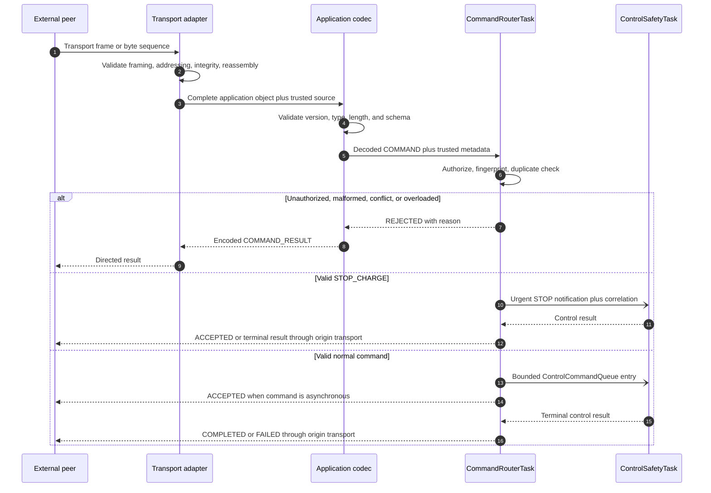

# Firmware Interface Control Document

## 1. Document control

| Field | Value |
|---|---|
| Document ID | `RCC-FW-ICD-001` |
| Project | Robot Charge Controller |
| Applicable hardware variant | Split Board Design — Control Board + Relay Board |
| Record revision | Draft 0.1 |
| Status | Under review |
| Prepared at | 2026-09-03, Asia/Bangkok (UTC+07:00) |
| Prepared by | Codex drafting support, based on the SRS and selected architecture baseline |
| Requirements source | `RCC-FW-SRS-001`, Draft 0.1 |
| Architecture source | `RCC-FW-ARCH-001`, Draft 0.2 |
| Hardware source baseline | Git commit `fe85ff2` plus the uncommitted hardware changes identified in the SRS |
| Firmware source baseline | Pre-implementation; no firmware source revision exists yet |

This is the authoritative English draft for the firmware communication interfaces. It
does not approve hardware, certify electrical compatibility, accept residual risk, or
authorize a production release.

## 2. Purpose and scope

This ICD defines the logical application protocol shared by CAN, RS485, operational
UART, and service UART. It defines message roles, source authority, command semantics,
result semantics, duplicate handling, event categories, error behavior, and the
requirements that each transport binding shall satisfy.

### 2.1 In scope

- Common transport-independent application envelope.
- Trusted transport metadata and source authorization.
- Command groups, permissions, inputs, outputs, and state effects.
- `ACCEPTED`, `REJECTED`, `COMPLETED`, and `FAILED` semantics.
- Duplicate request and idempotency behavior.
- CAN, RS485, operational UART, and service-UART binding requirements.
- Multi-frame object-transfer requirements for configuration and calibration.
- Protocol error handling, resource bounds, observability, and verification.

### 2.2 Out of scope

- Internal FreeRTOS queue binary layouts and module APIs.
- Exact NVS configuration and calibration record layouts.
- Charging-state algorithms already controlled by the SRS and Architecture.
- Electrical design of transceivers, isolation, termination, bias, ESD, connectors, or
  cabling, except where those properties constrain the firmware interface.
- Final bitrate, identifier allocation, node addressing, retry timing, CRC parameters,
  and maximum payload sizes until the open decisions in Section 21 are resolved.
- Wi-Fi, Bluetooth, or IP-based protocols in firmware v1.

## 3. Normative language and precedence

`Shall` identifies a requirement of this ICD. `Should` identifies a recommendation.
`May` identifies a permitted option. Symbolic names written in code font are stable
logical identifiers; their numeric wire values are not assigned unless this document
explicitly assigns them.

Precedence when artifacts disagree:

1. Controlled system safety and product requirements.
2. `RCC-FW-SRS-001`.
3. `RCC-FW-ARCH-001`.
4. This ICD.
5. Firmware Detailed Design and source code.

An inconsistency shall be raised for controlled resolution; lower-level artifacts
shall not silently override a higher-level requirement.

## 4. Interface inventory and trust boundary

| Interface ID | Physical/logical interface | Intended role | May control charging | Source identity basis | Status |
|---|---|---|---|---|---|
| `ICD-IF-CAN-001` | CAN field bus | Operational control or monitor-only | Only when selected as active control interface | CAN adapter plus configured node/identifier mapping | Transport parameters open |
| `ICD-IF-RS485-001` | RS485 field bus | Operational control or monitor-only | Only when selected as active control interface | RS485 adapter plus configured node address | Transport parameters open |
| `ICD-IF-UART-OP-001` | External 3.3 V UART | Operational control or monitor-only | Only when selected as active control interface | Dedicated physical UART port identity | Pin/port and framing binding open |
| `ICD-IF-UART-SVC-001` | Service UART | Commissioning, calibration, and fault recovery | Only for commands explicitly allowed to service | Dedicated service port identity and service access assumptions | Physical mapping and access policy open |

The firmware shall treat UART as 3.3 V logic UART, not RS-232. Exact connector pins,
transceiver behavior, termination/bias, grounding, isolation, ESD ownership, cable
assumptions, and partial-power behavior shall be verified against the controlled
hardware revision before the transport bindings are frozen.

### 4.1 Authority rules

| Requirement ID | Requirement |
|---|---|
| `ICD-AUTH-001` | Exactly one configured operational interface shall be the active control interface. |
| `ICD-AUTH-002` | Non-selected operational interfaces shall be monitor-only. |
| `ICD-AUTH-003` | Service authority shall originate from the configured service-UART path, not from a role field supplied in message payload. |
| `ICD-AUTH-004` | Transport adapters shall attach trusted `source_interface`, `source_node`, and receive-time metadata before routing. |
| `ICD-AUTH-005` | The application payload shall not be allowed to override trusted source metadata. |
| `ICD-AUTH-006` | Authorization shall complete before a normal command enters `ControlCommandQueue`. |
| `ICD-AUTH-007` | An authorized command remains subject to current state, inhibit, fault, measurement, configuration, calibration, and persistence interlocks. |
| `ICD-AUTH-008` | Loss or failure of any communication interface shall not stall autonomous operation or a valid active charging session. |

The current authority model identifies a physical/configured source; it does not by
itself provide cryptographic authentication. The product threat model and any required
message authentication remain an explicit open decision.

### 4.2 Physical interface contract status

| Interface | Producer → consumer | Signal/quantity | Normal and fault limits | Reference/return | Timing | Startup/power-off behavior | Protection owner | Verification |
|---|---|---|---|---|---|---|---|---|
| `ICD-IF-CAN-001` | Controller ↔ CAN peer(s) | CAN differential bus | Unbound pending exact transceiver, topology, cable, and environment | Bus reference/shield/ground strategy unbound | Bitrate/sample point unbound | No received traffic may cause an action before driver, frame, source, and application validation | Hardware design; firmware owns error-state handling | Controlled schematic/PCB review, bus analyzer, HIL |
| `ICD-IF-RS485-001` | Controller ↔ RS485 peer(s) | RS485 differential bus | Unbound pending exact transceiver/cable/common-mode evidence | Signal reference/ground strategy unbound | Baud/turnaround unbound | Idle, bias, partial-power, and driver-enable behavior require binding | Hardware design; firmware owns DE/RE sequencing and error recovery | Controlled schematic/PCB review, multi-node/noise test |
| `ICD-IF-UART-OP-001` | Controller ↔ operational peer | 3.3 V logic TX/RX | Logic thresholds, drive, leakage, and fault tolerance unbound pending exact endpoints | Logic GND; connector/reference path requires verification | Baud/framing unbound | Input traffic ignored until port/protocol initialization and validation; partial-power behavior unbound | Hardware design | Schematic review, scope/logic-analyzer and overflow tests |
| `ICD-IF-UART-SVC-001` | Controller ↔ service tool | Service serial path | Physical implementation and electrical limits unbound | Reference depends on controlled service path | Baud/framing unbound | Must support safe recovery where hardware power/path is available; shall not bypass relay-safe startup | Hardware/service design | Hardware mapping review and service recovery test |

An unbound cell is an explicit evidence dependency, not permission to use a typical
value. `ICD-OPEN-006` through `ICD-OPEN-009` and `ICD-OPEN-016` close these physical
contract gaps.

## 5. Protocol layering

```mermaid
flowchart LR
    peer["External peer"]
    phy["CAN, RS485, or UART<br/>physical and driver layer"]
    transport["Transport adapter<br/>framing, addressing, integrity"]
    codec["Application codec<br/>common envelope"]
    router["Command router<br/>authority, duplicate, validation"]
    control["ControlSafetyTask<br/>state and safety interlocks"]

    peer <-->|"transport frames"| phy
    phy <-->|"driver frames or byte stream"| transport
    transport <-->|"complete application object"| codec
    codec -->|"decoded message plus trusted source"| router
    router -->|"bounded command or urgent STOP"| control
    control -->|"result and state snapshot"| router
    router --> codec --> transport --> phy --> peer
```

Transport adapters shall not interpret charging policy. The command router shall not
operate the relay. `ControlSafetyTask` remains the sole state-machine and relay owner.

## 6. Common application message model

### 6.1 Logical envelope

| Field | Logical type | Presence | Meaning |
|---|---|---|---|
| `protocol_version` | `uint8` | Required | Application protocol version |
| `message_type` | Enum | Required | `COMMAND`, `COMMAND_RESULT`, or `EVENT` |
| `request_id` | `uint32` | Required | Transaction identity and duplicate-detection key |
| `command_code` | `uint16` | Required | Stable command identity for command/result; zero for an unsolicited event |
| `flags` | `uint16` | Required | Versioned application options; unknown handling defined by the flag registry |
| `payload_length` | `uint16` | Required | Length of the decoded application payload in bytes |
| `payload` | Command/result/event-specific | Optional | Fixed-width integer fields in engineering units |
| `object_crc32` | `uint32` | Conditional | End-to-end integrity for a complete multi-frame config/calibration object |

This table defines logical fields, not byte offsets. Byte order, numeric enum values,
field packing, maximum decoded length, and CRC32 parameters shall be assigned through
the open decisions before interoperable firmware is implemented.

### 6.2 Message types

| Message type | Direction | Purpose | `request_id` rule |
|---|---|---|---|
| `COMMAND` | Peer → controller | Request an operation or query | Nonzero within the source's active request-ID scope |
| `COMMAND_RESULT` | Controller → originating peer | Report admission, rejection, completion, or failure | Equal to the initiating command |
| `EVENT` | Controller → eligible observers | Report unsolicited state, fault, inhibit, session, or configuration change | Zero; related command ID, when relevant, is carried as `origin_request_id` in payload |

For `EVENT`, the first event-specific logical field is `event_code`; it is part of the
event payload rather than an additional common-envelope field.

### 6.3 Encoding rules

| Requirement ID | Requirement |
|---|---|
| `ICD-MSG-001` | All integer fields shall use fixed widths; no native C struct shall be transmitted without explicit serialization. |
| `ICD-MSG-002` | Voltage shall be represented in millivolts as `uint32`; signed current in milliamperes as `int32`; non-negative durations in milliseconds as `uint32` unless a command contract explicitly requires another controlled unit. |
| `ICD-MSG-003` | Reserved fields and reserved flag bits shall be transmitted as zero. |
| `ICD-MSG-004` | A receiver shall validate version, type, length, structural integrity, transport integrity, and required object CRC before executing a command. |
| `ICD-MSG-005` | Payload length shall describe the decoded application payload, not transport padding or framing bytes. |
| `ICD-MSG-006` | Multi-byte byte order shall be identical across CAN, RS485, and UART bindings. |
| `ICD-MSG-007` | Unknown mandatory flags, invalid reserved bits, or a length inconsistent with the command schema shall cause rejection without action. |
| `ICD-MSG-008` | A malformed request that cannot be safely addressed and correlated may be discarded without a reply, but shall increment a bounded diagnostic counter. |

### 6.4 Version compatibility

- `protocol_version` applies to the common application model, not to the physical
  transport driver.
- An unsupported version shall not be partially interpreted as the current version.
- The controller shall return `UNSUPPORTED_VERSION` when the request can be safely
  correlated and addressed.
- New optional fields or flags may be introduced only with deterministic behavior for
  older implementations.
- Changes that alter an existing field meaning, unit, signedness, or safety effect
  require a new application protocol version.

The initial numeric version and compatibility matrix are open in Section 21.

## 7. Trusted source metadata

Trusted metadata is internal and shall not be serialized as sender-controlled authority
inside the application payload.

| Field | Logical meaning |
|---|---|
| `source_interface` | `CAN`, `RS485`, `OPERATIONAL_UART`, or `SERVICE_UART` as determined by the receiving adapter/port |
| `source_node` | Transport-local peer identity derived from CAN mapping, RS485 address, UART session, or fixed point-to-point identity |
| `rx_timestamp` | Monotonic receive time used for timeout, ordering, and diagnostics |
| `transport_status` | Integrity, segmentation, and addressing result from the transport adapter |
| `reply_context` | Opaque transport-local information needed to return the result to the origin |

`source_node` is not globally meaningful unless a future controlled addressing model
defines that mapping. The duplicate key is scoped by both source interface and node.

## 8. Command result model

### 8.1 Standard result object

| Field | Logical type | Wire location | Meaning |
|---|---|---|---|
| `request_id` | `uint32` | Common envelope | Initiating command ID |
| `command_code` | `uint16` | Common envelope | Initiating command |
| `result` | Enum | Result payload | `ACCEPTED`, `REJECTED`, `COMPLETED`, or `FAILED` |
| `reason_code` | Enum | Result payload | Stable machine-readable explanation |
| `system_state` | Enum | Result payload | Current top-level or operational state |
| `inhibit_mask` | Bitmask | Result payload | All currently active inhibit causes |
| `primary_fault` | Enum | Result payload | Highest-priority active fault or `NONE` |
| `response_data` | Command-specific | Result payload | Query data, committed revision, session identity, or other defined output |

Each logical field is serialized once. `request_id` and `command_code` are inherited
from the common envelope and are not duplicated inside `response_data`.

### 8.2 Result semantics

| Result | Terminal | Meaning |
|---|---:|---|
| `ACCEPTED` | No | Request passed envelope/source checks and was admitted to the application/control workflow; it does not mean relay ON or physical completion |
| `REJECTED` | Yes | Request was not admitted or no action was started |
| `COMPLETED` | Yes | The command-specific success boundary was reached |
| `FAILED` | Yes | The request was accepted, but its success boundary was not reached |

Queries and local commands that finish immediately may return `COMPLETED` without a
preceding `ACCEPTED`. Long-running commands may return `ACCEPTED` and later one terminal
result with the same `request_id`. Every accepted command shall eventually have a
terminal result or an explicitly detectable peer/controller reset.

### 8.3 Baseline reason-code registry

Numeric values remain unassigned, but these symbolic meanings are part of Draft 0.1.

| Reason code | Applies when |
|---|---|
| `NONE` | No error reason applies |
| `UNSUPPORTED_VERSION` | Application version cannot be processed |
| `MALFORMED_MESSAGE` | Envelope or payload structure is invalid |
| `INTEGRITY_FAILED` | Transport integrity or required object CRC failed |
| `UNSUPPORTED_COMMAND` | Command code is not implemented for this version |
| `UNAUTHORIZED_SOURCE` | Source interface/node lacks permission |
| `DUPLICATE_ID_CONFLICT` | Same duplicate key was reused with different command content |
| `QUEUE_FULL` | Normal command capacity is unavailable |
| `INVALID_STATE` | Command is not valid in the current state |
| `INHIBITED` | An active inhibit prevents the requested operation |
| `FAULT_ACTIVE` | An active fault prevents the requested operation |
| `INTERLOCK_FAILED` | A required precondition failed |
| `MEASUREMENT_INVALID` | Required measurement is stale, invalid, or implausible |
| `CONFIG_INVALID` | Active or staged configuration is invalid/incompatible |
| `CAL_INVALID` | Calibration is invalid/incompatible |
| `PERSISTENCE_FAILED` | Required durable operation failed or timed out |
| `TIMEOUT` | Command-specific deadline expired |
| `CHARGE_NOT_ESTABLISHED` | Relay was commanded closed but charging current did not establish by the required deadline |
| `ABORTED_BY_STOP` | Accepted operation ended because of valid STOP |
| `ABORTED_BY_FAULT` | Accepted operation ended because of fault handling |
| `INTERNAL_ERROR` | Controlled internal failure not represented by a more specific reason |

Fault IDs and reason codes are separate namespaces. `primary_fault` reports the active
fault; `reason_code` explains the command result.

## 9. Request identity, duplicates, and idempotency

| Requirement ID | Requirement |
|---|---|
| `ICD-DUP-001` | The duplicate key shall be `(source_interface, source_node, request_id)`. |
| `ICD-DUP-002` | The router shall retain a request fingerprint and the latest result for each cached key. |
| `ICD-DUP-003` | Repeating the same key with the same fingerprint shall return the cached result without repeating the action. |
| `ICD-DUP-004` | Reusing the same key with different content shall return `REJECTED/DUPLICATE_ID_CONFLICT`. |
| `ICD-DUP-005` | `STOP_CHARGE` shall be idempotent even if its duplicate-cache entry is unavailable. |
| `ICD-DUP-006` | Duplicate processing shall not delay the urgent STOP path. |
| `ICD-DUP-007` | Duplicate-cache exhaustion shall reject new non-urgent commands explicitly rather than evict an in-flight safety-relevant request silently. |

The baseline duplicate cache is volatile within a boot. Persistent session guard,
fault, and inhibit state provide conservative restart behavior, but do not make the
request cache persistent. Cache size, retention interval, request-ID reuse rule, and
behavior across peer reconnect remain open.

## 10. Command permission matrix

| Command group | Commands | Active control interface | Other operational interfaces | Service UART |
|---|---|---:|---:|---:|
| Identification | `PING`, `GET_DEVICE_INFO` | Allow | Allow | Allow |
| Monitoring | `GET_STATUS`, `GET_MEASUREMENTS`, `GET_FAULTS`, `GET_EVENT_LOG` | Allow | Allow | Allow |
| Operational control | `START_CHARGE`, `STOP_CHARGE`, `SET_TIME` | Allow | Deny | Deny unless service is explicitly selected as the active operational interface in a future controlled revision |
| Configuration | `GET_CONFIG`, `ENTER_CONFIG_MODE`, `STAGE_CONFIG`, `VALIDATE_CONFIG`, `COMMIT_CONFIG`, `ABORT_CONFIG` | Allow subject to config-state rules | Deny | Allow subject to config-state rules |
| Calibration | `GET_CAL_DATA`, `BEGIN_CAL`, `CAL_POINT`, `VALIDATE_CAL`, `COMMIT_CAL`, `ABORT_CAL` | Deny | Deny | Allow |
| Latched recovery | `CLEAR_FAULT` | Deny | Deny | Allow subject to clear preconditions |

Monitoring permission does not grant control authority. Rate/resource limits still
apply to monitoring queries so they cannot starve safety processing.

## 11. Command dictionary

Numeric command codes and exact serialized payload layouts remain open. The symbolic
commands and behavioral boundaries below are controlled by this draft.

### 11.1 Identification and monitoring

| Command | Request data | Successful response data | Success boundary | Principal rejection/failure reasons |
|---|---|---|---|---|
| `PING` | Optional bounded echo token | Echo token plus device response metadata | Request parsed and response generated | Version, integrity, malformed length, resource limit |
| `GET_DEVICE_INFO` | None | Product/board identity, hardware revision, firmware version/hash, build profile, protocol capabilities | Self-consistent identity snapshot returned | Version, integrity, resource limit |
| `GET_STATUS` | None | State/substate, relay command/feedback if available, session, inhibit mask, primary fault, config/CAL revisions, boot/time flags | Self-consistent `SystemStateSnapshot` returned | Version, integrity, resource limit |
| `GET_MEASUREMENTS` | None | VOUT mV, signed IOUT mA, timestamp/age, validity/calibration/freshness flags | Self-consistent `MeasurementSnapshot` returned | Measurement unavailable, version, resource limit |
| `GET_FAULTS` | Optional cursor/filter | Active fault bitmap, primary fault, fault detail page, next cursor | Requested bounded page returned | Invalid cursor/filter, version, resource limit |
| `GET_EVENT_LOG` | Cursor and bounded count | Ordered bounded event page plus next cursor and lost/coalesced counters | Requested page returned | Invalid cursor/count, event unavailable, resource limit |

`GET_MEASUREMENTS` should return the most recent available snapshot together with its
age and validity flags even when a channel is invalid. It returns a terminal failure
only when no structurally valid snapshot can be provided. A peer shall not infer that a
reported numeric value is usable when its validity/freshness flag is false.

### 11.2 Operational control

| Command | Request data | Admission conditions | `COMPLETED` boundary | State/inhibit effect |
|---|---|---|---|---|
| `START_CHARGE` | Empty in the baseline | Authorized source; valid current state; request/interlock/config/CAL/measurement/storage conditions re-evaluated by Control | Charging current is established and state reaches `CHARGING` | May clear `REMOTE_INHIBIT` or eligible reset/recovery inhibit only according to its cause-specific rule; creates write-ahead session guard before relay ON |
| `STOP_CHARGE` | Empty in the baseline | Authorized active-control source; structural and integrity checks pass | Relay OFF command has been issued, `REMOTE_INHIBIT` is active, and required safety persistence succeeds | Opens/retains relay OFF and sets persistent `REMOTE_INHIBIT`; idempotent and urgent |
| `SET_TIME` | UTC time object; exact epoch/precision open | Authorized source and valid time object | Time service accepts the new UTC mapping and reports sync status | Does not affect autonomous-operation eligibility |

`START_CHARGE` acceptance never means relay closed. A later normal charge completion is
a session event, not the completion boundary of `START_CHARGE`. If STOP makes the
physical path safe but safety persistence fails, STOP action remains effective while
the command returns `FAILED/PERSISTENCE_FAILED` and the controller latches
`NVS_WRITE_FAILED` in RAM.

The behavior and result lifecycle of `START_CHARGE` when no valid VOUT request is
present are intentionally unbound in Draft 0.1 and shall be resolved by
`ICD-OPEN-017`. No selected behavior may create an unbounded in-flight command.

### 11.3 Configuration

| Command | Purpose | Key conditions | Terminal success boundary |
|---|---|---|---|
| `GET_CONFIG` | Read active metadata or a bounded object/page | Authorized source | Requested active revision/data returned with integrity metadata |
| `ENTER_CONFIG_MODE` | Enter configuration service state | Relay OFF; charger absent for required dwell; no blocking fault | State enters `CONFIG_MODE` |
| `STAGE_CONFIG` | Transfer candidate config object | In `CONFIG_MODE`; transfer integrity and resource checks pass | Candidate object staged, not active |
| `VALIDATE_CONFIG` | Validate staged object without activation | Complete staged object exists | Validation result and all detected violations returned |
| `COMMIT_CONFIG` | Atomically activate validated config | Relay OFF; `CONFIG_MODE`; validated compatible object | New generation durably active and confirmed by persistence ACK |
| `ABORT_CONFIG` | Discard staging transaction | Matching staging transaction or no active transaction | Staging is empty; active config unchanged |

The previous active configuration remains active after malformed, incomplete, invalid,
aborted, or failed commit. `START_CHARGE` is rejected in `CONFIG_MODE`.

### 11.4 Calibration

| Command | Purpose | Key conditions | Terminal success boundary |
|---|---|---|---|
| `GET_CAL_DATA` | Read active calibration metadata/data | Service UART | Requested revision/data returned with integrity metadata |
| `BEGIN_CAL` | Start a board-calibration transaction | Service UART; relay OFF; charger/test conditions follow calibration procedure | Calibration staging transaction created |
| `CAL_POINT` | Submit or capture a VOUT/IOUT calibration point | Matching transaction and valid point type/range | Point accepted into staging only |
| `VALIDATE_CAL` | Fit/check staged calibration and independent verification points | Required point set complete | Validation result including residual-error criteria returned |
| `COMMIT_CAL` | Atomically activate valid board calibration | Validated, hardware-compatible object | New `CAL_DATA` generation durably active |
| `ABORT_CAL` | Discard staged calibration | Matching transaction or no active transaction | Staging is empty; active `CAL_DATA` unchanged |

The separate Configuration and Calibration Specification shall define object schemas,
point types, procedures, allowed ranges, and acceptance calculations.

### 11.5 Latched recovery

| Command | Request data | Admission conditions | Terminal success boundary |
|---|---|---|---|
| `CLEAR_FAULT` | Target fault or controlled clear scope; exact payload open | Service UART; relay OFF; physical/logical clear preconditions satisfied | Requested latched state is cleared, required persistence succeeds, and `SELF_TEST` completes to the appropriate safe state |

`CLEAR_FAULT` shall never transition directly to a relay-enabled state. A failed
self-test returns `FAILED` and preserves or reasserts the applicable fault/inhibit.

## 12. Command processing sequence

The diagram is logical. Every result shall return through the originating transport and
address context unless the transport is no longer available. Failure to transmit a
result shall not roll back a completed physical safe action.

## 13. Urgent STOP contract

| Requirement ID | Requirement |
|---|---|
| `ICD-STOP-001` | STOP shall pass transport integrity, addressing, version, command, and source-authorization checks before it is treated as valid. |
| `ICD-STOP-002` | After validation, STOP shall use the urgent notification path independent of normal command-queue availability. |
| `ICD-STOP-003` | Repeated valid STOP shall retain relay OFF and `REMOTE_INHIBIT` without harmful repeated action. |
| `ICD-STOP-004` | STOP processing shall not wait for telemetry transmission, external acknowledgment, event-log capacity, or UTC synchronization. |
| `ICD-STOP-005` | Relay OFF shall be commanded before terminal persistence and logging. |
| `ICD-STOP-006` | The transport-to-relay-response bound shall be measured under worst-case communication and CPU load before it is assigned as verified. |
| `ICD-STOP-007` | Transport receive, decode, and authorization resources shall be budgeted so lower-priority traffic cannot starve a valid STOP before it reaches the urgent path. |

The firmware response confirms its command and persistence boundaries. It shall not
claim that physical relay contacts are open unless hardware feedback or another
verified observation supports that statement.

## 14. Event model

### 14.1 Baseline event registry

| Event | Minimum payload meaning | Persistence expectation |
|---|---|---|
| `BOOT_COMPLETED` | Boot ID, reset classification, resulting state, firmware/hardware identity | Critical summary |
| `STATE_CHANGED` | Previous/new state, trigger, monotonic time | RAM; persistent only when significant |
| `FAULT_CHANGED` | Fault ID, active/cleared, severity, primary fault, evidence flags | Recoverable/latched summary persistent |
| `INHIBIT_CHANGED` | Previous/new inhibit mask and cause | Persistent safety summary |
| `SESSION_ARMED` | Session ID and origin | Persistent write-ahead safety record |
| `CHARGE_ESTABLISHED` | Session ID, VOUT/IOUT snapshot, establish time | Bounded session summary |
| `SESSION_COMPLETED` | Session ID, terminal reason, duration, final measurement summary | Persistent bounded summary |
| `SESSION_ABORTED` | Session ID, STOP/fault/reset reason | Persistent bounded summary |
| `CONFIG_CHANGED` | Old/new revision, source, commit result | Persistent summary |
| `CAL_CHANGED` | Old/new revision, hardware binding, source, commit result | Persistent summary |
| `TIME_SYNC_CHANGED` | Synced/unsynced and source | RAM unless required by event correlation policy |
| `COMMUNICATION_DEGRADED` | Interface, reason, counters | Rate-limited/coalesced diagnostic |

Numeric event codes, subscription/broadcast policy, periodic telemetry policy, and
per-transport event addressing are open. Periodic telemetry shall not be written to
flash. Events shall contain `boot_id`, `event_seq`, monotonic time, and synchronization
status; optional UTC is included only when available.

## 15. Multi-frame object transfer

Configuration and calibration objects may exceed one transport frame. Their transport
segmentation may differ, but the reassembled application object shall have identical
meaning on every interface.

| Requirement ID | Requirement |
|---|---|
| `ICD-OBJ-001` | A transfer shall identify object type, object/schema version, transaction identity, total decoded length, and expected object CRC32. |
| `ICD-OBJ-002` | Reassembly storage shall be bounded; an object exceeding the configured maximum shall be rejected before activation. |
| `ICD-OBJ-003` | Missing, duplicate, conflicting, overlapping, or out-of-policy fragments shall not produce an active object. |
| `ICD-OBJ-004` | Object CRC32 shall be evaluated over a canonically serialized complete object, independent of transport framing and padding. |
| `ICD-OBJ-005` | A completed transfer enters staging only. Validation and commit are separate commands. |
| `ICD-OBJ-006` | Timeout, abort, reset, or integrity failure shall discard or invalidate staging without changing the previous active object. |
| `ICD-OBJ-007` | Only one active staging transaction per object domain shall exist unless a later controlled revision defines arbitration. |

Exact fragment fields, ordering policy, transfer window, maximum size, timeout, and CRC
parameters remain open.

## 16. CAN binding requirements

| Area | Draft 0.1 requirement/status |
|---|---|
| Controller/transceiver capability | Verify against the controlled ESP32 and CAN-transceiver hardware revision |
| CAN protocol class | Unbound; classic CAN versus any other capability shall not be inferred from the name alone |
| Bitrate and sample configuration | Unbound; require cable/topology/clock evidence |
| Identifier format/allocation | Unbound; define request, result, event, node, and priority mapping |
| Node identity | Derived from controlled identifier/address configuration, not payload role |
| Segmentation | Required if the application object exceeds one CAN data field; scheme unbound |
| Transport integrity | Use CAN frame integrity plus application/object checks as specified; residual failure analysis pending |
| Bus-off/error-passive recovery | Shall report degraded status and shall not stall autonomous control; exact retry policy unbound |
| Queueing | Bounded Rx/Tx; control and urgent STOP processing shall be protected from telemetry flooding |
| Physical layer | Termination, stub, common-mode, isolation, ground reference, ESD, and connector ownership require hardware/interface evidence |

A CAN adapter shall deliver only completely validated/reassembled application objects
to the codec. Arbitration priority shall prevent lower-value telemetry from creating an
unbounded delay for an otherwise valid STOP under the specified maximum bus load.

## 17. RS485 binding requirements

| Area | Draft 0.1 requirement/status |
|---|---|
| Topology and duplex | Verify against the controlled schematic/cabling; current hardware context identifies an RS485 interface but the ICD does not yet freeze topology |
| Baud, data bits, parity, stop bits | Unbound |
| Node addressing | Unbound; source identity shall be derived by the adapter, not asserted as authority in payload |
| Frame delimiter and length | Unbound; receiver shall recover deterministically after malformed/truncated traffic |
| Transport CRC | Required unless a justified controlled analysis establishes equivalent integrity; exact algorithm unbound |
| Direction control | Turnaround, driver-enable timing, echo/collision handling, and fail-safe idle behavior unbound |
| Response timing | Bounded and compatible with bus master/multi-drop policy; numeric values unbound |
| Segmentation/reassembly | Bounded and required for objects larger than one frame |
| Physical layer | Termination, bias, common-mode, ground offset, isolation, surge/ESD, cable and connector requirements need controlled evidence |

No partial RS485 frame shall reach the command router. A noisy or stuck bus shall
degrade the interface without blocking autonomous operation or Control execution.

## 18. UART binding requirements

### 18.1 Operational UART

| Area | Draft 0.1 requirement/status |
|---|---|
| Electrical convention | External 3.3 V logic UART; not RS-232 |
| Baud, data bits, parity, stop bits | Unbound |
| Point-to-point identity | Bound to the operational UART port; peer/session identity policy unbound |
| Framing and resynchronization | Unbound; shall include deterministic length/delimiter and integrity handling |
| Flow control | Unbound; must not permit unbounded buffering |
| Control authority | Only when operational UART is the configured active control interface |

### 18.2 Service UART

| Area | Draft 0.1 requirement/status |
|---|---|
| Physical mapping | Unbound; verify whether the controlled service path is direct 3.3 V UART, USB-UART bridge, or another dedicated port |
| Service identity | Derived from the dedicated configured port, never a payload role |
| Access control | Physical/service access assumptions and any authentication requirement are open |
| Commands | Monitoring, configuration, calibration, and `CLEAR_FAULT` as allowed by Section 10 |
| Safe behavior | Service traffic cannot directly command relay; Control re-evaluates all interlocks |
| Recovery | Shall remain usable to repair invalid config/CAL data while in `SERVICE_LOCK`, subject to available hardware/power |

Operational and service UART shall have distinct trusted identities even if a later
hardware revision multiplexes them. Such multiplexing would require an explicit,
verified mode-selection and access-control design.

## 19. Resource, timeout, and failure behavior

| Condition | Required behavior |
|---|---|
| Transport Rx overflow | Drop/recover according to transport binding, increment bounded counter, do not execute partial message |
| Codec length/schema error | Reject with `MALFORMED_MESSAGE` when safely correlatable |
| Integrity failure | Discard/reject without action; rate-limit diagnostics/responses to avoid storms |
| Unauthorized command | Return `REJECTED/UNAUTHORIZED_SOURCE`; do not enqueue |
| Normal command queue full | Return `REJECTED/QUEUE_FULL`; STOP uses urgent path |
| Duplicate same request | Return cached result; no repeated action |
| Duplicate ID conflict | Reject with `DUPLICATE_ID_CONFLICT` |
| Response Tx failure | Preserve completed internal/physical action; expose interface diagnostic when possible |
| Interface disconnect | Clear transport session state safely; do not terminate a valid autonomous/charging session solely because of communication loss |
| Reassembly timeout/reset | Invalidate partial object; retain previous active config/CAL |
| Communication flood | Rate-limit/reject/drop lower-priority work; retain control deadlines and urgent STOP service |

All buffers, queues, caches, pages, transfers, and retry loops shall have finite bounds.
Numeric bounds shall be included in the transport Detailed Design and verified under
worst-case traffic.

### 19.1 Logical service classes

| Service class | Examples | Required treatment |
|---|---|---|
| Urgent control receive | Valid `STOP_CHARGE` after minimum validation | Reserved/bounded processing path; shall not wait behind normal command queue |
| Safety/control result | STOP result, start failure, fault-clear result | Directed to origin with higher service priority than telemetry |
| State and fault event | `FAULT_CHANGED`, `INHIBIT_CHANGED`, significant `STATE_CHANGED` | Bounded and rate-controlled without blocking Control |
| Normal command/query | START, config/calibration operation, status queries | Bounded admission and explicit overload rejection |
| Diagnostic/telemetry | Event pages and periodic telemetry | Lowest service class; may drop/coalesce according to declared policy |

Each transport binding shall map these logical classes to its arbitration, queue, and
transmit policy. The mapping shall not imply that an untrusted frame becomes urgent
before the minimum integrity/address/source validation in `ICD-STOP-001`.

## 20. Verification baseline

| Verification ID | Interface/requirement | Method | Acceptance criterion | Current status |
|---|---|---|---|---|
| `ICD-VER-001` | Common codec | Host unit/property tests | Valid vectors round-trip; malformed length/type/version/reserved bits never execute a command | Planned |
| `ICD-VER-002` | Cross-transport equivalence | Golden-vector tests | Same application object has identical decoded meaning on CAN, RS485, and UART | Blocked by transport encoding decisions |
| `ICD-VER-003` | Authorization | Host + target tests | Every command/source combination matches Section 10; payload role cannot elevate authority | Planned |
| `ICD-VER-004` | Duplicate behavior | Host + target tests | Same key/content does not repeat action; conflicting content is rejected | Planned |
| `ICD-VER-005` | Urgent STOP | Target + HIL under maximum traffic | STOP bypasses normal queue and relay OFF command occurs within the evidence-bound deadline | Blocked by timing/transport decisions |
| `ICD-VER-006` | Result lifecycle | Host + target tests | Accepted asynchronous commands produce exactly one terminal result unless reset/disconnect is explicitly detected | Planned |
| `ICD-VER-007` | Object transfer | Host fuzz + target power-cut tests | Invalid/incomplete/corrupt object never becomes active; previous valid generation remains usable | Blocked by object schema/transport binding |
| `ICD-VER-008` | CAN saturation/recovery | Target + bus analyzer + HIL | Bounded resource use; bus error/recovery does not stall Control; priority meets STOP deadline | Blocked by CAN binding |
| `ICD-VER-009` | RS485 framing/recovery | Target + fault injection | Deterministic resynchronization after noise/truncation; no partial command execution | Blocked by RS485 binding |
| `ICD-VER-010` | UART framing/recovery | Target + fault injection | Deterministic resynchronization and separate operational/service authority | Blocked by UART binding |
| `ICD-VER-011` | Flood/resource limits | Target + HIL | No unbounded allocation, task starvation, or loss of urgent path at specified maximum load | Blocked by numeric resource budget |
| `ICD-VER-012` | Version compatibility | Golden vectors | Supported matrix is deterministic; unsupported versions never receive partial execution | Blocked by version assignment |

Each result shall record hardware revision, firmware hash, protocol version, transport
configuration, peer/tool revision, raw vectors/trace, test status, and acceptance
evaluation. Tool execution and requirement verification are distinct statuses.

## 21. Open interface decisions and evidence actions

These entries are not placeholders for arbitrary implementation defaults. They are
controlled decisions required before the affected binding or test can be frozen.

| Action ID | Decision/evidence required | Affected area | Acceptance evidence | Confidence |
|---|---|---|---|---|
| `ICD-OPEN-001` | Assign initial `protocol_version`, numeric message types, command codes, event codes, reason codes, and inhibit/fault mappings | All transports and golden vectors | Reviewed registry with collision/reserved-range check | `needs_verification` |
| `ICD-OPEN-002` | Select common byte order, field packing/alignment, and canonical serialization | Codec and object CRC | Golden byte vectors on host and ESP32 | `needs_verification` |
| `ICD-OPEN-003` | Define maximum envelope, payload, page, config object, CAL object, and reassembly memory sizes | Resource budget and segmentation | Static memory budget plus boundary tests | `needs_verification` |
| `ICD-OPEN-004` | Define flags, mandatory/optional handling, fragment metadata, object CRC32 algorithm, coverage, initialization, reflection, and byte order | Codec and object transfer | Independent CRC vectors and corrupt-fragment tests | `needs_verification` |
| `ICD-OPEN-005` | Define duplicate-cache size, retention, request-ID reuse, reconnect, boot, and wraparound behavior | Idempotency | Boundary and reboot test matrix | `needs_verification` |
| `ICD-OPEN-006` | Bind CAN class, bitrate, sample point, ID format/allocation, node mapping, segmentation, queue priority, and recovery | CAN | Controlled topology/cable/clock analysis plus analyzer tests | `needs_verification` |
| `ICD-OPEN-007` | Bind RS485 topology, baud/framing, addressing, delimiter/length, CRC, turnaround, timeout, retries, termination and bias assumptions | RS485 | Schematic/cabling evidence plus multi-node/noise tests | `needs_verification` |
| `ICD-OPEN-008` | Bind operational UART pins/port, baud/framing, integrity, flow control, timeout and peer identity | Operational UART | Controlled hardware mapping plus golden-vector/overflow tests | `needs_verification` |
| `ICD-OPEN-009` | Bind service-UART physical path, port identity, recovery availability and access controls | Service UART | Hardware revision and service procedure test | `needs_verification` |
| `ICD-OPEN-010` | Define UTC epoch, range, precision, validity, rollover and `SET_TIME` payload | Time interface | Boundary vectors and reset/sync tests | `needs_verification` |
| `ICD-OPEN-011` | Define event delivery, subscriptions, addressing, rate limits, periodic telemetry and loss indication | Events/telemetry | Load budget and observer interoperability tests | `needs_verification` |
| `ICD-OPEN-012` | Complete interface threat model and decide whether message authentication, anti-replay beyond request IDs, or service access control is required | Authority/security | Controlled threat assessment and responsible-human decision | `needs_verification` |
| `ICD-OPEN-013` | Define exact payload schemas for status, measurement, fault, event-log pagination and device identity | Query commands | Schema review and golden vectors | `needs_verification` |
| `ICD-OPEN-014` | Define configuration/calibration object schemas and command payloads in the Configuration and Calibration Specification | Config/CAL commands | Cross-document schema IDs and power-cut tests | `needs_verification` |
| `ICD-OPEN-015` | Define command/result/event timeouts and the end-to-end urgent STOP timing budget per transport | Timing and retry | WCET, bus-load analysis and controlled HIL/bench measurement | `needs_verification` |
| `ICD-OPEN-016` | Verify connector pins, voltage convention, termination/bias, isolation, ground reference, ESD ownership and partial-power behavior for every interface | Physical interface contracts | Controlled schematic/PCB review and interface test record | `needs_verification` |
| `ICD-OPEN-017` | Select `START_CHARGE` behavior when no valid VOUT request is present: reject, clear inhibit and return, or arm for a bounded wait | START result lifecycle and autonomous interaction | State/sequence review plus host and HIL acceptance tests | `needs_verification` |

## 22. Traceability

| ICD area | SRS/Architecture source | Verification |
|---|---|---|
| Active interface and monitor-only policy | `FW-RCMD-001`, `FW-RCMD-002`, Architecture 16.1 | `ICD-VER-003` |
| STOP, inhibit, and urgent path | `FW-RCMD-003` through `FW-RCMD-006`, `ARCH-INV-003`, `ARCH-INV-007` | `ICD-VER-005`, `ICD-VER-011` |
| Duplicate and idempotent behavior | `FW-RCMD-006`, `FW-RCMD-007` | `ICD-VER-004` |
| Service-only clear | `FW-RCMD-008`, Architecture 15.3/16.1 | `ICD-VER-003`, fault-clear target tests |
| Common envelope and result | SRS 13.1/13.2, Architecture 16.2 | `ICD-VER-001`, `ICD-VER-002`, `ICD-VER-006` |
| Permissions | SRS 13.3 | `ICD-VER-003` |
| Integer engineering units | SRS 12.3 | Codec golden-vector tests |
| Communication independence | `FW-ARC-006`, `FW-SM-004`, `ICD-AUTH-008` | `ICD-VER-008` through `ICD-VER-011` |
| Persistent config/CAL objects | SRS 11/12, Architecture 17/18 | `ICD-VER-007` |

## 23. ICD review gate

| Field | Value |
|---|---|
| Gate ID | `FW-GATE-ICD-001` |
| Gate definition | Application protocol and physical transport bindings ready to enter Firmware Detailed Design |
| Artifact assessed | `RCC-FW-ICD-001`, Draft 0.1 |
| Scope | Common application model, command semantics, source authority, result lifecycle, duplicates, event model, and binding requirements |
| AI assessment | `recommended_conditional_pass` as an application-level discussion baseline; transport freeze remains incomplete |
| Assessment basis | `RCC-FW-SRS-001` Draft 0.1, `RCC-FW-ARCH-001` Draft 0.2, and the contracts in this ICD |
| Open conditions | Resolve `ICD-OPEN-001` through `ICD-OPEN-017` before declaring all wire formats and transport bindings implementation-ready |
| Residual risks | Unbound transport timing/integrity, physical-interface assumptions, source-authentication policy, and urgent-STOP latency |
| Human decision | `pending_human_decision` |
| Release authorization | `pending_human_decision` |

This assessment does not approve the interface, certify safety/security, or authorize
implementation against unbound transport parameters. It identifies a structured Draft
0.1 from which the remaining decisions can be reviewed one at a time.
