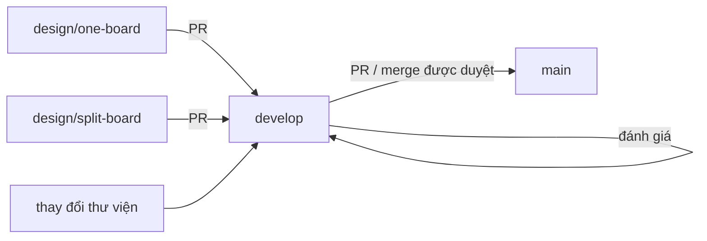

# Quy trình phát triển (Development Workflow)

Tài liệu này mô tả cách tổ chức repository và cách các thay đổi từ nhánh thiết kế (design branches) được đưa vào nhánh `main` ổn định.

## 1. Mô hình nhánh (Branch Model)

Repository tuân theo mô hình kiểu **GitFlow** được điều chỉnh cho phù hợp với thiết kế phần cứng:

```text
main (ổn định, sẵn sàng phát hành)
  ▲ merge sau khi đánh giá
develop (tích hợp + thư viện dùng chung)
  ▲ merge qua pull request
  ├── design/one-board     (One_Board_Design)
  └── design/split-board   (Split_Board_Design)
```

| Nhánh | Mục đích | Nội dung |
|---|---|---|
| `main` | Trạng thái ổn định, sẵn sàng phát hành | Chỉ có khung dự án: `README.md`, `LICENSE`, `.gitignore`, `Docs/` |
| `develop` | Điểm tích hợp và tài sản dùng chung | Khung dự án + `Hardware/libraries/` (symbol, footprint, mô hình 3D) |
| `design/one-board` | Phát triển thiết kế một board | `Hardware/One_Board_Design/` + `Hardware/libraries/` |
| `design/split-board` | Phát triển thiết kế tách board | `Hardware/Split_Board_Design/` + `Hardware/libraries/` |

## 2. Vai trò của từng nhánh

### `main`

- Chỉ chứa những nội dung được coi là **ổn định và sẵn sàng phát hành**.
- Trong giai đoạn prototype, không có thiết kế board nào nằm trên `main`.
- Một thiết kế board chỉ được đưa lên `main` sau khi đã được đánh giá và xác nhận, đồng thời đã được merge vào `develop` và được phê duyệt.

### `develop`

- Là **nhánh tích hợp**: mọi thay đổi đã được đánh giá đều được merge vào đây trước khi đến `main`.
- Lưu trữ **thư viện dùng chung** (`Hardware/libraries/`) — nguồn duy nhất (single source of truth) cho symbol, footprint và mô hình 3D được sử dụng bởi mọi thiết kế board.
- Các thay đổi thư viện được thực hiện trên `develop` (hoặc qua một nhánh ngắn hạn được merge vào `develop`).

### Các nhánh `design/*`

- Mỗi thiết kế board được phát triển trên **nhánh riêng của nó**.
- `design/one-board`   → thiết kế một board (One_Board_Design).
- `design/split-board` → thiết kế board tách điều khiển/rơ-le (Split_Board_Design).
- Các nhánh này **merge `develop` định kỳ** để nhận thư viện dùng chung và các cập nhật khung dự án mới nhất.

## 3. Luồng thay đổi (Change Flow)



### 3.1 Làm việc trên một thiết kế board

1. Chuyển sang nhánh thiết kế tương ứng:
   ```sh
   git checkout design/one-board      # hoặc design/split-board
   ```
2. Kéo các tài sản dùng chung mới nhất từ `develop`:
   ```sh
   git fetch origin
   git merge origin/develop
   ```
3. Thực hiện các thay đổi schematic / PCB.
4. Chạy ERC và DRC, ghi lại bằng chứng đánh giá.
5. Commit với thông điệp mô tả rõ ràng (xem [Quy ước commit](#6-quy-ước-commit)).
6. Push nhánh:
   ```sh
   git push origin design/one-board
   ```
7. Mở pull request vào `develop`.

### 3.2 Thay đổi thư viện dùng chung

Thư viện dùng chung (symbol, footprint, mô hình 3D) nằm trên `develop`:

1. Tạo một nhánh ngắn hạn từ `develop` (hoặc làm việc trực tiếp trên `develop` cho các thay đổi nhỏ):
   ```sh
   git checkout develop
   git checkout -b fix/library-xyz
   ```
2. Chỉnh sửa các file thư viện trong `Hardware/libraries/`.
3. Commit, push, và mở pull request trở lại vào `develop`.
4. Sau khi thay đổi thư viện được merge vào `develop`, mỗi nhánh thiết kế merge `develop` để nhận bản cập nhật.

### 3.3 Phát hành lên `main`

1. Đảm bảo mọi thay đổi board đã được merge vào `develop` và đã được đánh giá.
2. Khi trạng thái tích hợp được coi là ổn định:
   ```sh
   git checkout main
   git merge develop
   git push origin main
   ```
   hoặc mở pull request từ `develop` vào `main`.
3. Tạo tag cho bản phát hành nếu cần:
   ```sh
   git tag -a v0.1.0 -m "First prototype baseline"
   git push origin v0.1.0
   ```

## 4. Cấu trúc repository hiện tại

```text
robot_charge_controller/
├── README.md                 # Tổng quan dự án
├── LICENSE                   # Giấy phép dự án
├── .gitignore
├── docs/                     # Yêu cầu, kiến trúc, thiết kế, tính toán, đánh giá, kiểm chứng
│   ├── 01-requirements/
│   ├── 02-architecture/
│   ├── 03-design/
│   ├── 04-calculations/
│   ├── 05-reviews/
│   ├── 06-verification/
│   ├── decisions/
│   └── workflow.md           # Tài liệu này
├── hardware/                 # Thiết kế phần cứng
│   ├── libraries/            # Dùng chung: symbol, footprint, mô hình 3D (trên develop)
│   └── templates/            # Template KiCad dùng chung
├── firmware/                 # Firmware ESP32 (include, src, lib, test)
├── simulation/               # Mô phỏng SPICE
├── components/               # BOM, linh kiện thay thế, datasheet
├── manufacturing/            # Ghi chú chế tạo, bộ hồ sơ phát hành
├── test/                     # Đo lường, báo cáo kiểm tra phần cứng
└── tools/                    # Script xuất, kiểm tra, tự động hóa
```

> [!NOTE]
> `hardware/libraries/` được duy trì trên nhánh `develop` — nguồn duy nhất cho symbol,
> footprint và mô hình 3D dùng chung. Các thiết kế board cụ thể
> (`One_Board_Design`, `Split_Board_Design`) được phát triển trên các nhánh
> `design/one-board` và `design/split-board`.

## 5. Cổng kiểm tra chất lượng (Quality Gates)

Trước khi một nhánh thiết kế được merge vào `develop`, các kiểm tra sau phải đạt và được ghi lại:

| Cổng kiểm tra | Công cụ | Yêu cầu |
|---|---|---|
| Kiểm tra quy tắc điện (ERC) | KiCad `kicad-cli sch erc` | Không có lỗi; các cảnh báo đã được xem xét |
| Kiểm tra quy tắc thiết kế (DRC) | KiCad `kicad-cli pcb drc` | Không có vi phạm chưa được phê duyệt |
| Độ phân giải thư viện | KiCad | Không thiếu symbol, footprint hoặc mô hình 3D |
| Đánh giá thiết kế | Đánh giá kỹ thuật | Đã được đánh giá và phê duyệt |
| Kiểm tra sản xuất | KiCad / nhà máy | Chỉ trước khi phát hành chế tạo |

## 6. Quy ước commit

Thông điệp commit tuân theo **phong cách ngữ nghĩa (semantic style)** của repository:

- `feat(hardware): ...` — tính năng hoặc khả năng mới
- `fix(hardware): ...` — sửa lỗi
- `refactor(hardware): ...` — tái cấu trúc không thay đổi hành vi
- `chore: ...` — bảo trì, dọn dẹp, thay đổi không chức năng
- `docs: ...` — chỉ tài liệu

Ví dụ về scope: `hardware`, `firmware`, `docs`, `libraries`.

Ví dụ:

```sh
git commit -m "fix(hardware): correct 3D model paths in shared footprints"
```

## 7. Vệ sinh nhánh (Branch Hygiene)

- Xóa một nhánh thiết kế sau khi nó đã được merge và không còn cần thiết:
  ```sh
  git push origin --delete design/one-board
  git branch -d design/one-board
  ```
- Giữ `main` sạch: nó không bao giờ được chứa thiết kế đang triển khai dở dang.
- Rebase hoặc merge `develop` vào các nhánh thiết kế thường xuyên để giảm thiểu xung đột.
- Tạo tag cho các mốc quan trọng (baseline prototype, điểm kiểm tra đánh giá, bản phát hành).