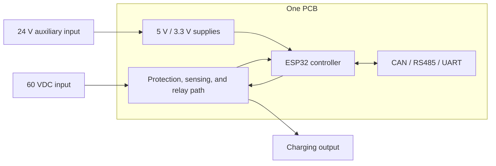

# One-Board Design

This directory contains the original Robot Charge Controller hardware design, in which the high-current relay path, sensing circuits, auxiliary power supplies, ESP32 controller, and communication interfaces are integrated on a single PCB.

> [!WARNING]
> This is a prototype design for a charging path with requirements of up to **60 VDC and 20 A**. These values have not been established as verified operating capability. Incorrect design, assembly, or testing can cause arcing, overheating, fire, equipment damage, or personal injury. The design is not approved for production or safety-critical use.

## Architecture



All functional blocks share the same PCB and are maintained as one hierarchical KiCad project.

## Functional Blocks

| Block | Responsibility | KiCad sheet |
|---|---|---|
| Relay control | Drives the DC-rated power relay and controls the charging path | `Main_Relay_Control.kicad_sch` |
| Auxiliary power | Converts the 24 V auxiliary input to the logic supply rails | `Auxiliary_Power_Supply.kicad_sch` |
| Protection and sensing | Provides output protection and voltage/current measurement | `Output_Protection_And_Sensing.kicad_sch` |
| MCU control | Hosts the ESP32-WROOM-32E and USB-to-UART circuitry | `MCU_Control.kicad_sch` |
| Communications | Provides CAN, RS485, and 3.3 V UART interfaces | `Communication_Interfaces.kicad_sch` |

The root schematic, PCB layout, and project configuration use the name `robot-hv-charge-controller`.

## Directory Contents

```text
One_Board_Design/
├── robot-hv-charge-controller.kicad_pro  # KiCad project configuration
├── robot-hv-charge-controller.kicad_sch  # Root hierarchical schematic
├── robot-hv-charge-controller.kicad_pcb  # PCB layout
├── Auxiliary_Power_Supply.kicad_sch
├── Communication_Interfaces.kicad_sch
├── Main_Relay_Control.kicad_sch
├── MCU_Control.kicad_sch
├── Output_Protection_And_Sensing.kicad_sch
├── fp-lib-table                           # Project footprint libraries
├── sym-lib-table                          # Project symbol libraries
└── README.md
```

The project's shared symbols, footprints, and 3D models are kept **outside** this directory, in `hardware/libraries/`. This directory therefore does **not** contain its own `libraries/` folder; instead, the library tables and 3D-model references point one level up to the shared location (see [Library Paths](#library-paths)).

## Opening the Design

Open `robot-hv-charge-controller.kicad_pro` with KiCad 10.0.3 or a reviewed compatible version. The project and all hierarchical sheets must remain together. The project expects the shared library files to be present at `../libraries/` relative to this directory; if you relocate the project, update the library paths described in [Library Paths](#library-paths) accordingly.

Before using any generated manufacturing data, regenerate and review ERC and DRC reports. The selected fabrication baseline is a two-layer, 1.6 mm PCB with 2 oz finished copper on both copper layers. The current board stack-up records 0.07 mm copper on F.Cu and B.Cu, while the copper-finish field remains unspecified; the complete stack-up and finish still require fabricator confirmation before release.

## Library Paths

The project uses a **shared library layout**: the KiCad project files live in this directory, while the project-specific symbols, footprints, and 3D models live one level up in `hardware/libraries/`.

```text
hardware/
├── libraries/                          # Shared project libraries (single source of truth)
│   ├── symbols/
│   │   └── RobotChargeController.kicad_sym
│   ├── footprints/
│   │   └── RobotChargeController.pretty/
│   └── 3d-models/                      # Project-specific 3D STEP models
└── One_Board_Design/                   # This KiCad project
    ├── robot-hv-charge-controller.kicad_pro
    ├── *.kicad_sch
    ├── robot-hv-charge-controller.kicad_pcb
    ├── fp-lib-table
    └── sym-lib-table
```

### How the references resolve

| Reference | Value in file | Resolves to |
|---|---|---|
| Symbol library (`sym-lib-table`) | `${KIPRJMOD}/../libraries/symbols/RobotChargeController.kicad_sym` | `hardware/libraries/symbols/` |
| Footprint library (`fp-lib-table`) | `${KIPRJMOD}/../libraries/footprints/RobotChargeController.pretty` | `hardware/libraries/footprints/` |
| Project 3D models (footprints + PCB instances) | `${KIPRJMOD}/../libraries/3d-models/...` | `hardware/libraries/3d-models/` |
| Standard KiCad 3D models | `${KICAD10_3DMODEL_DIR}/...` | KiCad installation `3dmodels` |
| Embedded 3D models | `kicad-embed://...` | Stored inside the PCB file |

`${KIPRJMOD}` is the directory containing the `.kicad_pro` file, i.e. this directory. The `../` prefix points one level up to `hardware/libraries/`.

### Notes

- **Do not** create a `libraries/` folder inside this directory — the project intentionally references the shared library location with `../libraries/`.
- Hierarchical sheet references (`Sheetfile` properties) use **plain filenames** (e.g. `MCU_Control.kicad_sch`) and resolve because all sheets live in the same directory as the root schematic — they are **not** affected by the shared-library layout.
- If the project is moved to a different folder, update the `../libraries/...` references in `sym-lib-table`, `fp-lib-table`, and the `(model "...")` entries in the footprints and the PCB file.
- This directory previously contained `${KIPRJMOD}/libraries/...` references (without `../`) that pointed into a non-existent `One_Board_Design/libraries/` folder. Those have been corrected to `${KIPRJMOD}/../libraries/...` and verified with ERC — the design opens with no missing symbols, footprints, or 3D models from the shared library.

## Benefits and Trade-offs

### Benefits

- A single PCB simplifies mechanical installation and reduces inter-board wiring.
- Shared power, control, and communication circuitry can be developed in one KiCad project.
- Fewer board-to-board connectors reduce connector count and assembly steps.

### Trade-offs

- High-current switching and low-voltage control circuitry must coexist on the same PCB.
- Thermal, EMC, grounding, clearance, and return-path constraints are tightly coupled.
- A change to one functional area may require revising and replacing the complete assembly.
- Bench access and fault isolation may be more difficult than with physically separated boards.

## Development Status

| Area | Current state |
|---|---|
| Hierarchical schematic | Present; requires current ERC and engineering review evidence |
| PCB layout | Present; requires current DRC, thermal, EMC, and manufacturability review evidence |
| Copper stack-up metadata | 0.07 mm recorded on both copper layers; finish and fabricator stack-up still require confirmation |
| 60 VDC / 20 A operation | Design requirement; not yet verified by the repository evidence |
| Production release | Not authorized |

This design does not replace a battery charger or battery management system. Charging control, cell balancing, and pack-level protection remain the responsibility of the external charger and BMS.

For the architecture that separates the control electronics from the relay section, see the [Split-Board Design](../Split_Board_Design/README.md).
