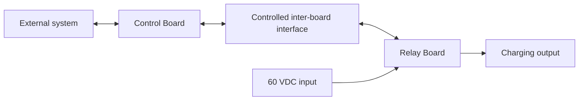

# Split-Board Design

This directory contains the planned Robot Charge Controller architecture that separates the low-voltage control electronics from the relay and high-current charging path. Unlike the [One-Board Design](../One_Board_Design/README.md), this variant is intended to use two physically separate PCBs connected through a controlled inter-board interface.

> [!WARNING]
> This is a planned prototype architecture for a charging path with requirements of up to **60 VDC and 20 A**. The split-board implementation, interface, and operating capability have not been verified. Incorrect partitioning, wiring, assembly, or testing can cause arcing, overheating, fire, equipment damage, or personal injury. The design is not approved for production or safety-critical use.

## Architecture



## Planned Partition

| Area | Intended responsibility |
|---|---|
| [Control Board](Control_Board/README.md) | ESP32 supervision, low-voltage logic power, programming support, external inputs, and communication interfaces |
| [Relay Board](Relay_Board/README.md) | DC-rated relay switching and the high-current charging path |
| [Inter-board interface](interface/README.md) | Controlled electrical, mechanical, fault, and verification contract between the two PCBs |

The final allocation of voltage sensing, current sensing, protection circuits, relay-coil drive, and auxiliary field outputs has not been defined. These functions must be assigned using electrical, thermal, EMC, fault-containment, serviceability, and testability requirements rather than copied from the One-Board Design without review.

## Directory Structure

```text
Split_Board_Design/
├── Control_Board/       # Future controller KiCad project
├── Relay_Board/         # Future relay/high-current KiCad project
├── interface/           # Controlled inter-board contract
└── README.md
```

No Split-Board KiCad project or connector pinout exists yet. The next engineering step is to define measurable requirements and approve the inter-board interface contract before schematic capture.

## Development Status

| Area | Current state |
|---|---|
| Architecture concept | Control and relay functions are separated |
| Functional allocation | Partial; sensing, protection, and auxiliary functions need a recorded decision |
| Inter-board interface | Requirements skeleton present; electrical contract not defined |
| Control Board schematic and PCB | Not started |
| Relay Board schematic and PCB | Not started |
| Integrated verification | Not started |
| Production release | Not authorized |

This design does not replace a battery charger or battery management system. Charging control, cell balancing, and pack-level protection remain the responsibility of the external charger and BMS.
